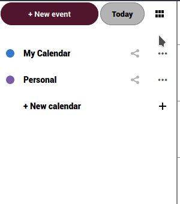

L'exportation des calendriers est assez simple :

  - Connectez-vous au [cloud](https://cloud.disroot.org)
  - Sélectionnez l'application Calendrier

  

  - Pour exporter un de vos calendriers ou les calendriers auxquels vous êtes abonné, sélectionnez l'option de menu *"trois points "* à côté du calendrier et cliquez sur l'option *"Exporter "*. Le calendrier exporté est enregistré au format .ics.

  

  - Répétez le processus pour tous les autres calendriers que vous souhaitez exporter.
