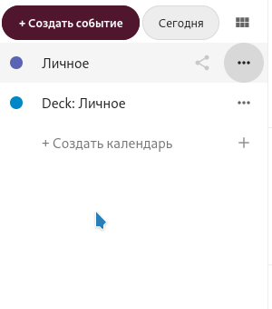

Экспортировать календари довольно просто:

  - Войдите в [облако](https://cloud.disroot.org)
  - Выберите приложение Календарь

  

  - Чтобы экспортировать любой из имеющихся у вас календарей, выберите пункт меню *"три точки"*, который будет рядом с тем календарём, резервную копию которого вы хотите создать и выберите параметр *"Скачать"*. Экспортированный календарь сохраняется в формате .ics.

  

  - Повторите процесс для всех остальных календарей, которые вы хотите экспортировать.
