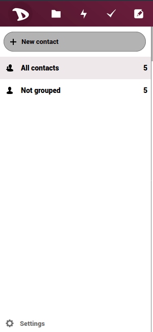

Contacts can be exported at any time in a very simple way.

  - Login to your cloud account at [https://cloud.disroot.org](https://cloud.disroot.org)
  - Select "*Contacts*" app.

  

  - Hit the download button next to the addressbook you want to export. Contacts are saved in .vcf format.

  
