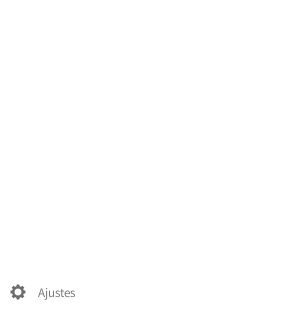

Los contactos se pueden exportar de manera sencilla en cualquier momento.

  - Inicia sesión en tu [nube](https://cloud.disroot.org)
  - Selecciona la aplicación "*Contactos*".

  

  - Selecciona la opción **Ajustes** que está abajo en la barra lateral izquierda.

4. Haz click en el menú de "*tres puntos*" que estará al lado de la libreta de direcciones que quieras exportar.

5. Selecciona "*Descargar*" para obtener tus contactos en un archivo para guardar en formato .vcf.

