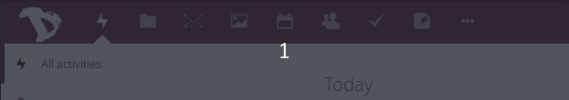

I contatti possono essere esportati in qualsiasi momento in modo molto semplice.

- Accedi al [cloud](https://cloud.disroot.org)
- Seleziona l'applicazione "*Contatti*".

- Premi il pulsante di download accanto alla rubrica che desideri esportare. I contatti vengono salvati in formato .vcf.

