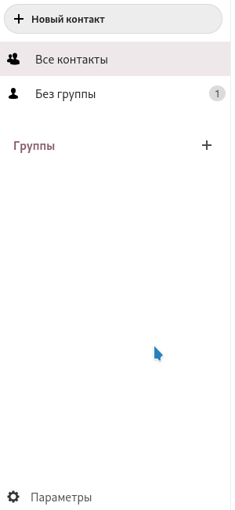

Контакты можно экспортировать в любое время очень простым способом.

  - Войдите в [облако](https://cloud.disroot.org)
  - Выберите приложение "*Контакты*".

  

  - Выберите пункт меню **Параметры** в нижней части левой боковой панели.

  - Нажмите на меню "*три точки*", которое будет рядом с адресной книгой, которую вы хотите экспортировать.

  - Выберите "*Скачать*", чтобы сохранить контакты в файле в формате .vcf.

  
