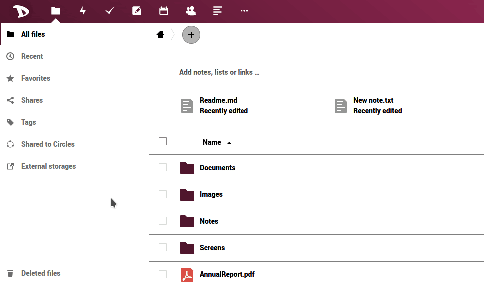

Vous pouvez télécharger vos fichiers aussi facilement que dans le cas de toute application **Nextcloud**.

  - Connectez-vous à votre [cloud](https://cloud.disroot.org)
  - Sélectionnez l'application **Files**.
  - Sélectionnez tous les fichiers en cliquant sur la case à cocher
  - Cliquez ensuite sur le menu **Actions** et sélectionnez *Téléchargement*.

