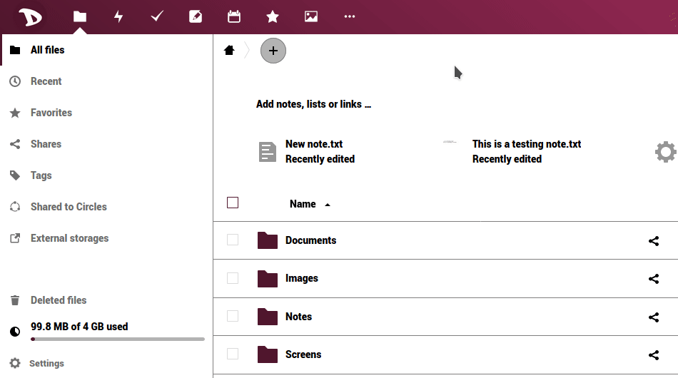

Puoi scaricare i tuoi file i n modo molto semplice su **Nextcloud**:app.

- Accedi al tuo [cloud](https://cloud.disroot.org)
- Seleziona l'app **File**
- Seleziona tutti i file facendo clic sulla casella di controllo
- Quindi fai clic sul menu **Azioni** e seleziona *Scarica* 

