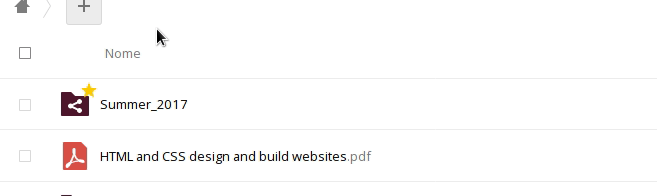

Você pode descarregar os seus ficheiros muito facilmente.

1. Faça login na sua conta de cloud em [cloud.disroot.org](https://cloud.disroot.org)

2. Selecione a aplicação **Ficheiros**

3. Selecione todos os ficheiros e pastas

4. Depois carregue no menu **Ações** e selecione *Transferir*

