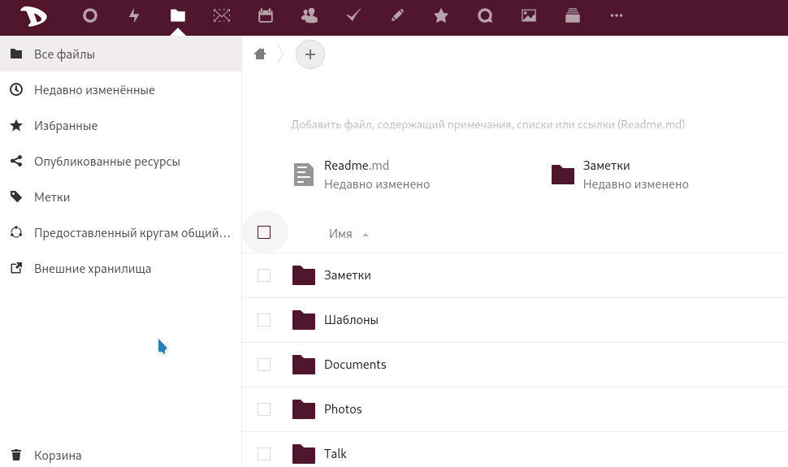

Вы можете скачать свои файлы так же просто, как и в случае любого приложения **Nextcloud**.

  - Войдите в [облако](https://cloud.disroot.org)
  - Выберите приложение **Файлы**
  - Выберите все файлы, установив флажок
  - Затем нажмите меню **Действия** и выберите *Скачать*

