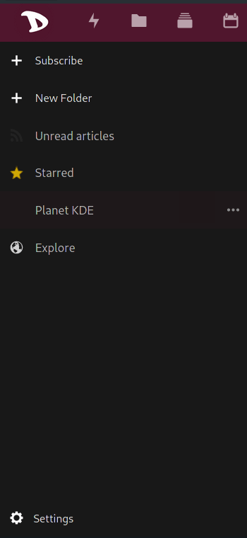

Exporting your news feeds and your subscriptions is as easy as in case of any **Nextcloud** app.

  - Login to the [cloud](https://cloud.disroot.org)
  - Select the **News** app

  

  - Select Settings on the bottom of the left side-bar.
  - Depending on your needs you can either decided to export:
    - Your subscriptions (OPML) - This is specially useful if you want to change your News feed (RSS reader) provider or if you simply would like to have a backup of current news site list.
    - Unread/Starred articles - If you want to export the article content themselves either for offline use, archive purpose or migration. Note read articles get removed in regular intervals.

    
