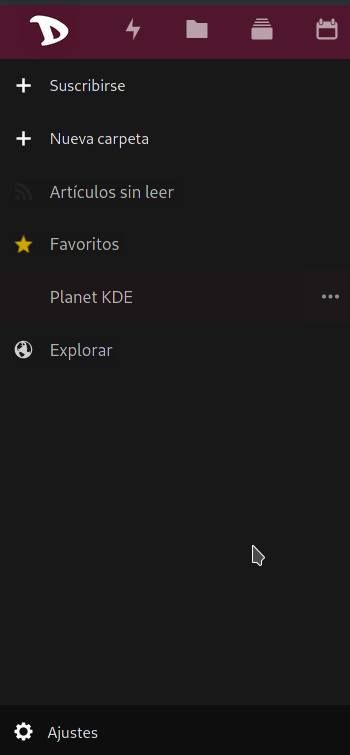

# Exportar feeds de Noticias

Exportar fuentes de noticias y suscripciones es un procedimiento bastante sencillo.

1. Inicia sesión en la [nube](https://cloud.disroot.org)

2. Selecciona la aplicación **Noticias**

3. Selecciona **Ajustes**, abajo a la izquierda, en la barra lateral.

4. Dependiendo de tus necesidades, puedes elegir exportar:
  - **Tus suscripciones (OPML):** Esto es especialmente útil si quieres cambiar tu proveedor de fuentes de noticias (lector RSS) o simplemente tener un respaldo de la actual lista de sitios de noticias.  _[**OPML**](https://es.wikipedia.org/wiki/OPML) es un tipo de formato muy utilizado por los actuales lectores de feeds de noticias para importar y exportar listas de suscripciones._

  - **Artí­culos Sin leer/Favoritos (JSON):** Esta es la opción para exportar el contenido mismo de los artículos, ya sea para leerlos fuera de lí­nea, para archivarlos o para migrar.  _[**JSON**](https://es.wikipedia.org/wiki/JSON) es un formato de texto para intercambio de datos._

Al hacer click en **Exportar** el navegador te preguntará donde quieres guardar el archivo, selecciona una ubicación y finalmente **Guardar**.
