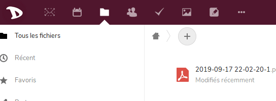
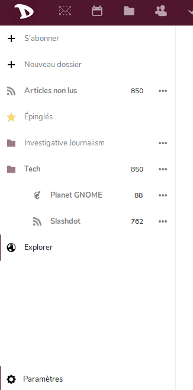

Exporter vos flux de news ainsi que vous abonnements est simple et se fait comme ceci:

1. Connectez-vous sur [cloud](https://cloud.disroot.org)

2. Sélectionnez l'app **News**

3. Sélectionnez **Paramètres** au bas de la barre latéral gauche.

5. En fonction de vos besoins, vous pouvez choisir de télécharger:
  - Tous vos abonnements (OPML) - Cette option est particulièrement pratique si vous désirez changer voter lecteur de flux RSS ou si vous avez simplement besoin de faire un backup de votre liste de flux actuelle.
  - Articles Non-Lus/Epinglés - Si vous désirez exporter le contenu des articles eux-mêmes soit pour une utilisation hors-ligne, pour de l'archivage, soit pour de la migration. NB: les articles lus sont retirés à intervalles réguliers.

