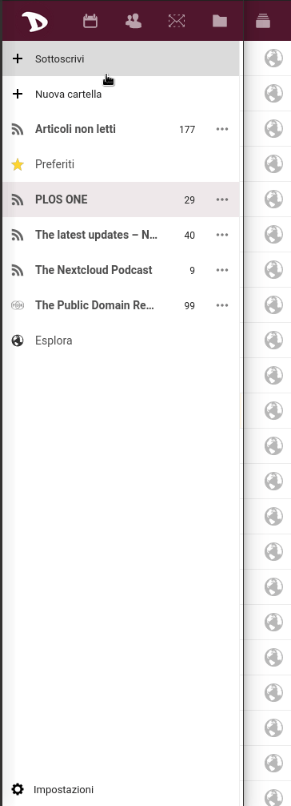

Esportare i tuoi feed rss e le tue sottoscrizioni è molto semplice.

1. Accedi al [cloud](https://cloud.disroot.org)

2. Seleziona l'applicazione **Notizie**

3. Seleziona **Impostazioni** in basso nella barra laterale.

5. A dipendenza delle tue necessità puoi decidere di esportare:
   - **Le tue sottoscrizioni (OPML)** - Questa opzione è particolarmente utile quando vuoi cambiare il tuo lettore di Feed RSS o semplicemente vuoi fare il backup delle tue sottoscrizioni. [OPML](https://en.wikipedia.org/wiki/OPML) è un formato molto utilizzato dai vari lettori di feed per esportare o importare le proprie sottoscrizioni.
   - **Gli articoli non letti** - Se vuoi esportare gli articoli che risultano non ancora letti per poterli leggere quando sei offline. 
   [JSON](https://en.wikipedia.org/wiki/JSON) è un formato utile per lo scambio di dati
   
Quando si clicca su **Esporta** il browser chiederà dove si vuole salvare il file. Basta scegliere il percorso preferito e cliccare su **Salva**.
   

