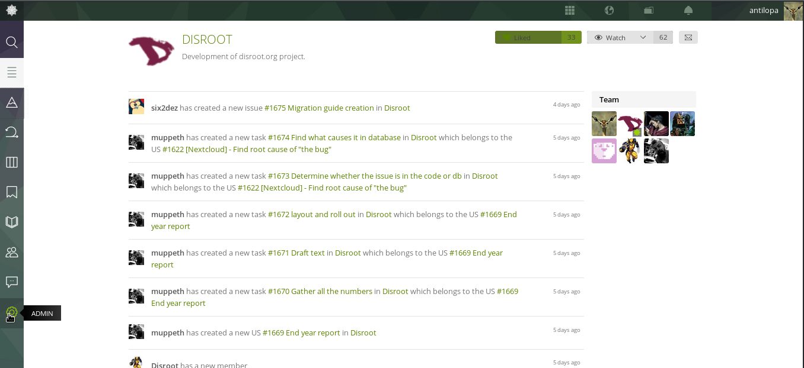
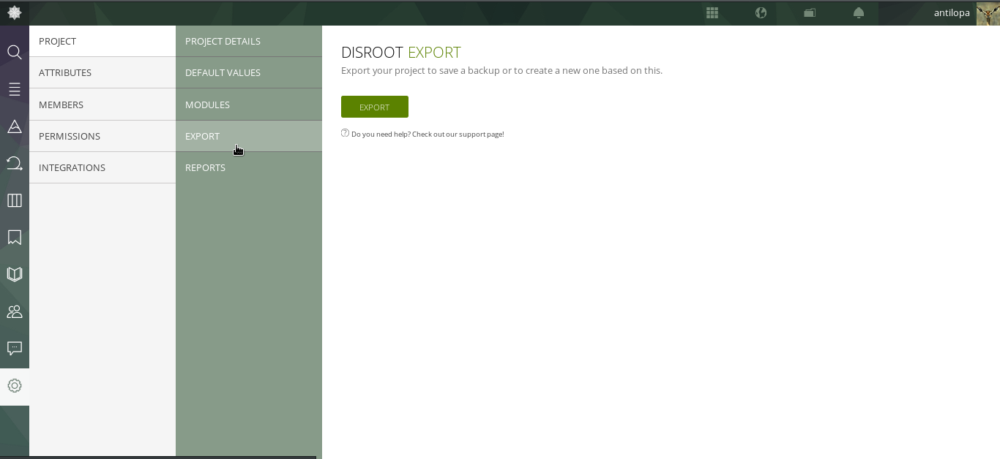

Segui i seguenti passi per esportare i dati dei tuoi progetti dall'interfaccia di **Taiga**:

1. Vai su https://board.disroot.org e fai il log in.
2. Seleziona il progetto che vuoi esportare e accedi al link "Amministratore" (nella barra sulla sinistra).

3. Sotto il menu **PROGETTO** troverai l'opzione **ESPORTA**. Clicca sul pulsante  per generare un file .json con tutte le informazioni del progetto. Puoi utilizzare questa possibilità per fare un backup del tuo progetto, oppure per creare un nuovo progetto basato su quello precedente.

