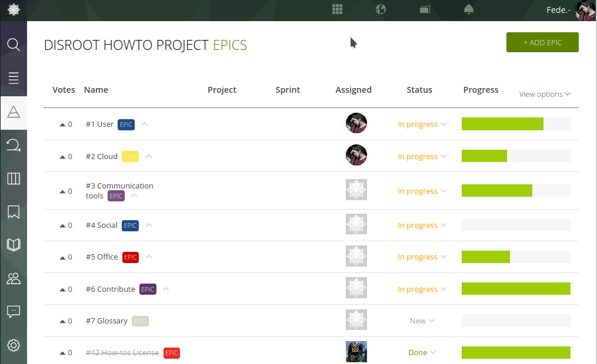

To export your project's data from **Taiga**, just follow these steps:

- Go to https://board.disroot.org and log in.
- Select the project you want to export and go to the Admin's settings.
- Under the **Project** tab you will find the **Export** option. Click the **EXPORT** button to generate a .json file with all the project's information. You can use that as a backup or to start a new project based on it.

