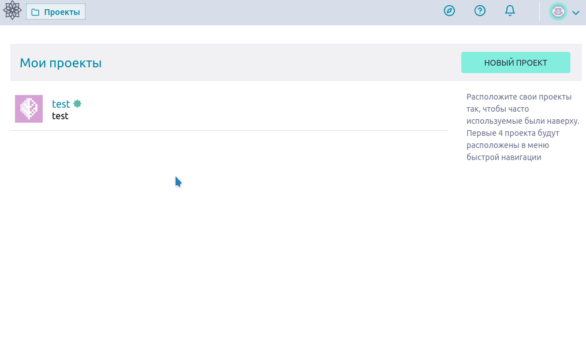

Выполните следующие действия, чтобы экспортировать информацию о проекте из интерфейса **Taiga**:

- Перейдите на [https://board.disroot.org](https://board.disroot.org) и войдите в систему.
- Выберите проект, который хотите экспортировать и перейдите в настройки администратора (нижняя левая боковая панель).
- На вкладке **Проект** вы найдете опцию **Экспорт**. Нажмите кнопку **ЭКСПОРТ**, чтобы создать файл .json со всей информацией о проекте. Вы можете использовать его в качестве резервной копии или начать новый проект на его основе.

