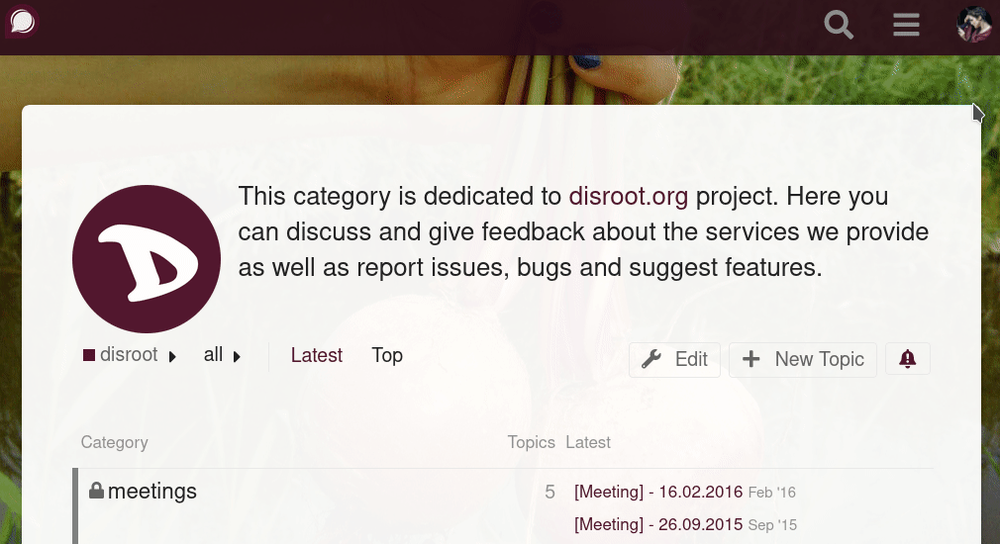
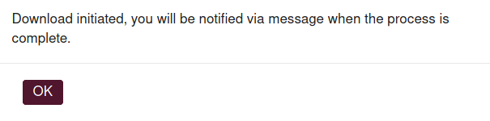
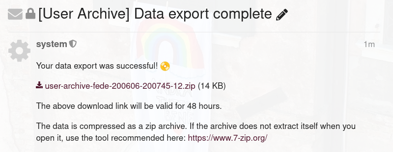

**Discourse**, the forum software used by **Disroot**, allows you to export the text content of all your posts to a .csv file, (a simple text file which is supported by most calc/spreadsheet software).

**To export your posts from Discourse:**
- Login in the **Forum**
- Press your user avatar on the upper right corner of the screen
- Press the button with your username

  

- Press the **Download All** button

  

- A pop-up windows will appear asking if you want to download your posts and then press **OK**

  

- The system will start processing your data and send you a notification when it is ready to download.

  

  

- You will get a message from the system notifying you that the data is ready to be downloaded, and providing you a link to download the .csv file with a copy of your posts. If you have enabled notifications via email, you will also get an email with this information.

- Press the link to download the file.

    

- The link will be available for 48h, after that it will expire and you will have to export your data again.

- Once you extract the file you can open it in your spreadsheet program.

**NOTE**: The data can only be downloaded once every 24h
