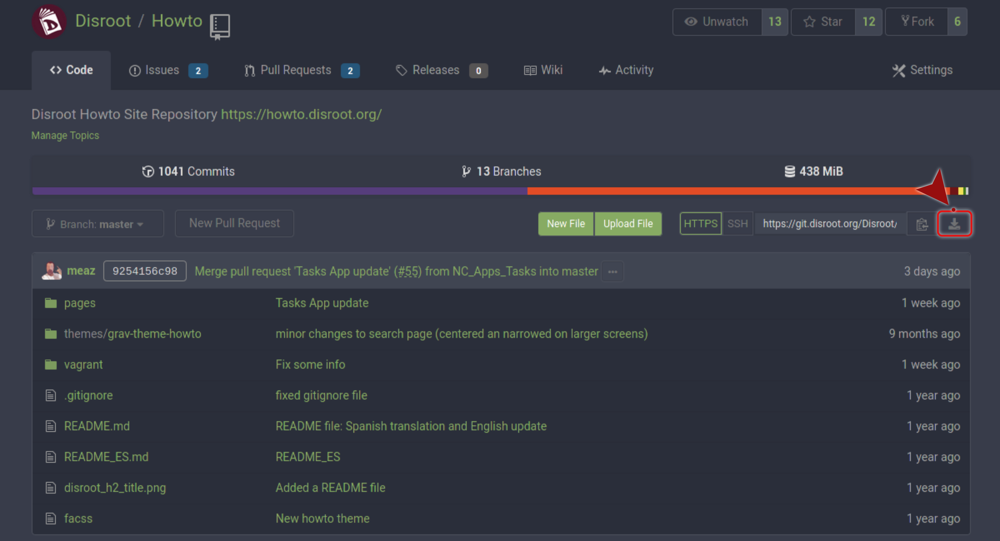
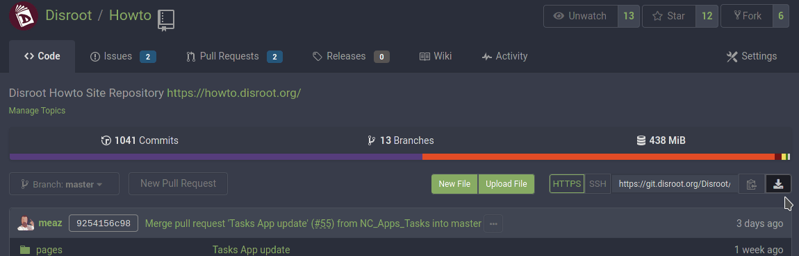
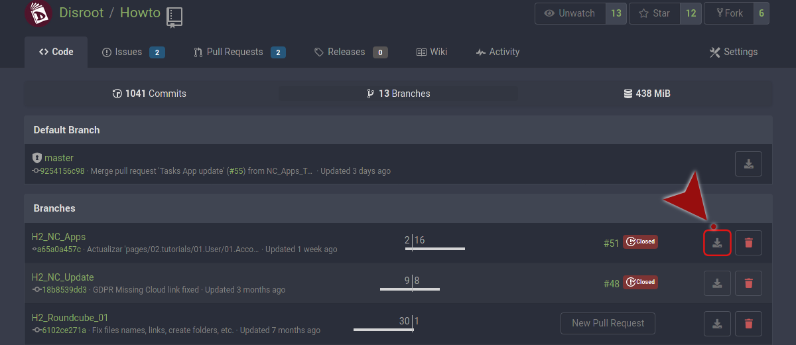

# Git: Respaldar tus repositorios
Aunque **Git** es un sistema respaldos en sí mismo, hay varias formas de hacer copias de seguridad de tus repositorios git.

## Usando la línea de comandos
### comando git clone
La forma más sencilla es simplemente clonar el repositorio **Gitea** a través de la línea de comandos.

~~~
git clone <repo_name> </path/to/your/local_backup_location>
~~~

Esto copiará la rama principal a la ubicación especificada.

Para clonar una rama concreta de un repositorio:

~~~
git clone -b branch_name --single-branch /path/to/your/local/repo.git
~~~

### comando git bundle
El comando **git bundle** creará un único archivo que contiene todas las referencias que necesitas exportar de tu repositorio local (soporta _git fetch_ y _git pull_).

Para crear un respaldo de una rama el comando **git bundle** creará un archivo **nombre_repo.bundle**.

~~~
git bundle create nombre_repo.bundle master
~~~

Para respaldar más ramas o etiquetas solo escribe:

~~~
git bundle create nombre_repo.bundle master otra_rama
~~~

Para restaurar el contenido del archivo .bundle, navega hasta un repo vacío y escribe:

~~~
git bundle unbundle nombre_repo.bundle
~~~

Si no tienes un repositorio, y lo que quieres hacer es recrear el original entonces escribe:

~~~
git clone nombre_repo.bundle -b master mi_nuevo_repo
~~~

!! **Es importante notar que** aunque ambos comandos hacen cosas similares, la principal diferencia entre ellos es que **git bundle** comunica los cambios a un repositorio al que no puedes hacer **push** (o que no puede traerlos de ti), por ejemplo, porque no hay acceso a la red. Así, **git bundle** te permite empaquetar las referencias de tu repositorio como un único archivo que es una fuente git reconocida. Puedes hacer fetch, pull y clonar desde él.

De acuerdo con la [documentación de git](https://git-scm.com/docs/git-bundle):

> Algunos flujos de trabajo requieren que una o más ramas de desarrollo en una máquina sean replicadas en otra máquina, pero las dos máquinas no pueden estar directamente conectadas, y por lo tanto los protocolos interactivos de Git (git, ssh, http) no pueden ser utilizados.

> El comando git bundle empaqueta los objetos y referencias en un archivo en la máquina de origen, que luego puede ser importado a otro repositorio usando git fetch, git pull, o git clone, después de mover el archivo por algún medio (por ejemplo, por sneakernet).

## Usando la interfaz web
Desde la interfaz web de **Gitea de Disroot** puedes descargar un repositorio completo en un único archivo comprimido.

* Inicia sesión en **Disroot Git**
* Navega hasta el repositorio que quieras descargar
* A la derecha de la pestaña **Código**, al lado de la dirección del repo, está la opción **Descarga**

* Solo haz click en el ícono de descarga y selecciona el tipo de archivo en el que la copia del repositorio será comprimida

Si quieres descargar una rama específica, entonces ve a la sección **Ramas**.

Verás la **Rama predeterminada** (master) y el resto de las ramas. A la derecha de cada una de ellas hay dos botones: el primero es el que usaremos para descargar la rama, el segundo es para borrarla (ten cuidado con este).

* Solo haz click en el botón **Descargar**
* Selecciona el tipo de archivo comprimido y clickéalo

Ahora comenzará a comprimir la rama. Dependiendo del tamaño, puede tardar un momento.

* A continuación, aparecerá una ventana que te preguntará dónde quieres guardar el archivo
* Selecciona la ubicación...

... y eso es todo.
