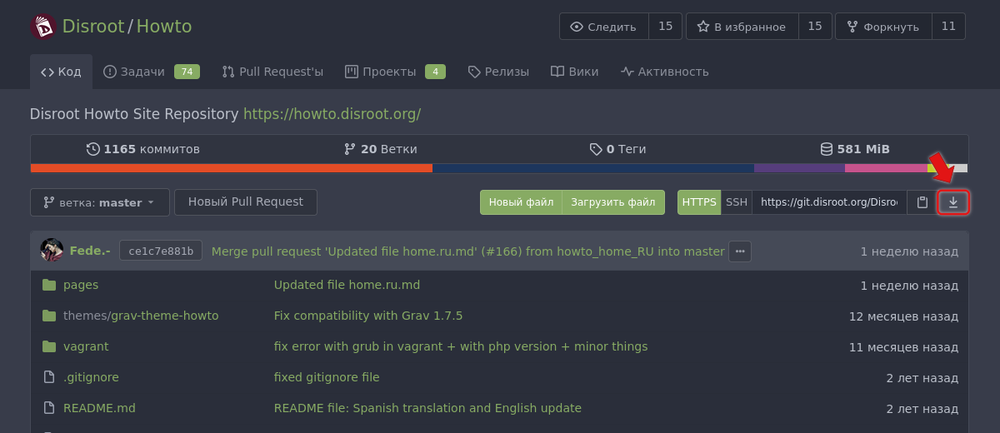
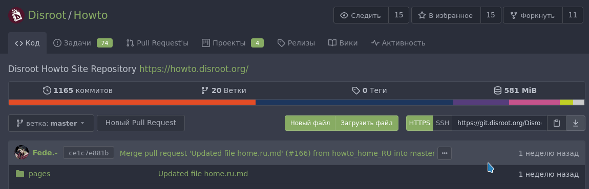
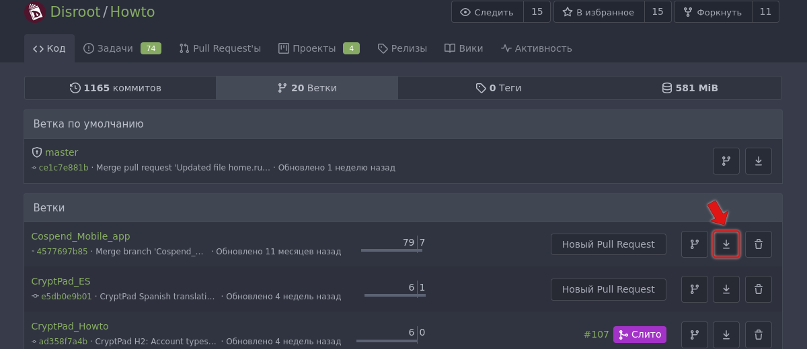

# Git: создайте резервную копию ваших репозиториев
Хотя **Git** сама по себе является системой резервного копирования, существует несколько способов резервного копирования ваших репозиториев git.

## Использование командной строки
### Команда git clone
Самый простой способ — просто клонировать репозиторий **Gitea** через командную строку.

~~~
git clone <имя_репозитория> </путь/к/вашей/локальной_директории>
~~~

Эта команда клонирует главную ветку в указанное место.

Чтобы клонировать определенную ветку репозитория:

~~~
git clone -b имя_ветки --single-branch /путь/к/вашей/локальной_директории.git
~~~

### Команда git bundle
Команда **git bundle** создаст один файл, содержащий все состояния ссылок, которые вам нужно экспортировать из вашего локального репозитория (поддерживает git fetch и git pull).

Команда **git bundle** создаст резервную копию ветки с именем файла **имя_репозитория.bundle**.

~~~
git bundle create имя_репозитория.bundle master
~~~

Чтобы создать резервную копию других веток или тегов, просто введите:

~~~
git bundle create имя_репозитория.bundle master другая_ветка
~~~

Чтобы восстановить содержимое файла .bundle, перейдите к пустому репозиторию и введите:

~~~
git bundle unbundle имя_репозитория.bundle
~~~

Если у вас нет репозитория и вы хотите воссоздать оригинал, введите:

~~~
git clone имя_репозитория.bundle -b master имя_директории_моего_нового_репозитория
~~~

!! **ПРИМЕЧАНИЕ**, хотя обе команды делают похожие вещи, основное различие между ними заключается в том, что **git bundle** позволяет передать изменения в репозиторий, в который вы не можете отправить (или который не может получить от вас), например, потому что нет доступа к сети. Таким образом, **git bundle** позволяет вам упаковать состояния ссылок вашего репозитория в виде одного файла, который является полным исходным кодом git. Вы можете выполнить fetch, pull и clone из него.

Согласно [документации git](https://git-scm.com/docs/git-bundle/):

> Некоторые рабочие процессы требуют, чтобы одна или несколько веток разработки на одном компьютере были реплицированы на другой компьютер, но два компьютера не могут быть соединены напрямую, и поэтому нельзя использовать интерактивные протоколы Git (git, ssh, http).
 
> Команда git bundle упаковывает объекты и ссылки в архив на исходном компьютере, который затем можно импортировать в другой репозиторий с помощью git fetch, git pull или git clone после перемещения архива каким-либо образом (например, с помощью USB накопителя или оптического диска).

## Использование веб-интерфейса
Из веб-интерфейса **Disroot’s Gitea** вы можете скачать весь репозиторий в одном архивном файле.

* Войдите в **Disroot Git** 
* Перейдите к репозиторию, который вы хотите скачать
* Справа от вкладки **Код**, рядом с адресом репозитория, находится опция **Скачать репозиторий**.

* Просто нажмите значок загрузки и выберите тип файла, в который будет архивирована копия репозитория.

Если вы хотите скачать конкретную ветку, перейдите в раздел **Ветки**.

Вы увидите **Ветку по умолчанию** (master) и остальные ветки. Справа от каждой из них есть две кнопки: первая - это та, которую мы будем использовать для скачивания ветки, вторая - для её удаления (будьте осторожный с ней).

* Просто нажмите кнопку **Скачать**
* Выберите тип архива и нажмите на него

Теперь начнётся архивирование ветки. В зависимости от размера, это может занять некоторое время.

* Затем появится окно с вопросом, куда вы хотите сохранить файл
* Выберите место...

... и это всё.