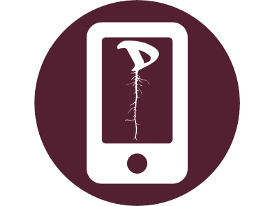

# DisApp · The Disroot's Community application ·
## One App to rule them all

----
## Background
Disrooter **Massimiliano** saw the potential of a **Disroot** app and decided to take the challenge with an unexpected approach. He developed the **Disroot "Swiss army knife"** app that helps and guides disrooters to recommended apps, tips and tutorials on how to set everything up.

## What does it do?
The app will pick the best (in our opinion) app for email, chat, etc, and for those services that don't have a dedicated app it will open them in the webview window. The app also provides directions to all community tutorials we've gathered over the years to help people use provided services.

## Where can you get it?
The app is available from the **F-Droid**'s store [here](https://f-droid.org/en/packages/org.disroot.disrootapp/).
