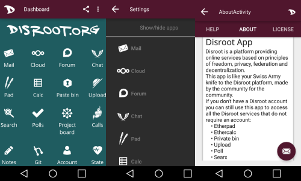

# **DisApp**: Приложение сообщества Disroot

## **Одно приложение, чтобы управлять всеми**

----
## Происхождение
Участник сообщества Disroot **Massimiliano** увидел потенциал приложения **Disroot** и решил принять вызов с неожиданным подходом. Он разработал **"Швейцарский армейский нож" для платформы Disroot**, приложение, которое помогает и направляет пользователей, рекомендуя приложения, советы и учебные пособия о том, как все настроить.

## Что оно делает?
Приложение подберет лучшие (на наш взгляд) приложения для электронной почты, чата и т.д., а для тех сервисов, у которых нет специального приложения, откроет их во встроенном браузере. Приложение также предоставляет инструкции ко всем учебным пособиям сообщества, которые мы собирали на протяжении многих лет, чтобы помочь людям использовать предоставляемые нами услуги.

## Где его можно скачать?
Приложение доступно в магазине приложений **F-Droid** [здесь](https://f-droid.org/en/packages/org.disroot.disrootapp/).