# Die Benutzeroberfläche (UI)

 

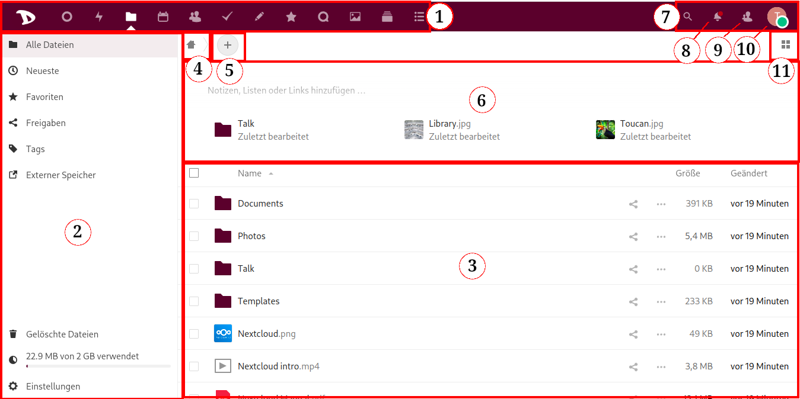

Dies ist die Hauptansicht. Nach dem Anmelden wird Deine **Cloud** wahrscheinlich in etwa so aussehen. Also fangen wir auch hier an, seine Bereiche und Funktionen kennzulernen.

## 1. App-Navigationsleiste
In dieser Leiste findest Du alle verfügbaren oder integrierten Anwendungen der **Disroot**-Cloud, wie zum Beispiel **Email**, **Dateien** und **Task**manager, **Notizen**, **Kalender**, **Kontakte**, **Lesezeichen**, **Photos**, **Talk**, **Kreise**, **Deck** und der **Aktivitäten**bericht.  *Um mehr über die Anwendungen zu erfahren, sieh Dir [dieses Kapitel](/tutorials/cloud/apps) an.*

*Wir haben nach sorgfältiger Abwägung entschieden, den RSS-Feeder **News** zu deaktivieren*

  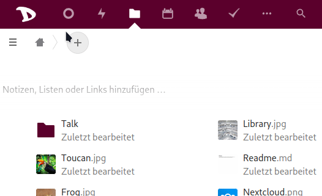

## 2. App-Informationsbereich
Wenn Du mit einer App arbeitest, werden hier zugehörige Informationen, Optionen und Filter erscheinen.

  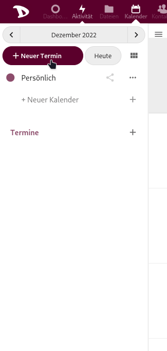

## 3. Haupt-Appansicht
Dieser Bereich zeigt die Inhalte der gewählten App.

  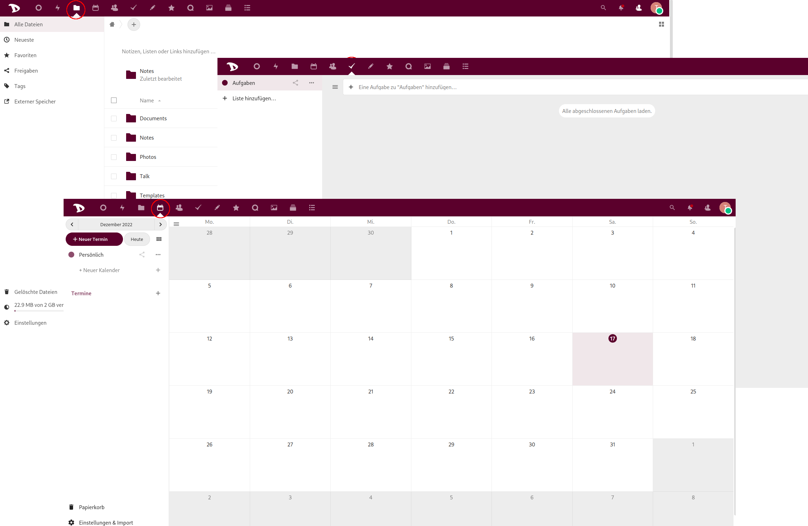

## 4. Home
Dieser Button  bringt Dich zurück zu Deinem Root-Verzeichnis (das Hauptverzeichnis), wenn Du durch Deine Dateiverzeichnisse navigierst.

  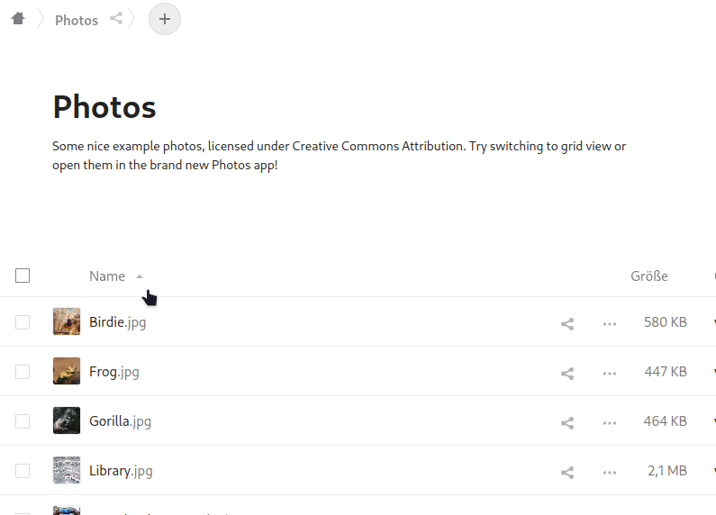

## 5. Neu
Dies ermöglicht es Dir, eine Datei hochzuladen und neue Verzeichnisse, Textdateien oder Pads zu erstellen.

  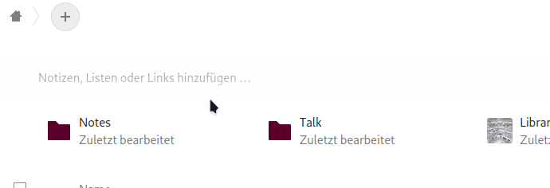

## 6. Umfangreicher Arbeitsbereich
Dies ermöglicht es Dir, Deine Verzeichnisse in einen Kontext zu setzen, Notizen, Dateiverweise und sogar Todo-Listen hinzuzufügen. Das ist besonders nützlich, um Deine Arbeit mit Anderen zu koordinieren und sicherzustellen, dass jeder weiß, wofür ein bestimmtes Verzeichnis gedacht ist. Du kannst hier außerdem eine kurze Liste mit den zuletzt geänderten Dateien und Verzeichnissen sehen.

  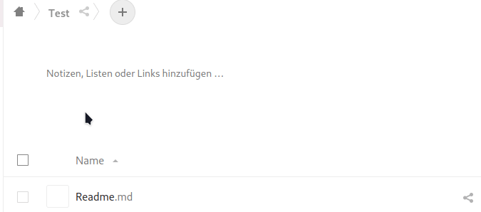

Du kannst den umfangreichen Arbeitsbereich ein- und ausschalten, indem Du auf das Einstellungen-Icon im unteren Bereich der linken Leiste klickst.

  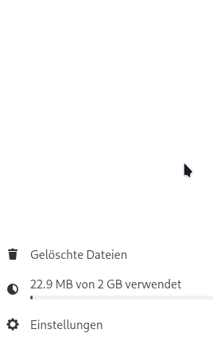

## 7. Suche
Durch einen Klick auf das Lupen-Icon kannst Du nach Dateien suchen.

  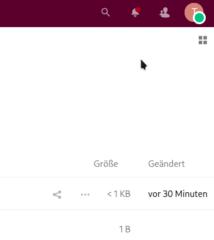

## 8. Benachrichtigungen
Jedes Mal, wenn Du einen Link, ein Verzeichnis oder eine Datei mit jemandem teilst oder jemand mit Dir, ein Dokument oder eine Datei geändert wird oder ein Administrator oder anderer Nutzer Dir eine Nachricht sendet, wirst Du hier benachrichtigt (ein hervorgehobener Punkt erscheint).

  

## 9. Kontakte
Hier findest Du Deine Kontakte und die Nutzer auf dem Server.

  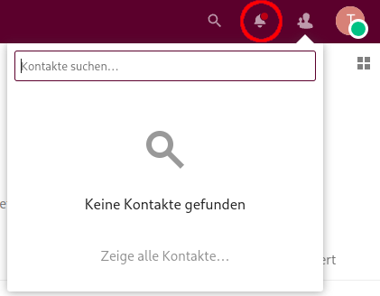

## 10. Einstellungsmenü
Wenn Du darauf klickst, erscheint ein Dropdownmenü und Du kannst auf die persönlichen und Anwendungs-Einstellungen zugreifen. Einige dieser Einstellungen ermöglichen es Dir, Dein Profil, Passwort, Sprache, Benachrichtigungseinstellungen, verbundene Geräte u.s.w. zu verwalten und zu ändern. Im nächsten Kapitel werden wir uns das im Detail ansehen.

  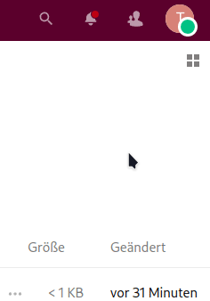

## 11. Ansicht wechseln
Indem Du hier klickst, kannst Du ändern, wie Deine Dateien in der Hauptansicht angezeigt werden. Du kannst zwischen Rasteransicht und Iconansicht wechseln.

  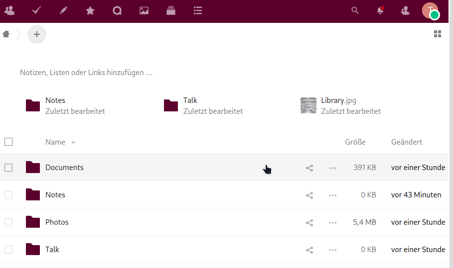
