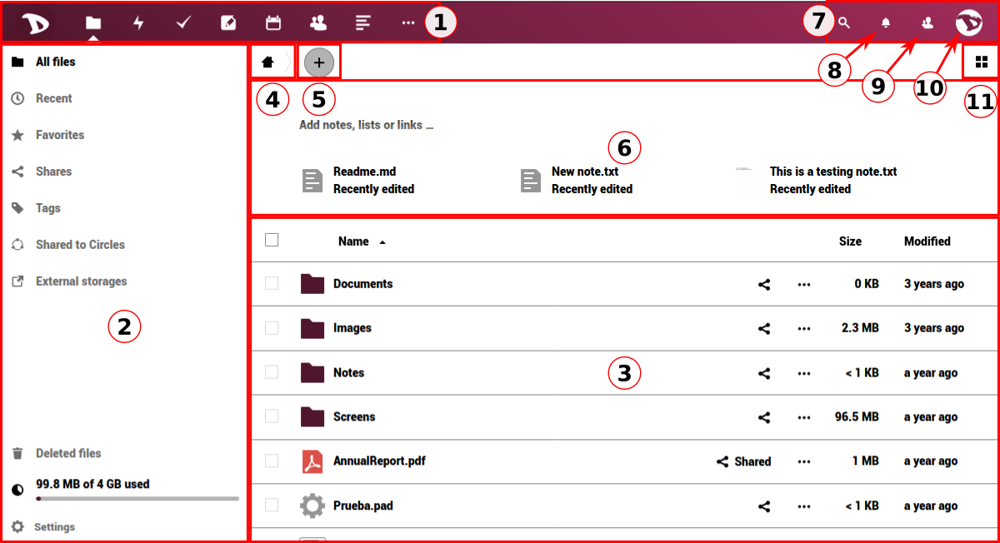
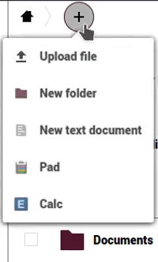

# The User Interface (UI)

 

This is the main screen. After logging in, your **Cloud** will surely look like this. So, we will start here by learning it's sections and functions.

## 1. Apps navigation bar
In this bar you will find all the applications available on or integrated to the **Disroot** cloud, such as **Email**, **Files** and **Tasks** managers, **Notes**, **Calendar**, **Contacts**, **News**, **Bookmarks**, **Photos**, **Talk**, **Circles**, **Deck** and the **Activity** log.  *To learn about them, check [this section](/tutorials/cloud/apps)*.

  

## 2. Apps information section
When interacting with the apps, related information, options and filters will appear here.

  

## 3. Main apps view
This section displays the contents of a selected app.

  

## 4. Home
This button  leads you back to the root folder (the home folder) when you navigate through your files folders.

  

## 5. “New”
It enables you to upload a file and create new folders, text files or pads.

  

## 6. Workspace
It allows you to bring context to your folders, adding notes and even todo lists and links to files on top. This is useful to coordinate work with other people, making sure everyone knows what a particular folder is for. You can also see a short list with the last modified files or folders.

  

  You can enable/disable the rich workspace by clicking the settings icon at the bottom of the left bar.

  

## 7. Search
By clicking on the magnifier icon you can search files.

  

## 8. Notifications
Whenever you share a link/file/folder or someone share it with you, there are changes to a document, a modification to a file or other users or admins send a message, you will be notified here (a highlighted point will appear).

  

## 9. The contacts menu
Here you’ll find your contacts and users on the server.

  

## 10. The settings menu
By clicking on it, a dropdown menu appears and you can access to the personal and features settings. Some of these settings allow you to change or modify your profile, password, language, manage notifications and connected devices, etc. We will see it in detail in the next chapter.

  

## 11. The view selector
By clicking on it, you’ll be able to change the way the main apps view section displays your files. You can toggle from grid view to icon view and vice versa.

  
