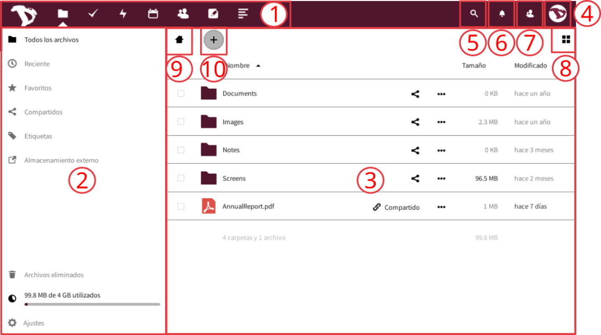
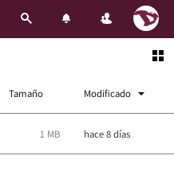
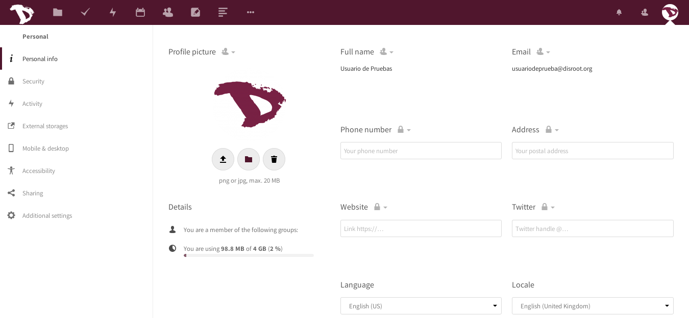
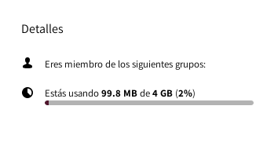
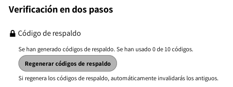
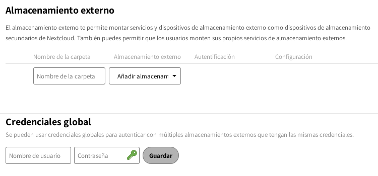
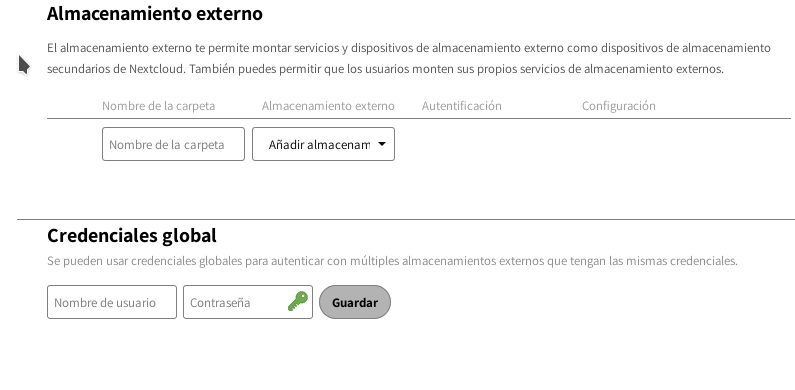
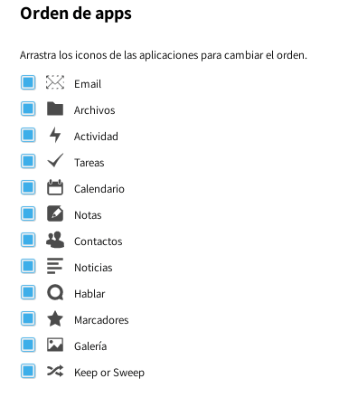

# La Interfaz de Usuarix

 

Esta es la pantalla principal y, como habrás notado, es bastante directa. Vamos a verla más de cerca.

Luego de iniciar sesión, encontrarás tres secciones principales, o bloques, y algunos botones de funciones:
1. **La barra de aplicaciones**: aquí tienes las aplicaciones disponibles en la nube de Disroot, tales como gestores de Archivos y Tareas, Calendario, Contactos, Notas, Marcadores y el registro de Actividad. Para saber más sobre las aplicaciones, mira en [esta sección](/tutorials/cloud/apps).
2. **La sección de información de las aplicaciones**: cuando interactúes con las aplicaciones, aquí aparecerán información relacionada, opciones y filtros.
3. **La vista principal de las aplicaciones**: esta sección muestra los contenidos de una aplicación seleccionada.
4. **El menú de Configuraciones**: haciendo click en él, un menú desplegable aparece y puedes acceder a las configuraciones personales y de las características. Algunos de estos ajustes te permiten cambiar o modificar tu perfil, contraseña, idioma, gestionar notificaciones y dispositivos conectados, etc. Lo veremos más adelante.
5. **El campo de búsqueda**: haciendo click en el ícono de la lupa puedes buscar archivos.
6. **Las notificaciones**: ya sea un link, archivo o carpeta que hayas compartido (o que hayan compartido contigo), una modificación en un archivo compartido o un mensaje, serás notificado a través de un punto resaltado aquí.
7. **El menú de Contactos**: aquí encontrarás tus contactos y los usuarios del servidor.
8. **El selector de vista**: haciendo click en él, podrás cambiar la manera en que la vista principal de las aplicaciones muestra tus archivos. Puedes alternar de Vista de cuadrícula a Vista de íconos y viceversa.
9. **El botón de navegación**: este botón te lleva de regreso a la carpeta de raíz (la carpeta de Inicio) cuando navegas a través de tus carpetas de archivos.
10. **El botón “nuevo”**: te permite subir archivos y crear nuevas carpetas, archivos de texto o pads.

----------

# Configuraciones Personales
Comencemos mirando lo que puedes configurar y personalizar en tu cuenta en la nube. Haz click sobre tu imagen de perfil en la esquina superior derecha y elige la configuración **"Personal"** (*si no has establecido una imagen aún, verás un avatar redondo con la primera letra de tu nombre de usuarix dentro*).

Las configuraciones están divididas en secciones. Puedes usar los links rápidos en la *sección lateral izquierda* para acceder a ellos fácilmente.

### Personal Info
**Este es el lugar donde puedes agregar información sobre ti mismx, que luego puedes elegir compartir con otrxs.** 

Haciendo click en el ícono de "candado" justo al lado del título de la información, puedes ajustar el nivel de privacidad que quieras asignarle. Por defecto, tu imagen de perfil, nombre completo y correo electrónico están configurados para ser visibles solo a lxs usuarixs y los servidores en los que confíes.

Los niveles que puedes elegir son:

  - **Privada**: Tú eres la única persona que puede ver esta información
  - **Local**: La información será visible para otrxs usuarixs de la nube de Disroot (solo si conocen tu nombre de usuarix)
  - **Contactos**: Además de otrxs usuarixs de la nube de Disroot, la información será compartida con usuarixs de otras instancias de Nextcloud cuando compartas archivos o datos con ellxs
  - **Pública**: La información será enviada a una libreta de direcciones global (que puede ser vista por cualquiera)

!! **AVISO:** 
!! Deberías prestar especial atención cuando completas esta información *(lo cual es opcional)* y decidir cuánta información sobre ti mismx quieres compartir y revelar al mundo.

#### Otras informaciones y configuraciones
Debajo de tu imagen de perfil puedes ver:
- **los grupos** a los que perteneces (si los hubiera). Por defecto, las cuentas de **Disroot** no están asociadas con ningún grupo.
- **la cuota** de almacenamiento que estás utilizando

Además, puedes cambiar también tu idioma preferido.

----
# Seguridad
Seguridad es el lugar donde puedes revisar, hacer ajustes (adicionales) y revocar configuraciones de seguridad.|

## Dispositivos y sesiones
Aquí puedes ver cuántos dispositivos están actualmente conectados a tu cuenta. Si no reconoces alguno de los dispositivos conectados, esto podría significar que tu cuenta está comprometida y deberías proceder a cambiar tu contraseña.

!! **AVISO:**
!! Ten presente que cada navegador, móvil, ordenador, etc., serán mostrados como dispositivos separados cada vez que, por ejemplo, cambies tu red. Así que no te asustes de entrada. Simplemente, verifica seriamente todo dos veces antes de entrar de lleno en modo paranoide

### Contraseña de App
Cuando la Verificación en dos pasos (2FA) está habilitada, aplicaciones de terceros (como tu correo, notas o lectores de noticias) no podrán iniciar sesión en tu cuenta usando solo tus credenciales de usuarix. Para esos dispositivos puedes crear una contraseña específica para cada aplicación.

## Verificación en dos pasos

**¿Qué es la Verificación en dos pasos (A2F)?** 
Es un proceso de seguridad que tiene una verificación en dos pasos que, usualmente, es la combinación de dos factores: 
1) algo que sabes (como una contraseña), 
2) algo que tienes (podría ser una llave o token de seguridad, una tarjeta, un código QR, etc.) o 
3) algo que eres (como tu huella digital). 

Un ejemplo de cómo funciona: cuando vas a un cajero automático a retirar dinero necesitas utilizar tu tarjeta bancaria (algo que tienes) y un PIN (algo que sabes). Si la combinación falla, no puedes extraer el dinero.

La verificación en dos pasos puede ser utilizada si quieres tener un inicio de sesión más seguro (puedes leer más al respecto [aquí](https://es.wikipedia.org/wiki/Autenticaci%C3%B3n_de_m%C3%BAltiples_factores)). Cuando está habilitada, se te requerirán no solo tu usuarix y contraseña, sino también una verificación adicional como una contraseña temporaria o a través de un dispositivo electrónico. 

### Códigos de respaldo
Es altamente recomendable que descargues tus códigos de respaldo cuando hayas habilitado la verificación en dos pasos. Si, por alguna razón, tu aplicación de contraseñas temporarias no funciona (*digamos, perdiste el teléfono...*), todavía podrías iniciar sesión. Deberías guardar estos códigos de respaldo en un lugar seguro (*¡no en tu teléfono, claro...!*) ya que cada código te permite un inicio de sesión único. Una vez que accedes puedes reconfigurar tu administrador de Contraseña Temporaria o deshabilitar la verificación en dos pasos.

### TOTP y U2F
**Disroot** ofrece dos tipos de verificación de dos pasos:

- **TOTP (** *siglas en inglés de* **Contraseña de Uso Único Basadas en Tiempo)**: [TOTP](https://es.wikipedia.org/wiki/Autenticaci%C3%B3n_con_contrase%C3%B1a_de_un_solo_uso) es como [Google Authenticator](https://es.wikipedia.org/wiki/Google_Authenticator). Es una aplicación que ejecutas en tu teléfono y genera una contraseña para un solo uso. Algunos verificadores de código abierto son [andOTP](https://f-droid.org/en/packages/org.shadowice.flocke.andotp/) y [FreeOTP](https://f-droid.org/en/packages/org.liberty.android.freeotpplus/).

- **U2F (** *siglas en inglés de* **2° Factor Universal)**: [U2F](https://en.wikipedia.org/wiki/Universal_2nd_Factor) utiliza un dispositivo electrónico como la [LLave USB de Yubico](https://en.wikipedia.org/wiki/YubiKey). Enchufas el dispositivo a tu laptop y presionas el botón del dispositivo para autorizar. Luego de agregarlo, el navegador se comunicará con el dispositivo 2UF para autorizar tu inicio de sesión.

|TOTP|2FU|
|:--:|:--:|
|||

Puedes agregar tantos dispositivos como quieras. Se recomienda darle a cada uno un nombre distintivo. Chrome es el único navegador que soporta dispositivos 2UF por defecto. Para usar 2UF en Firefox, necesitarás instalar el complemento "U2F Support Add-on".

### Módulo de encriptado básico
Aquí puedes decidir si un administrador estará habilitado o no para recuperar tus archivos en caso que pierdas tu contraseña. Esta opción está deshabilitada por defecto ya que posibilita a los administradores de **Disroot** descifrar y ver tus archivos.

!! **AVISO:**
!! **¡Habilitar esta opción después de perder la contraseña no recuperará tus archivos!** Necesitas tomar esta decisión de antemano. **Te recomendamos enfáticamente no perder nunca tu contraseña, en primer lugar, y mantenerla guardada en forma segura.** 
Esta es la mejor manera de mantener tus archivos y tu cuenta a salvo. De verdad, no queremos tener acceso a ellos.

----

# Actividad
En la sección de actividad puedes decidir cómo quieres ser informadx acerca de los eventos que sucedan en tu nube. Puedes elegir recibir notificaciones por correo, ser notificadx en el flujo de Actividad, o incluso no ser notificadx. Si eliges recibir notificaciones por correo, puedes ajustar la frecuencia desde "**Lo antes posible**" a "**Cada hora**, **Diariamente** o **Semanalmente**.

----
## Almacenamiento Externo
La aplicación Almacenamiento Externo te permite montar servicios de almacenaje y/o dispositivos externos como dispositivos secundarios de almacenamiento de Nextcloud.

## Configurando un almacenamiento externo

### Autenticación

- **Nombre de usuario y contraseña**: requiere que el usuarix y la contraseña sean definidas manualmente. Estas pasan directamente al servidor y son especificadas durante la configuración del punto de montaje.

- **Credenciales de login, guardar en la sesión**: utiliza tus credenciales de inicio de sesión de **Nextcloud** para conectarse al almacenamiento. Estas no son almacenadas en ningún lugar del servidor, sino en la sesión de usuarix, aumentando la seguridad. Las desventajas son que compartir está deshabilitado cuando el mecanismo está en uso, porque **Nextcloud** no tiene acceso a las credenciales de almacenamiento, y el escaneo de archivos en segundo plano no funciona.

- **Credenciales de inicio de sesión, salvar en la base de datos**: como en el método previo, utiliza tus credenciales de inicio de sesión para conectarse con el almacenamiento, pero estas son guardadas en la base de datos cifrada y lo compartido es secreto. Esto permite compartir archivos desde dentro de este punto de montaje.

- **Credenciales global**: utiliza el campo  general de entrada para las “Credenciales global” en sección de configuraciones del almacenamiento externo como fuente para las credenciales en lugar de las credenciales individuales para un punto de montaje.

----
# Móvil & Escritorio (Mobile & desktop)
Aquí encontrarás atajos a las aplicaciones de **Nextcloud** para el móvil y el escritorio.

----
# Accesibilidad (Accesibility)
En esta sección puedes cambiar el tema de alto contraste que viene por defecto al tema oscuro y la fuente por defecto a la fuente Dyslexia.

----
# Compartir

## Nube federada
¿Qué es una nube federada? Igual que los correos, que pueden ser enviados entre usuarixs de diferentes servidores (GMail, Riseup, Disroot, etc) también **Nextcloud** te da la posibilidad de compartir archivos, contactos, calendarios, etc, con personas fuera de **Disroot** que utilicen también soluciones en la nube (**Owncloud** y/o **Nextcloud**). Esto da a lxs usuarixs la posibilidad de usar la plataforma de su elección y a la vez colaborar unos con otrxs. En esta sección puedes ver tu ID de federación. Puedes compartirla con otrxs enviando un link o vía plataformas predefinidas (para lo cual puedes agregar tus preferidas que no estén incluidas, por supuesto).

-----
# Configuraciones adicionales (Additional settings)

## Orden de apps

----------
