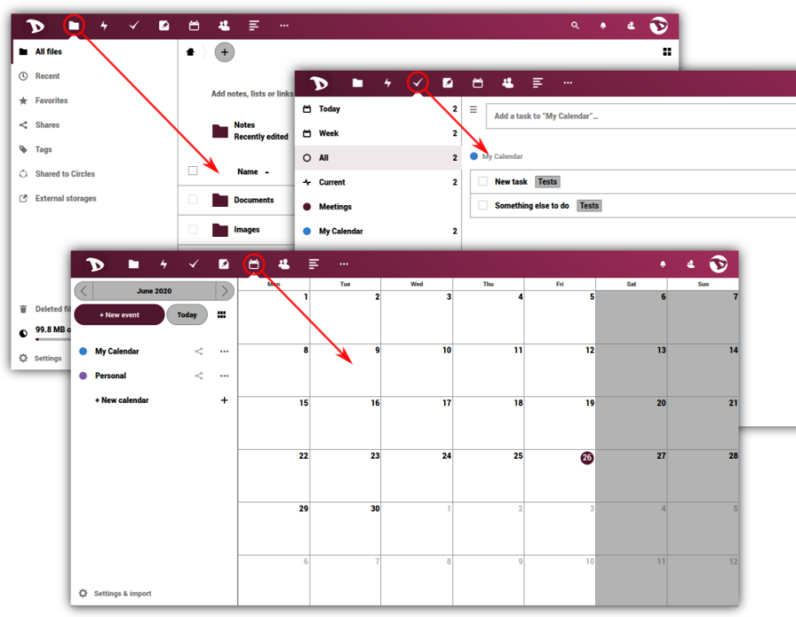
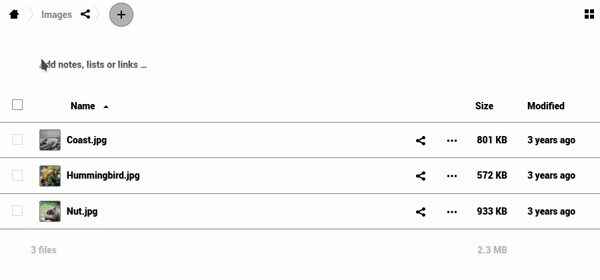
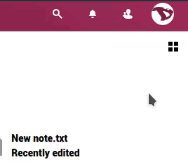

# L'interface utilisateur (IU)

 

This is the main screen. After logging in, your **Cloud** will surely look like this. So, we will start here by learning it's sections and functions.

## 1. Apps navigation bar
In this bar you will find all the applications available on or integrated to the **Disroot** cloud, such as **Email**, **Files** and **Tasks** managers, **Notes**, **Calendar**, **Contacts**, **News**, **Bookmarks**, **Photos**, **Talk**, **Circles**, **Deck** and the **Activity** log.  *To learn about them, check [this section](/tutorials/cloud/apps)*.

  

## 2. Apps information section
When interacting with the apps, related information, options and filters will appear here.

  

## 3. Main apps view
This section displays the contents of a selected app.

  

## 4. Home
This button  leads you back to the root folder (the home folder) when you navigate through your files folders.

  

## 5. “New”
It enables you to upload a file and create new folders, text files or pads.

  

## 6. Espace de travail
Il vous permet d'apporter un contexte à vos dossiers, en ajoutant des notes et même des listes de tâches et des liens vers des fichiers en haut. Ceci est utile pour coordonner le travail avec d'autres personnes, en s'assurant que chacun sait à quoi sert un dossier particulier. Vous pouvez également voir une courte liste avec les derniers fichiers ou dossiers modifiés.

  

  Vous pouvez activer/désactiver l'espace de travail riche en cliquant sur l'icône des paramètres en bas de la barre de gauche.

  

## 7. Recherche
En cliquant sur l'icône de la loupe, vous pouvez rechercher des fichiers.

  

## 8. Notifications
Chaque fois que vous partagez un lien/fichier/dossier ou que quelqu'un le partage avec vous, qu'il y a des changements dans un document, une modification dans un fichier ou que d'autres utilisateurs ou administrateurs envoient un message, vous serez notifié ici (un point surligné apparaîtra).

  

## 9. Le menu des contacts
Vous trouverez ici vos contacts et utilisateurs sur le serveur.

  

## 10. Le menu des paramètres
En cliquant dessus, un menu déroulant apparaît et vous pouvez accéder aux paramètres personnels et aux fonctionnalités. Certains de ces paramètres vous permettent de changer ou de modifier votre profil, votre mot de passe, votre langue, de gérer les notifications et les appareils connectés, etc. Nous les verrons en détail dans le prochain chapitre.

  

## 11. Le sélecteur de vue
En cliquant dessus, vous pourrez modifier la façon dont la section d'affichage des applications principales affiche vos fichiers. Vous pouvez passer de la vue grille à la vue icône et vice versa.

  
