# Interfaccia utente (UI)

 

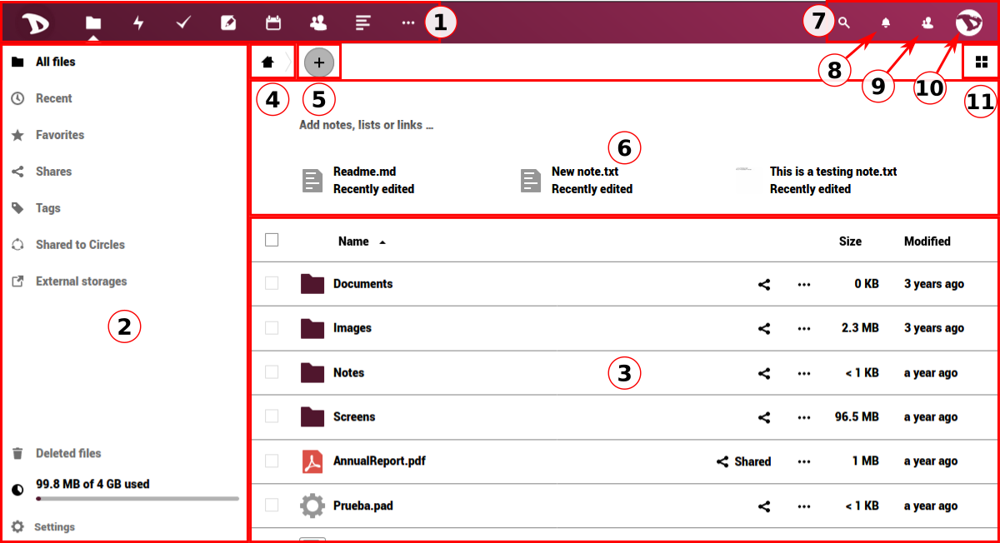

Questa è la schermata principale. Dopo aver effettuato l'accesso, il tuo **Cloud** avrà questo aspetto. Quindi, inizieremo qui imparando le sue sezioni e funzioni. 

## 1. Barra di navigazione delle app
In questa barra troverai tutte le applicazioni disponibili o integrate nel cloud di **Disroot** come ad esempio: **Email**, **File**, **Tasks** manager, **Note**, **Calendario**, **Contatti**, **News**, **Segnalibri**, **Foto**, **Talk**, **Circle**, **Deck** e le **Attività** (log).  *Per scoprire questi servizi, guarda [questa sezione](/tutorials/cloud/apps)*.

  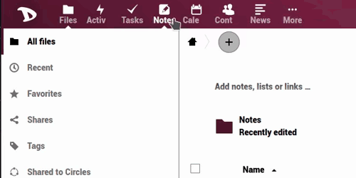

## 2. Sezione informazioni sulle app
Quando si interagisce con le app, le informazioni correlate, le opzioni e i filtri verranno visualizzati qui. 
  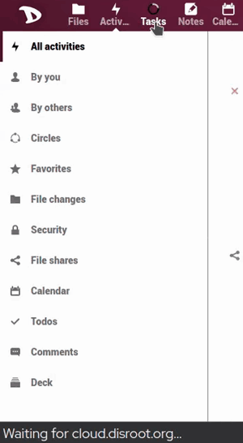

## 3. Visualizzazione principale delle app
Questa sezione mostra i contenuti di un'app selezionata.
  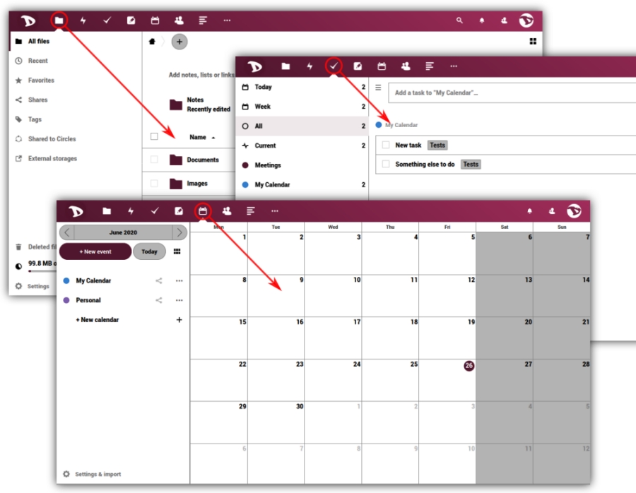

## 4. Home
Questo pulsante  ti riporta alla cartella principale (la cartella home) quando navighi tra le cartelle dei file. 
  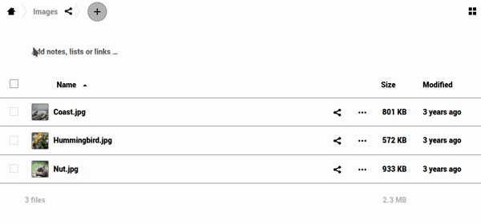

## 5. “New”
Ti consente di caricare un file e creare nuove cartelle, file di testo o pad.

  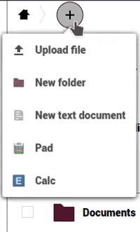

## 6. Area di lavoro
Ti consente di dare un contesto alle tue cartelle, aggiungendo note e persino elenchi di cose da fare e collegamenti ai file in cima. Questo è utile per coordinare il lavoro con altre persone, assicurandosi che tutti sappiano a cosa serve una particolare cartella. Puoi anche vedere un breve elenco con gli ultimi file o cartelle modificati. 

  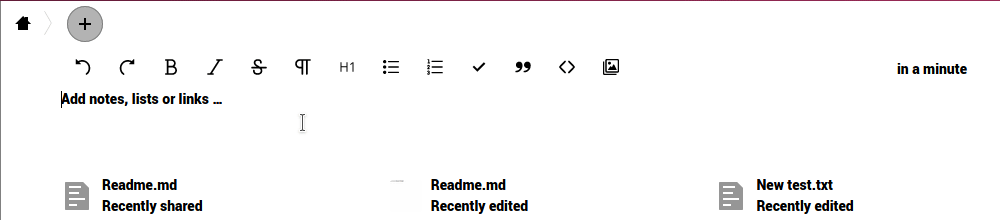

Puoi abilitare/disabilitare il "rich workspace" facendo clic sull'icona delle impostazioni nella parte inferiore della barra di sinistra. 

  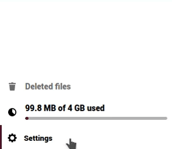

## 7. Cerca
Cliccando sull'icona della lente di ingrandimento puoi cercare i file. 

  

## 8. Notifiche
Ogni volta che condividi un link/file/cartella o qualcuno lo condivide con te, ci sono modifiche a un documento, una modifica a un file o altri utenti o amministratori inviano un messaggio, sarai avvisato qui (apparirà un punto evidenziato).

  

## 9. Il menu dei contatti
Qui troverai i tuoi contatti e utenti sul server. 

  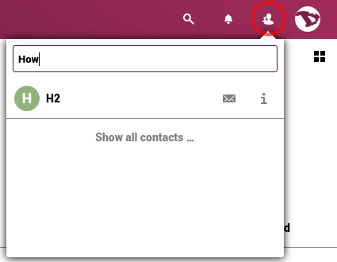

## 10. Il menu delle impostazioni
Facendo clic su di esso, viene visualizzato un menu a discesa e puoi accedere alle impostazioni personali e delle funzionalità. Alcune di queste impostazioni ti permettono di cambiare o modificare il tuo profilo, password, lingua, gestire le notifiche e i dispositivi collegati, ecc. Lo vedremo nel dettaglio nel prossimo capitolo. 

  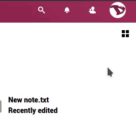

## 11. Il selettore di visualizzazione
Facendo clic su di esso, sarai in grado di cambiare il modo in cui la sezione di visualizzazione delle app principali mostra i tuoi file. È possibile passare dalla visualizzazione griglia alla visualizzazione icone e viceversa. 
  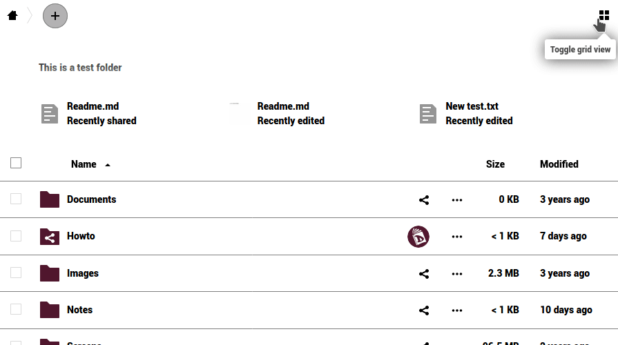
