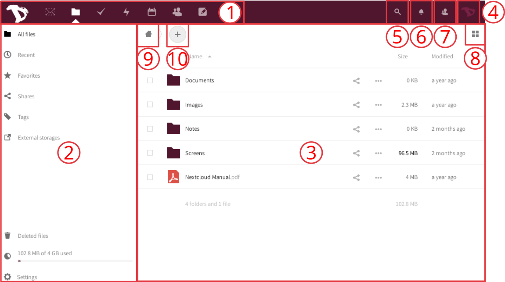
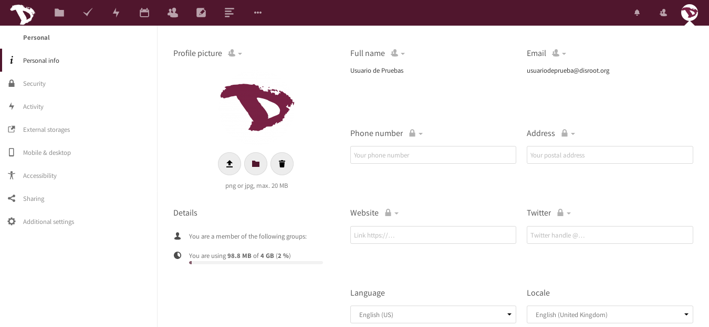
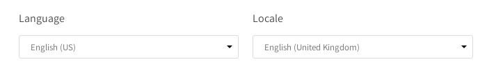
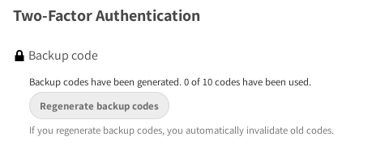
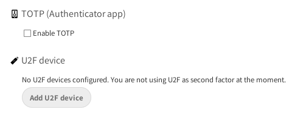
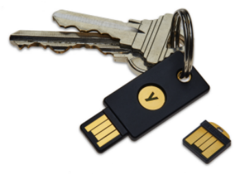
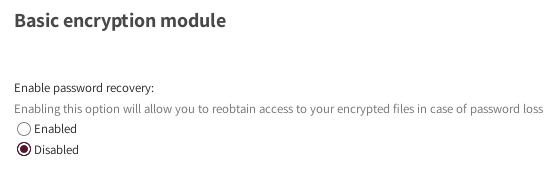
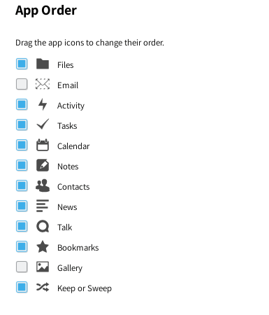

# Interfaccia utente (UI)

 

Questa è la schermata principale. Come potrai notare è piuttosto semplice. Diamo un'occhiata più da vicino.

Dopo aver effettuato l'accesso, trovi tre sezioni o blocchi principali e alcuni pulsanti che ti permettono di accedere a delle funzioni particolari:
1. **La barra di navigazione delle app**: qui hai le applicazioni cloud disponibili su Disroot, come gestore file e attività, calendario, contatti, note, segnalibri e il registro delle attività. Per informazioni sulle app, seleziona [questa sezione] (/tutorials/cloud/apps).
2.**La sezione delle informazioni sulle app**: quando si interagisce con le app, qui verranno visualizzate informazioni, opzioni e filtri correlati.
3.**La visualizzazione delle app principali**: in questa sezione vengono visualizzati i contenuti di un'app selezionata.
4. **Il menu delle impostazioni**: facendo click su di esso, viene visualizzato un menu a discesa e puoi accedere alle impostazioni personali e delle funzionalità. Alcune di queste impostazioni ti consentono di cambiare o modificare il tuo profilo, password, lingua, gestire le notifiche e i dispositivi connessi, ecc. Lo vedremo più avanti.
5. **Il campo di ricerca**: facendo click sull'icona della lente di ingrandimento è possibile cercare i file.
6.**Le notifiche**: che si tratti di un link/file/cartella che hai condiviso (o che è stato condiviso con te), una modifica su un file condiviso o un messaggio, sarai avvisato qui.
7. **Il menu dei contatti**: qui troverai i tuoi contatti e gli utenti presenti sul server.
8. **Il selettore vista**: cliccando su di esso, sarete in grado di cambiare il modo in cui le principali applicazioni visualizzeranno i file. È possibile passare (commutare) dalla visualizzazione griglia alla visualizzazione icona e viceversa.
9.**Il pulsante di navigazione**: questo pulsante ti riporta alla cartella principale quando navighi attraverso le cartelle dei tuoi file.

10. **Il pulsante “nuovo”**: consente di caricare un file e creare nuove cartelle, file di testo o pad.

----------

# Impostazioni personali
Cominciamo guardando cosa puoi configurare e personalizzare sul tuo account cloud.   
Fai clic sulla tua immagine del profilo nell'angolo in alto a destra e scegli **"Impostazioni"** *(se non hai ancora impostato un'immagine, vedrai un avatar rotondo con la prima lettera del tuo nome utente all'interno)*.

Le impostazioni sono divise in sezioni. Nella *sezione sinistra* troverai collegamenti rapidi alle diverse opzioni. Vediamoli ...

### Informazioni personali
**Questo è il luogo in cui puoi aggiungere informazioni su di te, che poi puoi scegliere di condividere con gli altri.**  
Facendo clic sull'icona "lucchetto" accanto al titolo delle informazioni, è possibile impostare il livello di privacy che si desidera assegnare ad esso. Per impostazione predefinita, l'immagine del profilo, il nome completo e l'e-mail sono impostati per essere visibili solo agli utenti locali e ai server di cui ti fidi.

I livelli che puoi scegliere sono:

- **Privato**: sei la sola persona che che può vedere queste informazioni
- **Locale**: le informazioni saranno visibili agli altri utenti di **Disroot** (solo se quest'ultimi conoscono il tuo username)
- **Contacts**: Oltre agli altri utenti **Disroot**, le informazioni saranno condivise con gli utenti su altre istanze Nextcloud quando condividi dati o file con loro.
- **Public**: Le informazioni saranno inviate a una rubrica globale (il che significa che possono essere visualizzate da chiunque)

!! **NOTA:**
!! Dovresti prestare particolare attenzione durante la compilazione di queste informazioni *(che sono facoltative)* e decidere quante informazioni su di te vuoi condividere e rivelare agli altri.

#### Altre informazioni e impostazioni
Sotto l'immagine del profilo puoi vedere:
- **I gruppi a cui appartieni (se presenti). Per impostazione predefinita, gli account ** Disroot ** non sono associati a nessun gruppo.
- **La quota** di spazio che stai utilizzando.

Inoltre puoi anche cambiare la lingua.

-----
# Sicurezza
Sicurezza è il posto dove puoi vedere, aggiungere o revocare impostazioni legate alla sicurezza.

## Dispositivi & sessioni
Qui puoi vedere quanti dispositivi sono attualmente connessi al tuo account. Se non riconosci un dispositivo connesso, potrebbe significare che il tuo account è stato compromesso e dovresti procedere con la modifica della password.

!! **NOTA:**
!! Tieni presente che, ad esempio, ogni browser, dispositivo mobile, computer e così via verrà mostrato come dispositivo separato ogni volta che cambi rete. Quindi non impazzire all'inizio. Basta seriamente ricontrollare tutto, prima di passare alla modalità paranoica.

### Password per applicazioni
Quando l'autenticazione a due fattori è abilitata, le applicazioni di terze parti (come e-mail, note o client di notizie) non saranno in grado di accedere al proprio account solo con le credenziali dell'utente. Per questi dispositivi è possibile creare una password specifica per l'app.

## Autentificazione a due fattori

**Cos'è l'autentificazione a due fattori (2FA)?** 
È un processo di sicurezza che prevede una verifica in due passaggi: 
1) qualcosa che conosci (come una password), 
2) qualcosa che hai (come un security token, un codice QR, ecc.) o 
3) qualcosa di tuo (come le tue impronte digitali). 

Un esempio di come funziona: quando vai a un bancomat per estrarre denaro devi utilizzare la tua carta di credito (qualcosa che hai) e un PIN (qualcosa che conosci). Se la combinazione fallisce, non puoi estrarre il denaro.

L'autentificazione a due fattori può essere usata se vuoi aumentare la sicurezza del tuo login (puoi approfondire [qui](https://en.wikipedia.org/wiki/Multi-factor_authentication)). Quando abilitato, sarai chiamato non solo ad inserire nome utente e password, ma pure ad un ulteriore fattore di autentificazione come OTP (one-time-password). 

### Autentificazione a due fattori - codici di backup
È consigliabile scaricare i codici di backup dopo aver abilitato l'autentificazione a due fattori. Se, per qualche motivo, la tua app OTP non funziona o *hai perso il telefono!*, puoi comunque accedere. Dovresti conservare questi codici di backup in un luogo sicuro (*non il tuo telefono!*). Ciascun codice ti consente di accedere una volta. Una volta entrato, puoi riconfigurare il tuo OTP o disabilitare due fattori.

### TOTP and U2F
**Disroot** offfre due possibilità di autentificazione a due fattori:

- **TOTP (One-Time-Password)**: TOTP è simile a Google Authenticator. Questa è un'app che puoi eseguire sul tuo telefono e genera una password basata sul tempo. Alcuni autenticatori open source lo sono [andOTP](https://f-droid.org/en/packages/org.shadowice.flocke.andotp/) e [FreeOTP](https://f-droid.org/en/packages/org.liberty.android.freeotpplus/).

- **U2F (Universal 2nd factor)**: U2F usa un device come [USB key di Yubico](https://en.wikipedia.org/wiki/YubiKey). Collega il dispositivo al laptop e premi il pulsante del dispositivo per autorizzare. Dopo averlo aggiunto, il browser comunicherà con il dispositivo U2F per autorizzare l'accesso.

|TOTP|U2F|
|:--:|:--:|
|||

Puoi aggiungere tutti i dispositivi che desideri. Si consiglia di assegnare a ciascun dispositivo un nome univoco. Chrome è l'unico browser che supporta i dispositivi U2F per impostazione predefinita. Per utilizzare U2F è necessario installare il "Componente aggiuntivo di supporto U2F" su Firefox.

### Modulo di cifratura di base
Qui puoi decidere se un amministratore sarà in grado di recuperare i tuoi file se perdi la password. Questa opzione è disabilitata per impostazione predefinita in quanto consente agli amministratori di Disroot di decrittografare e visualizzare i file.

!! **NOTA:**
!!**L'abilitazione di questa opzione dopo la perdita della password non ripristinerà i tuoi file!** Devi prendere questa decisione in anticipo. **Ti consigliamo vivamente di conservare la password in un luogo sicuro.** 
Questo è il modo migliore per proteggere i tuoi file e il tuo account. Noi non vogliamo avervi accesso.

----

# Attività
Nella sezione Attività puoi scegliere come vuoi essere informato su ciò che sta accadendo sul tuo cloud. Puoi ricevere notifiche e-mail, ricevere notifiche nel flusso di attività o addirittura non ricevere alcuna notifica. Se si sceglie di ricevere notifiche e-mail, è possibile impostare la frequenza da "**Non appena possibile** a **Oraria**, **Giornaliera** o **Settimanale**.

----
# Archiviazioni esterne
L'applicazione di archiviazione esterna consente di montare servizi e/o dispositivi di archiviazione esterni come dispositivi di archiviazione Nextcloud secondari.

## Configuazione dell'archiviazione esterna

### Autentificazione

- **Nome utente e password**: richiede un nome utente e una password definiti manualmente. Questi vengono passati direttamente al back-end e vengono specificati durante l'installazione del punto di montaggio.
- **Credenziali di accesso, salva nella sessione**: utilizza le credenziali di accesso di Nextcloud per connettersi alla memoria. Questi non vengono archiviati in nessun punto del server, ma piuttosto nella sessione dell'utente, garantendo una maggiore sicurezza. Gli svantaggi sono che la condivisione è disabilitata quando questo meccanismo è in uso, poiché Nextcloud non ha accesso alle credenziali di archiviazione e la scansione dei file in background non funziona.
- **Credenziali di accesso, salva nel database**: come il metodo precedente, utilizza le credenziali di accesso per connettersi all'archiviazione, ma queste sono archiviate nel database crittografato con il segreto condiviso. Ciò consente di condividere file da questo punto di montaggio.
- **Credenziali globali**: utilizza il campo di input generale per "Credenziali globali" nella sezione delle impostazioni di archiviazione esterna come origine per le credenziali anziché le singole credenziali per un punto di montaggio.

----
# Mobile e desktop
Qui troverai scorciatoie per le applicazioni Nextcloud mobili e desktop.

----
# Accessibilità
In questa sezione puoi cambiare il tema predefinito ad alto contrasto con il tema scuro e il carattere nuvola predefinito con il carattere Dislessia.

----
# Condivisione

## Cloud federata
Che cos'è il cloud federato? Proprio come le e-mail che possono essere inviate tra utenti su server diversi (gmail, riseup, disroot ecc.), anche Nextcloud ti dà l'opportunità di condividere file, contatti, calendari ecc. con persone al di fuori di tale servizio che usano anche soluzioni cloud simili. Ciò dà la libertà agli utenti di utilizzare la piattaforma di loro scelta pur essendo in grado di collaborare tra loro. In questa sezione puoi vedere il tuo ID federativo. Puoi condividerlo con altri semplicemente inviando un link.

------
# Impostazioni aggiuntive

## Ordine delle applicazioni

