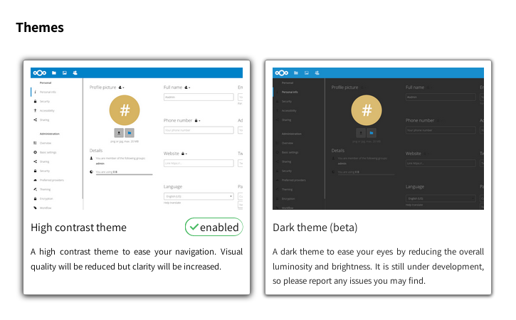

----
# The User Interface (UI)

||
|:--:|
|This is the main screen and, as you have noted, is pretty straightforward. Let’s take a closer look at it.|

After logged in, you'll find three main sections or blocks and some functions buttons:
1. **The apps navigation bar**: here you have the cloud applications available on Disroot, such as Files and Tasks managers, Calendar, Contacts, Notes, Bookmarks and the Activity log. To learn about the apps, check [this section](/cloud/apps).
2. **The apps information section**: when interacting with the apps, related information, options and filters will appear here.
3. **The main apps view**: this sections displays the contents of a selected app.
4. **The settings menu**: by clicking on it, a dropdown menu appears and you can access to the personal and features settings. Some of this settings allows you to change or modify your profile, password, language, manage notifications and connected devices, etc. We’ll see it later on.
5. **The search field**: by clicking on the magnifier icon you can search files.
6. **The notifications**: whether it be a link/file/folder you’ve shared (or that has been shared with you), a modification on a shared file or a message, you’ll be notified by a highlighted point here.
7. **The contacts menu**: here you’ll find your contacts and users on the server.
8. **The view selector**: by clicking on it, you’ll be able to change the way the main apps view section displays your files. You can toggle from grid view to icon view and vice versa.
9. **The navigation button**: this button leads you back to the root folder (the home folder) when you navigate though your files folders.
10. **The “new” button**: it enables you to upload a file and create new folders, text files or pads.

----------

# Personal Settings
Let's start by looking at what you can setup and customize on your cloud account. Click on your profile picture on the top right corner and choose **"Settings"** *(if you didn't set a picture yet, you'll see a round avatar with the first letter of your user name inside)*.

The settings are divided into sections. On the *left-section* you'll find quick links to the different options. Let's see them...

|Personal Info|
|:--:|

|This is the place where you can add information about yourself, which then you can choose to share with others.|
|--|
|By clicking on the "lock" icon right next to information title, you can set the privacy level you want to assign to it. By default, your profile picture, full name and email are set to be visible only to the local users and the servers you trust.|

The levels you can choose are:

- **Private**: You are the only person that can see this information
- **Local**: The information will be visible to other **Disroot** Cloud users (only if they know your username)
- **Contacts**: Besides other **Disroot** Cloud users, the information will be shared with users on other Nextcloud instances when you share data or files with them.
- **Public**: The information will be sent to a global address book (which means it can be viewed by anyone)

| **NOTE**|
|:--:|
|You should pay extra attention when filling up this information *(which is optional)* and decide how much information about yourself you want to share and reveal to others.|

## Other information and settings
Below the profile picture you can see:
- **the groups** you belong to (if any). By default, **Disroot** accounts are not associated with any group.
- **the quota** of storage space you're using.

Additionally, you can also change your preferred language.

-----
# Security
|Security is the place where you can review, set (additional) and revoke security settings.|
|:--:|
||

## Devices & sessions
Here you can see how many devices are currently connected to your account. If you don't recognize one connected device, it might mean your account has been compromised and you should proceed to change your password.

| **NOTE**|
|:--:|
|Keep in mind that every browser, mobile, computer, etc., will be shown as separate devices each time you change your network, for example. So don't freak out at first. Just seriously double check everything, before you go full on paranoid mode|

### App password
When Two-Factor Authentication is enable, third party applications (like your email, notes or news clients) won't be able to login your account with your user credentials only. For these devices you can create a specific password for the app.

## Two-factor authentication

|What is Two-factor authentication (2FA)?|Is a security process that has a two steps verification, usually, the combination of two factors: 1) something you know (like a password), 2) something you have (could be a security token, a card, a QR code, etc.) or 3) something you are (like your fingerprint). An example of how it works: when you go to an ATM to extract money you need to use your bank card (something you have) and a PIN (something you know). If the combination fails, you can't extract the money.|
|:--:|--|

Two-factor authentication can be used if you want have a more secure login (you can read more about it [here](https://en.wikipedia.org/wiki/Multi-factor_authentication)). When enabled, you will be asked not only for your login name and password, but also for an extra authentication like a one-time-password (OTP) or verification via a hardware device. 

### Two-factor backup codes
It's highly advisable to download backup codes when you have enabled two-factor. If, for some reason, your OTP app doesn't work (*you lost your phone!*), you still be able to login. You should keep these backup codes in a safe place (*not your phone!*) and each code allows you to login once. Once you are in you can reconfigure you OTP or disable two-factor.

### TOTP and U2F
Disroot offers two types of two-factor authentication:

- **TOTP (Time-based One-Time-Password)**: TOTP is like Google Authenticator. This is an app you can run on your phone and generates a time based password. Some open source authenticators are [andOTP](https://f-droid.org/en/packages/org.shadowice.flocke.andotp/) and [FreeOTP](https://f-droid.org/en/packages/org.liberty.android.freeotpplus/).

- **U2F (Universal 2nd factor)**: U2F uses a hardware device like the [USB key by Yubico](https://en.wikipedia.org/wiki/YubiKey). You plug the device into your laptop and press the device button to authorize. After adding it, the browser will communicate with the U2F device to authorize you to log in.

|TOTP|U2F|
|:--:|:--:|
|||

You can add as many devices as you like. It is recommended to give each device a distinct name. Chrome is the only browser that supports U2F devices by default. You need to install the "U2F Support Add-on" on Firefox to use U2F.

### Basic encryption module
Here you can decide whether or not an administrator will be able to recover your files in case you loose your password. This option is disabled by default as it enables admins of Disroot to decrypt and view your files.

| **NOTE**|
|:--:|
|**Enabling this option after your password was lost will not recover your files!** You need to make this decision beforehand. **We strongly encourage you to never loose your password in the first place and keep it stored safe.** This is the best way to keep your files and your account safe. We really don't want to have access to it.|

----

# Activity
In the Activity section you can choose how do you want to be informed about what's happening on your cloud. You can get email notifications, being notified in the Activity stream or even not being notified at all. If you choose to get email notifications, you can set the frecuency from "**As soon as posible** to **Hourly**, **Daily** or **Weekly**.

----
# External storages
The External Storage application allows you to mount external storage services and/or devices as secondary Nextcloud storage devices.

## Configuring an external storage

### Authentication

- **Username and password**: it requires a manually-defined username and password. These get passed directly to the backend and are specified during the setup of the mount point.

- **Log-in credentials, save in session**: it uses your Nextcloud login credentials to connect to the storage. These are not stored anywhere on the server, but rather in the user session, giving increased security. The drawbacks are that sharing is disabled when this mechanism is in use, as Nextcloud has no access to the storage credentials, and background file scanning does not work.

- **Log-in credentials, save in database**: as the previous method, it uses your login credentials to connect to the storage, but these are stored in the database encrypted with the shared secret. This allows to share files from within this mount point.

- **Global credentials**: it uses the general input field for “Global credentials” in the external storage settings section as source for the credentials instead of individual credentials for a mount point.

----
# Mobile & desktop
Here you'll find shortcuts to the mobile and desktop Nextcloud applications.

----
# Accesibility
In this section you can change the default high contrast theme to the dark theme and the default cloud font to the Dyslexia font.

----
# Sharing

## Federated cloud
What is federated cloud? Just like emails that can be send between users on different servers (gmail, riseup, disroot etc) also nextcloud gives you opportunity to share files, contacts, calendars etc. with people outside of disroot that also use similar cloud solution (owncloud and / or nextcloud). This gives the freedom to the users to use platform of their choice while being able to collaborate with each other. In this section you can see your federation ID. You can share it with others by just sending a link or via predefined platforms (to which you can add your preferred ones that are not included of course).

------
# Additional settings

## App order

----------
