# Files

The main task of the cloud is managing files. You can easily upload, download, share and comment them.

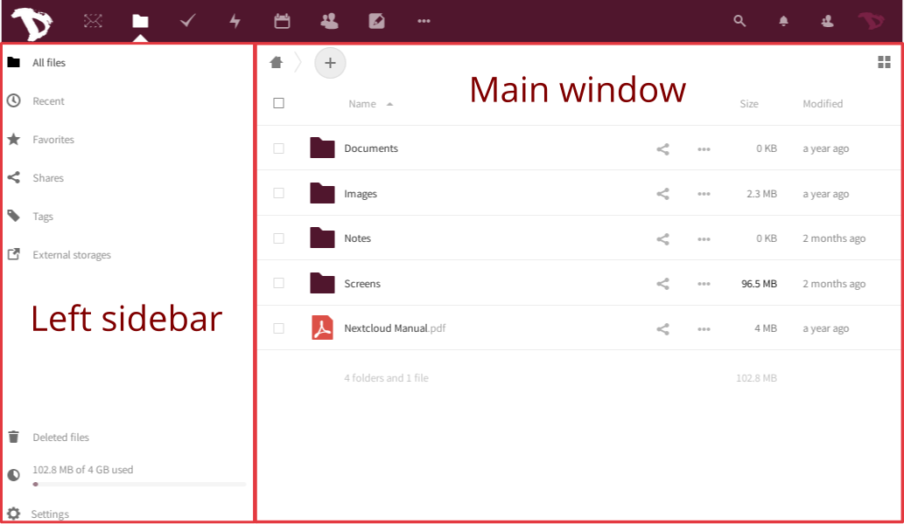

The *left-sidebar* let's you filter files based on certain criteria (recents, favorites, shared, by tags). The *Main window* is your file-browser (you should be familiar with it if you ever used a computer before... 

## Creating new files or directories
To create a new file, just click on **"+"** button and choose the type of file from the list. The same procedure aplies to create directories and pads.

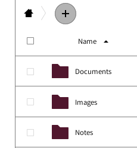

## Uploading files
There are two ways to upload files:

By dragging files from your "computer" (file browser) onto the cloud web browser window.

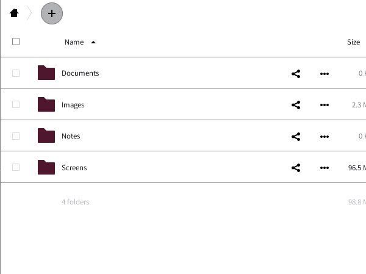

By using the **"+"** icon and selecting the "**Upload a file**" option.

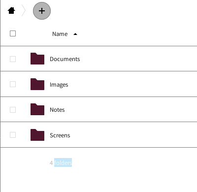

## File / Directory operations menu
By clicking on the **"three dots"** icon next to the filename or directory you can access to some extra options. Those options are self explanatory. You can "Add to favorites", see the "Details", "Rename", "Move or copy", "Download" or "Delete" the file or directory.

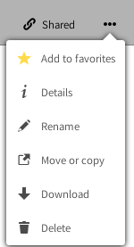

## File Sharing
Sharing files and directories is an essential part of any cloud storage service. You can choose to share files with other Disroot users, an entire group or even with other users using OwnCloud/Nextcloud on different platforms. You can also share with anyone out there through the public link option.

To share a file or directory just click the "*share icon*" () right next to the name of the item you want to share. A right-bar popup will show up with all the sharing options for you to choose from.

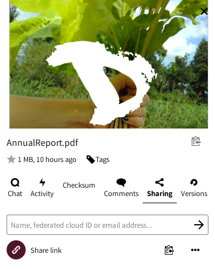

You might share with other users, groups, or users on different cloud servers using the federation address. To do so, you will have to type their entire usernames because **we don't provide autocompletion for privacy reasons**. 

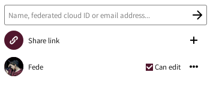

When sharing with other users or groups, you can choose if they have rights to edit and/or re-share the shared file. You can also set an expiration date for it and send a note to the recipients.

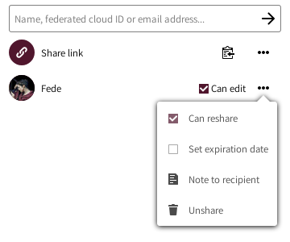

You can also share a file or directory with anyone by using the  option. It allows you to copy/paste a link and share it. Any person who knows the address (url) will be able to access the file. They don't need to have an account. This option enables you to set editing permissions, protect the link with a password, hide the download and set an expiration date.

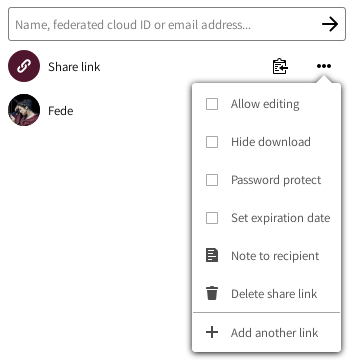

## Additional file operations

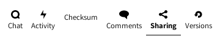

As you may have noticed when setting up sharing, there are more options in the right-sidebar.
They are:

**Chat** 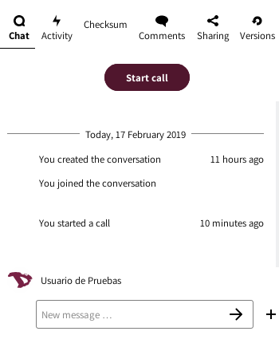

You can start a call or chat with the users you've shared a file or directory.

**Activity** 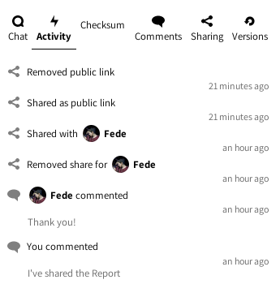

It gives you an overview of all events with the file. The time it was created, when it was shared, removed, edited, commented on, etc.

**Comments** 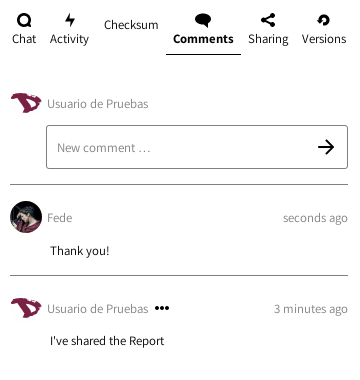

This is a very useful feature when you're working on a file with other users. Everyone you've shared the file with can read and add comments. By clicking on the three dots icons right next to your username, you can edit your comment.
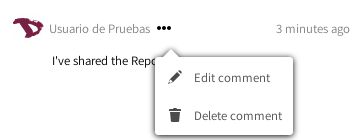

**Versions** 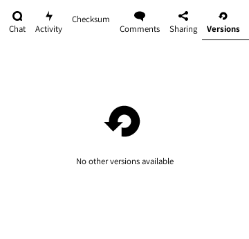

It lets you view all the changes done to a file. You can download previous revisions of a file as well as restore it to previous revision (deleting all changes done after).

----------

# Activity 

If your account start getting busy, let's say, for example, you start collaborating with (many) other users and groups, you could find the **"Activity"** app very useful. With it, you have a general overview on all the events happening within your cloud account (file changes, comments, shares, contacts, todos, calendars etc).

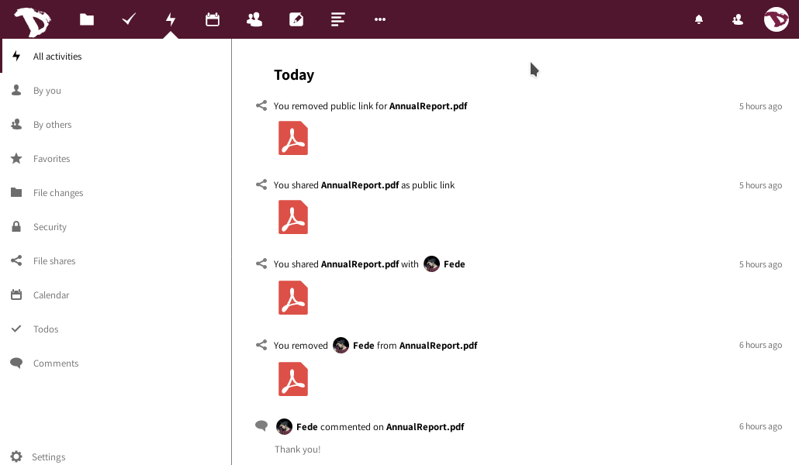

The main window gives you a timeline with all events, and the left sidebar let's you filter the information based on certain criteria.

Additionally, you can create a RSS feed of your activities which you can follow using your favorite rss reader, share it with someone or integrate it in your application or website. To do it, just press the "Settings" button at the bottom left-sidebar and enable the RSS feed option.

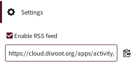

----------
