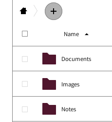
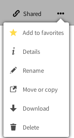
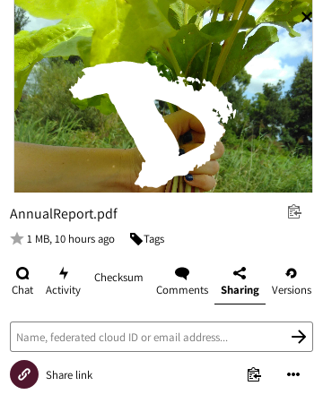

# ARCHIVOS

La principal tarea de la nube es administrar archivos. Puedes fácilmente subir, descargar, compartir y comentar.

La *barra lateral izquierda* te permite filtrar archivos basándose en ciertos criterios (recientes, favoritos, compartidos, por etiquetas). La *Ventana principal* es tu navegador de archivos (deberías estar familiarizado con él si alguna vez utilizaste una computadora antes... )

## Crear nuevos archivos o directorios
Para crear un archivo nuevo, sólo haz click sobre el botón **"+"** y elige el tipo de archivo de la lista. Puedes crear tanto directorios como archivos de textos y blocks de notas.

## Subir archivos
Hay dos maneras de subir archivos.
Puedes hacerlo arrastrando archivos desde tu equipo (navegador de archivos) hacia la ventana de navegación de la nube. La otra manera es utilizando el ícono **"+"** y seleccionar la opción **"Subir un archivo"**.

## Compartir archivos
Compartir archivos y directorios es una parte esencial de cualquier servicio de almacenamiento en la nube. Puedes elegir compartir archivos con otros usuarios de **Disroot** o tu grupo entero, pero también con otros usuarios que utilicen **Owncloud/Nextcloud** en diferentes plataformas. También puedes compartir con cualquiera a través de la opción Enlace público.

Para compartir un archivo o un directorio, simplemente haz click en el "*ícono compartir*" justo al lado del nombre del objeto que deseas compartir. Una barra derecha emergente aparecerá con todas las opciones para que elijas una manera de hacerlo.

Puedes decidir compartir con otros usuarios, grupos o usuarios en diferentes servidores de nube, utilizando la dirección federada o tipeando el nombre de usuario completo (**no proveemos autocompletado por razones de seguridad**). Cuando compartes con otros usuarios o grupos puedes decidir si los usuarios tienen o no privilegios para editar/modificar el contenido de lo compartido (borrar archivos, subir, editar), y si pueden volver a compartirlo con respecto a otros usuarios.

Además de compartir con otros usuarios, puedes compartir tus datos con cualquiera utilizando "Compartir Enlace", que puedes copiar/pegar a quien quieras. Cualquiera que conozca la dirección (url) podrá acceder a los archivos. La persona no necesita tener una cuenta válida. Compartir un enlace te da la opción extra de proteger lo que compartes con contraseña y fecha de caducidad.

## Comentarios, Actividades, Versión
Como habrás notado cuando configurabas Compartir, hay más opciones en la barra derecha.

 - **Actividades:** te da un resumen de todas las actividades con el archivo. El momento en que fue creado, cuándo fue compartido, editado, comentado, etc.
 - **Comentarios:** son muy útiles cuando trabajas sobre el archivo con otros usuarios. Todos aquellos con los que has compartido el archivo pueden leer y agregar comentarios.
 - **Versiones:** te permite ver todos cambios realizados al archivo. Puedes descargar revisiones previas del archivo, así como restaurar a una versión previa (borrando todos los cambios realizados posteriormente).

## Otras operaciones de archivo
Haciendo click en el ícono de **"tres puntos**" próximo al nombre del archivo o directorio, te da opciones extra. Esas opciones se explican solas. Puedes "Renombrar", "Mover", "Descargar" o borrar el archivo o directorio.

----------

#Actividades

Cuando tu cuenta comience a ponerse agitada, empieces a colaborar con muchos otros usuarios y grupos, podrías encontrar muy útil la aplicación **"Actividades"**. Aquí tienes un resumen general de todas las actividades sucediendo dentro de tu cuenta en la nube (cambios de archivos, comentarios, compartidos, contactos, pendientes, calendarios, etc).

La ventana principal te da una línea de tiempo con todas las actividades, y la barra lateral izquierda te permite filtrar la información según un criterio.

Adicionalmente puedes crear un aviso de actualizaciones RSS de tus actividades (Presiona el "botón configuraciones" al final de la barra lateral izquierda), que puedes seguir utilizando tu lector preferido de RSS, compartirlo con alguien o integrarlo en tu aplicación o sitio web (agregar el feed a tu sala matrix, por ejemplo).

----------

## Creating new files or directories
To create a new file, just click on **"+"** button and choose the type of file from the list. The same procedure aplies to create directories and pads.

## Uploading files
There are two ways to upload files:

|By dragging files from your "computer" (file browser) onto the cloud web browser window.|
|:--:|
||

|By using the **"+"** icon and selecting the "**Upload a file**" option.|
|:--:|
||

## File / Directory operations menu
By clicking on the **"three dots"** icon next to the filename or directory you can access to some extra options. Those options are self explanatory. You can "Add to favorites", see the "Details", "Rename", "Move or copy", "Download" or "Delete" the file or directory.

## File Sharing
Sharing files and directories is an essential part of any cloud storage service. You can choose to share files with other Disroot users, an entire group or even with other users using OwnCloud/Nextcloud on different platforms. You can also share with anyone out there through the public link option.

To share a file or directory just click the "*share icon*" () right next to the name of the item you want to share. A right-bar popup will show up with all the sharing options for you to choose from.

You might share with other users, groups, or users on different cloud servers using the federation address. To do so, you will have to type their entire usernames because **we don't provide autocompletion for privacy reasons**. 

When sharing with other users or groups, you can choose if they have rights to edit and/or re-share the shared file. You can also set an expiration date for it and send a note to the recipients.

You can also share a file or directory with anyone by using the  option. It allows you to copy/paste a link and share it. Any person who knows the address (url) will be able to access the file. They don't need to have an account. This option enables you to set editing permissions, protect the link with a password, hide the download and set an expiration date.

## Additional file operations

As you may have noticed when setting up sharing, there are more options in the right-sidebar.
They are:

|**Chat** |
|:--:|
|You can start a call or chat with the users you've shared a file or directory.|

|**Activity** |
|:--:|
|It gives you an overview of all events with the file. The time it was created, when it was shared, removed, edited, commented on, etc.|

|**Comments** |
|:--:|
|This is a very useful feature when you're working on a file with other users. Everyone you've shared the file with can read and add comments. By clicking on the three dots icons right next to your username, you can edit your comment.|
||

|**Versions** |
|:--:|
|It lets you view all the changes done to a file. You can download previous revisions of a file as well as restore it to previous revision (deleting all changes done after).|

----------

# Activity 

If your account start getting busy, let's say, for example, you start collaborating with (many) other users and groups, you could find the **"Activity"** app very useful. With it, you have a general overview on all the events happening within your cloud account (file changes, comments, shares, contacts, todos, calendars etc).

The main window gives you a timeline with all events, and the left sidebar let's you filter the information based on certain criteria.

Additionally, you can create a RSS feed of your activities which you can follow using your favorite rss reader, share it with someone or integrate it in your application or website. To do it, just press the "Settings" button at the bottom left-sidebar and enable the RSS feed option.

----------
