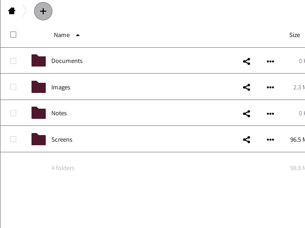
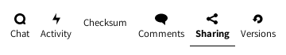
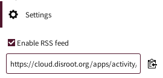

# File

Uno degli obiettivi principali del cloud è quello di gestire i file. Puoi in modo semplice caricarli, scaricarli, condividerli e commentarli.

La *barra laterale sinistra* ti consente di filtrare i file in base a determinati criteri (recenti, preferiti, condivisi, per tag).   La *finestra principale* è il tuo file browser* (dovresti avere familiarità con esso se hai già utilizzato un computer...) *

## Creare nuovi file o cartelle
Per creare un nuov file, basta cliccare sull'icona **"+"** e scegliere il tipo di file dalla lista. La stessa procedura si applica per la creazione di cartelle.

## Caricare un file
Ci sono due modi per caricare un file:

Trascinando il file dal tuo computer dentro la finestra del web browser.

Utilizzando l'icona **"+"** e selezionando l'opzione **carica file**.

## Menu file e cartelle
Cliccando sull'icona con i **"tre puntini"** a fianco del file o della cartella si ha la possibilità di accedere alle opzioni. Le varie possibilità si spiegano da sole: puoi aggiungere i contenuti ai tuoi preferiti, vedere i dettagli, rinominare, spostare, scaricare o eliminare file o cartelle.

## Condivisione file

La condivisione di file e directory è una parte essenziale di qualsiasi servizio di archiviazione cloud. Puoi scegliere di condividere file con altri utenti Disroot, un intero gruppo o anche con altri utenti utilizzando OwnCloud/Nextcloud su piattaforme diverse. Puoi anche condividere con chiunque là fuori tramite l'opzione di collegamento pubblico.

Per condividere un file o una directory, fai clic sull'icona "*condividi*" () proprio accanto al nome dell'elemento che desideri condividere. Verrà visualizzato un popup della barra di destra con tutte le opzioni di condivisione tra cui scegliere.

È possibile condividere con altri utenti, gruppi o utenti su server cloud diversi utilizzando l'indirizzo della federazione. Per fare ciò, dovrai digitare i loro nomi utente completi perché **non forniamo il completamento automatico per motivi di privacy**.  

Durante la condivisione con altri utenti o gruppi, è possibile scegliere se dispongono dei diritti per modificare e/o ricondividere il file condiviso. È inoltre possibile impostare una data di scadenza per esso e inviare una nota ai destinatari.

Puoi anche condividere un file o una directory con chiunque usando l'opzione. Ti permette di copiare/incollare un link e condividerlo. Chiunque conosca l'indirizzo (url) sarà in grado di accedere al file. Non hanno bisogno di avere un account. Questa opzione consente di impostare autorizzazioni di modifica, proteggere il collegamento con una password, nascondere il download e impostare una data di scadenza.

## Operazioni supplementari sui file

Come avrai notato durante l'impostazione della condivisione, ci sono più opzioni nella barra laterale destra.
Loro sono:

**Chat** 

Puoi iniziare una chiamata o una chat con gli utenti con i quali ai condiviso il file o la directory.

**Attività** 

Ti dà una panoramica di tutti gli eventi correlati con il file. Quando è stato creato, quando è stato condiviso, rimosso, modificato, commentato, ecc.

**Commenti** 

Questa è una funzione molto utile quando lavori su un file con altri utenti. Chiunque abbia condiviso il file può leggere e aggiungere commenti. Facendo clic sulle icone a tre punti accanto al tuo nome utente, puoi modificare il tuo commento.

**Versioni** 

Ti consente di visualizzare tutte le modifiche apportate a un file. È possibile scaricare le revisioni precedenti di un file e ripristinarlo alla revisione precedente (eliminando tutte le modifiche apportate dopo).

----------

# Attività

Se il tuo account inizia ad essere quasi pieno, perché ad esempio inizi a collaborare con (molti) altri utenti e gruppi, potresti trovare l'app **"Attività"** molto utile. Con essa hai una panoramica generale su tutti gli eventi che si verificano nel tuo account cloud (modifiche ai file, commenti, condivisioni, contatti, todos, calendari ecc.).

La finestra principale fornisce una sequenza temporale con tutti gli eventi e la barra laterale sinistra consente di filtrare le informazioni in base a determinati criteri.

Inoltre puoi creare un feed RSS delle tue attività che puoi seguire usando il tuo lettore rss preferito, condividerlo con qualcuno o integrarlo nella tua applicazione o sito web. Per farlo, basta premere il pulsante "Impostazioni" nella barra in basso a sinistra e abilitare l'opzione di feed RSS.

----------
