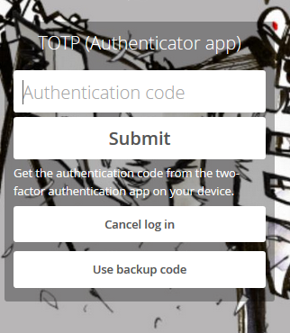
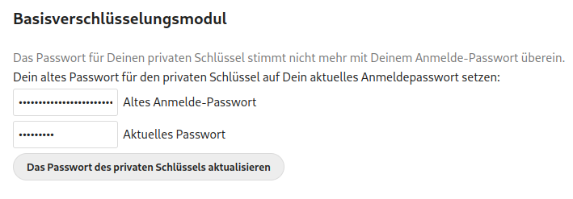

# Einstellungen
Hier kannst Du Deine persönlichen und die CLoud-Einstellungen einsehen und verwalten.

  

# Persönliche Einstellungen

Klicke auf Dein Profilbild in der oberen rechten Ecke und wähle **Einstellungen** *(wenn Du bisher kein Profilbild eingestellt hast, wirst Du dort einen runden Avatar mit dem ersten Buchstaben Deines Benutzernamens darin sehen)*.

  

## Persönliche Informationen

An dieser Stelle kannst Du Informationen über Dich selbst hinzufügen, welche Du dann, wenn Du das möchtest, mit anderen teilen kannst.

  

### 1. Profilbild

Durch einen Klick auf das "Benutzer"-Icon  (gleich neben der Überschrift "Informationen") kann Du das Level der Privatsphäre wählen, das Du auf Deine persönlichen Informationen anwenden willst. Standardmäßig ist die Privatsphäre für Dein Profilbild, Deinen vollen Namen und Deine Email-Adresse so eingestellt, dass sie nur für lokale Nutzer und von Dir vertraute Server sichtbar sind.

Abhängig von den Informationen kannst Du folgende Level wählen:

  - **Privat**: Nur Du kannst diese Informationen sehen

  - **Lokal**: Die Information ist nur für andere **Disroot Cloud** Nutzer sichtbar (und nur, wenn sie Deinen Benutzernamen kennen)

  - **Federated**: Zusaätzlich zu anderen **Disroot Cloud** Nutzern werden Deine Daten für Nutzer anderer **Nextcloud**-Instanzen sichtbar sein, wenn Du Daten oder Dateien mit ihnen teilst.

  - **Öffentlich**: Deine Informationen werden an ein globales Adressbuch gesendet (was bedeutet, dass jeder sie sehen kann)

!!**WICHTIG:**
!! Du solltest Dir beim Ausfüllen Deiner persönlichen Informationen *(was optional ist)* gut überlegen, wieviele Informationen Du mit anderen teilen möchtest.

### 2. Details

Unterhalb des Profilbildes siehst Du:

  

  - **Die Gruppen** zu denen Du gehörst (wenn vorhanden). Standardmäßig sind **Disroot**-Accounts zunächst mit keiner Gruppe verbunden.
  - Der Anteil des Speicherplatzes, den Du nutzt.

### 3. Benutzer- und Kontaktinformationen
Dein voller Name und Deine Email-Adresse werden Deinen **Disroot**-Accounteinstellungen entnommen. Wenn Du wissen willst, wie Du diese Informationen ändern kannst, sieh Dir bitte [dieses Tutorial](/tutorials/user/account/administration/profile) an.

### 4. Sprache
Normalerweise erkennt die **Cloud** automatisch die **Sprache** und die **Region** (was festlegt, wie Daten und andere Formate angezeigt werden). Wenn sie dies nicht macht, kannst Du die Sprache Deiner Wahl aus dem Dropdown-Menü wählen.

-----
# Sicherheit

Sicherheit ist der Bereich, in dem Du die aktuellen Sicherheitseinstelungen einsehen sowie zusätzliche Einstellungen aktivieren und deaktivieren kannst.

## Zwei-Faktor-Authentifizierung

Die **Zwei-Faktor-Authentifizierung (2FA)** ist eine Sicherheitsroutine, die eine Verifikation in zwei Schritten erfordert, üblicherweise durch die Kombination von zwei Faktoren: 
  - 1: etwas, das Du weißt (wie ein Passwort), 
  - 2: etwas, das Du hast (das kann ein Sicherheits-Token, eine Karte, ein QR-Code o.ä. sein) oder 
  - 3: etwas, das Du bist (wie Dein Fingerabdruck). 

**Ein Bespiel, wie das funktioniert**: _Wenn Du an einen Geldautomaten gehst um Geld abzuheben, brauchst Du Deine Bankkarte (etwas, das Du hast) und einen PIN (etwas, das Du weißt). Wenn die Kombination nicht korrekt ist, kannst Du kein Geld abheben._

Du kannst die Zwei-Faktor-Authentifizierung nutzen, wenn Du einen sichereren Login haben möchtest ([hier](https://de.wikipedia.org/wiki/Multi-Faktor-Authentisierung) kannst Du mehr darüber lesen). Wenn aktiviert, wirst Du nicht nur nach Deinem Login-Namen und Passwort gefragt, sondern auch nach einer zusätzlichen Authentisierung wie einem Einmalpasswort (One-Time-Password, OTP) oder einer Verifikation via eines Hardware-Schlüssels. 

### Zwei-Faktor Backup-Codes

Es wird dringend empfohlen die Backup-Codes herunterzuladen, wenn Du 2FA aktiviert hast. Wenn aus irgendeinem Grund Deine OTP-App nicht mehr funktioniert (*Du hast Dein Smartphone verloren!*), kannst Du Dich mit diesen Codes immer noch anmelden. Du solltest diese Backup-Codes an einem sicheren Ort aufbewahren (*nicht Dein Smartphone!*). Jeder Code erlaubt es Dir, Dich einmalig anzumelden. Wenn Du dann wieder drin bist, kannst Du Dein OTP neu konfigurieren oder 2FA deaktivieren.

### TOTP and U2F

**Disroot** bietet zwei Arten der Zwei-Faktor-Authentifizierung:

- **TOTP (Time-based One-Time-Password, zeitbasiertes Einmal-Passwort)**: Du kannst eine App installieren, die ein zeitbasiertes Passwort generiert. Beispiele für quelloffene Passwortgeneratoren sind [andOTP](https://f-droid.org/de/packages/org.shadowice.flocke.andotp/) und [FreeOTP+](https://f-droid.org/de/packages/org.liberty.android.freeotpplus/). Wenn Du bereits [KeePassDX](https://f-droid.org/de/packages/com.kunzisoft.keepass.libre/) verwendest, kannst Du dies auch für TOTP nutzen.

  

- **U2F (Universal 2nd Factor, Universeller 2. Faktor)**: U2F nutzt ein Hardware-Gerät wie den [Yubikey von Yubico](https://de.wikipedia.org/wiki/YubiKey) oder den quelloffenen Nitrokey. Du steckst das Gerät in Deinen Rechner und drückst den Geräteknopf oder berührst einfach das U2F-Gerät (NFC erforderlich). Nach dem Hinzufügen wird Dein Browser mit dem U2F-Gerät kommunizieren, um Dich für einen Login zu authorisieren.

  

## Basisverschlüsselungsmodul

Hier kannst Du entscheiden, ob ein Administrator im Falle eines Passwortverlusts Deine Dateien retten kann oder nicht. Standardmäßig ist diese Option deaktiviert, da es den **Diroot**-Administratoren ermöglicht, Deine Dateien zu entschlüsseln und anzusehen.

!!  
!! **Das Aktivieren dieser Option NACHDEM Du Dein Passwort verloren hast, wird Deine Dateien nicht zurückbringen!** Du musst diese Entscheidung bereits im Vorfeld treffen. **Wir raten Dir dringend, Dein Passwort an einem sicheren Ort aufzubewahren!** Dies ist die beste Möglichkeit, Deine Dateien und Deinen Account zu schützen. Wir wollen wirklich keinen Zugriff darauf haben.

## Ungültiger privater Schlüssel für die Verschlüsselungs-App

Wenn Du eine solche Mitteilung beim Login in die Cloud erhältst, liegt das vermutlich daran, dass Du vor Kurzem Dein Passwort geändert hast. Da **Nextcloud** das Benutzerpasswort zum Generieren der für die Verschlüsselung notwendigen Schlüssel nutzt, ist es notwendig, diese aus dem neuen Passwort erneut zu generieren. Um das zu tun, musst Du:

  - In das Einstellungsmenü gehen und dann zu **Sicherheit**...

  

  - nach unten scrollen bis zu **Basisverschlüsselungsmodul**...

  

  - Dein altes Passwort eingeben, dann das neue...

  

  - auf **Passwort des privaten Schlüssels erneuern** klicken

  

Nach dem Logout und einem erneuten Login solltest Du Deine Dateien wieder sehen und die Nachricht sollte verschwunden sein.

!!  
!! Wenn Du Dich nicht mehr an Dein altes Passwort erinnerst, ist es trotzdem noch möglich, Deinen Account zurückzusetzen, aber **es ist nicht möglich, Deine Dateien aus der Cloud zu retten, da sie mit dem alten Schlüssel verschlüsselt sind**.

## Geräte & Sitzungen

Hier kannst Du sehen, wie viele Geräte aktuell mit Deinem Account verbunden sind. Wenn Dir ein Gerät unbekannt ist, kann das bedeuten, dass Dein Account komprimittiert wurde und Du Dein Passwort ändern solltest.

!!  
!! Bedenke, dass jeder Browser, jedes Smartphone, jeder Computer usw. jedesmal als eigenes Gerät angezeigt wird, wenn Du zum Beispiel das Netzwerk wechselst. Also verfalle nicht gleich in Panik. Überprüfe einfach alles doppelt, bevor Du in den Paranoia-Modus gehst.

### App-Passwort

Wenn Du die Zwei-Faktor-Authentisierung aktiviert hast, können sich Drittanbieter-Anwendungen (wie Dein Email-Programm, Notes oder neue Clients) nicht ausschließlich mit Deinen Login-Daten anmelden. Für diese Anwendungen kannst Du ein spezifisches Passwort generieren.

----

# Benchrichtigungen / Aktivitäten

Im Aktivitäten-Bereich kannst Du wählen, wie Du informiert werden willst, was in Deiner Cloud passiert. Du kannst Email-Benachrichtigungen erhalten, im **Aktivitäten**-Stream informiert werden oder überhaupt keine Benachrichtigungen erhalten. Wenn Du Email-Benachrichtigungen wählst, kannst Du die Häufigkeit von "**So bald wie möglich**" über "**Stündlich**", "**Täglich**" bis hin zu "**Wöchentlich**" einstellen. Du kannst Dir außerdem morgens eine tägliche Aktivitätsübersicht zusenden lassen.

----
# Externe Speicher

Die Anwendung "Externer Speicher" ermöglicht es Dir, externe Speicherangebote oder -geräte als sekundäre **Nextcloud**-Speichergeräte einzubinden.

## Einen externen Speicher konfigurieren

Wähle eine verfügbare externe Speicheroption und dann eine Authentifizierungsmethode.

- **Benutzername und Passwort**: Es sind ein manuell definierter Benutzername und ein Passwort notwendig. Diese werden direkt an das Backend weitergegeben und während der Einrichtung des Einbindungspunktes spezifiziert.

- **Login-Daten, in Sitzung gespeichert**: Es werden Deine **Cloud**-Logindaten genutzt um Dich mit dem Speicher zu verbinden. Diese werden nirgendwo auf dem Server gespeichert sondern in der Nutzersitzung, was erhöhte Sicherheit bietet. Allerdings ist das Teilen deaktiviert bei dieser Methode, da **Nextcloud** keinen Zugriff auf die Login-Daten des Speichers hat.

- **Login-Daten, in Datenbank gespeichert**: Wie bei der vorherigen Methode werden Deine Login-Daten genutzt, um Dich mit dem Speicher zu verbinden, allerdings werden diese verschlüsselt in der Datenbank gespeichert. Das ermöglicht das Teilen von Dateien aus dem Einbindungspunkt heraus

- **Globale Login-Daten**: Hier wird das allgemeine Eingabefeld für "Globale Anmeldung" in den Einstellungen des externen Speichers als Quelle für Login-Daten genutzt anstelle von indiduellen Angaben für einen Einbindungspunkt.

----
# Mobil & Desktop

Hier findest Du Shortcuts zu den **Nextcloud**-Anwendungen für Mobil und Desktop...

... sowie Wegweiser zu den Dokumentationen, wie Du Deine Kalender und Kontakte verbindest, per WebDAV darauf zugreifst oder die Konfigurationsdatei für macOS/iOS herunterlädst.

... die **Disroot Cloud**-Serveradresse, falls Du sie zur Einrichtung eines mobilen oder Desktop-Clients benötigst...

... und schließlich Links, um die **Nextcloud Talk** App herunterzuladen.

----
# Barrierefreiheit

In diesem Bereich kannst Du ein kontrastreiches oder ein dunkles Theme auswählen sowie die Standard-Cloudschriftart in die Legasthenie-Schriftart ändern.

----
# Teilen

Das ist die wahre Zielsetzung von **Nextcloud**, zu teilen. Hier findest Du Deine **Federated-Cloud-ID**, Deine Identität im Ökosystem der Plattformen, die dieselbe oder ähnliche Software nutzen, um Informationen zu speichern und zu teilen.

## Föderierte Cloud

Genauso wie Du eine Email an andere Nutzer senden kannst, die einen Account auf einem anderen Server haben, können mit **Nextcloud** Dateien, Kalender, Kontakte usw. zwischen Nutzern unterschiedlicher Plattformen, die die gleiche Software nutzen, geteilt werden, sodass sie unabhängig von ihrem Serviceanbieter miteinander arbeiten können. Du kannst Deine **Federated-Cloud-ID** mit anderen teilen, indem Du ihnen einen Link sendest oder über eine vordefinierte Plattform sowie über Deine eigene Website.

## Dateien

Hier kannst Du das Eigentum an einer Datei oder einem Ordner ändern indem Du sie/ihn auswählst und den Benutzernamen der Person eingibst, an die Du das Eigentum übergeben willst.

## Teilen

Standardmäßig werden alle geteilten Inhalte von anderen Nutzern und/oder Gruppen akzeptiert. Dies kannst Du hier deaktivieren.

----
# Ablauf

Ablauf ist eine Anwendung, die Nutzern helfen soll, Aufgaben zu automatisieren. Wenn Du zum Beispiel in einer Gruppe an einem Dokument arbeitest, kannst Du einen Ablauf erstellen, der eine Benachrichtigung in den Team-Chatraum sendet, wenn jemand Dateien in einem bestimmten Ordner erstellt, hochlädt oder ändert.

_**In ein Gespräch schreiben**_ und _**Lesezeichen erstellen**_sind momentan die einzigen verfügbaren Abläufe.

## Wie funktioniert das?

Nehmen wir an, Du erstellst ein Dokument, das die Teilnahme von Anderen erfordert und für das Du eine Konversation mit Deiner Gruppe via **Nextcloud Talk** erstellst. Mit Ablauf kannst Du einstellen, dass die Gruppe jedesmal in der Konversation informiert wird, wenn das Dokument verändert wird. Du kannst eine Mehrzahl von Aktionen und Aufgaben erstellen, nicht nur für ein Dokument sondern auch für Ordner oder andere Dateien.

----
# Datenschutz

Dieser Bereich ist rein informativ. Hier findest Du das **Nextcloud** Benutzer-Daten-Manifest...

... wer Zugang zu Deinen Daten hat (in unserem Fall die **Disroot**-Admins), mit wem Du was geteilt hast, Wegweiser zu unserer **Datenschutzerklärung**, wie Deine Daten verschlüsselt sind...

... und wo sich Deine Daten befinden.

----
# App-Reihenfolge

Hier kannst Du die Apps zu- oder abwählen, die in der App-Navigationsleiste erscheinen sollen und die Reihenfolge per Drag and Drop ändern.

------
# Zusätzliche Einstellungen

Diese App hindert die **Nextcloud**-Synchronisationsclients am Hochladen von Dateien mit bekannten Ransomware-Endungen, auch wenn das weder hilft für den Fall, dass der Server direkt mit Ransomware infiziert ist, noch garantiert, dass Deine Dateien nicht auf anderem Wege betroffen sein können.

