# Settings
Here is where you will find and manage your personal and cloud settings.

  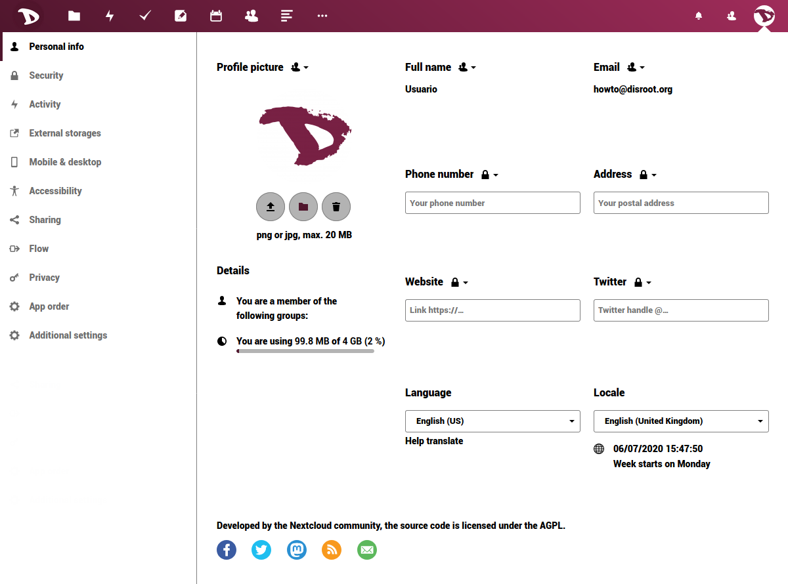

# Personal Settings

Click on your profile picture on the top right corner and choose **"Settings"** *(if you didn't set a picture yet, you'll see a round avatar with the first letter of your username inside)*.

  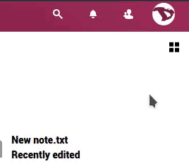

## Personal Info
This is the place where you can add information about yourself, which then you can choose to share with others.

  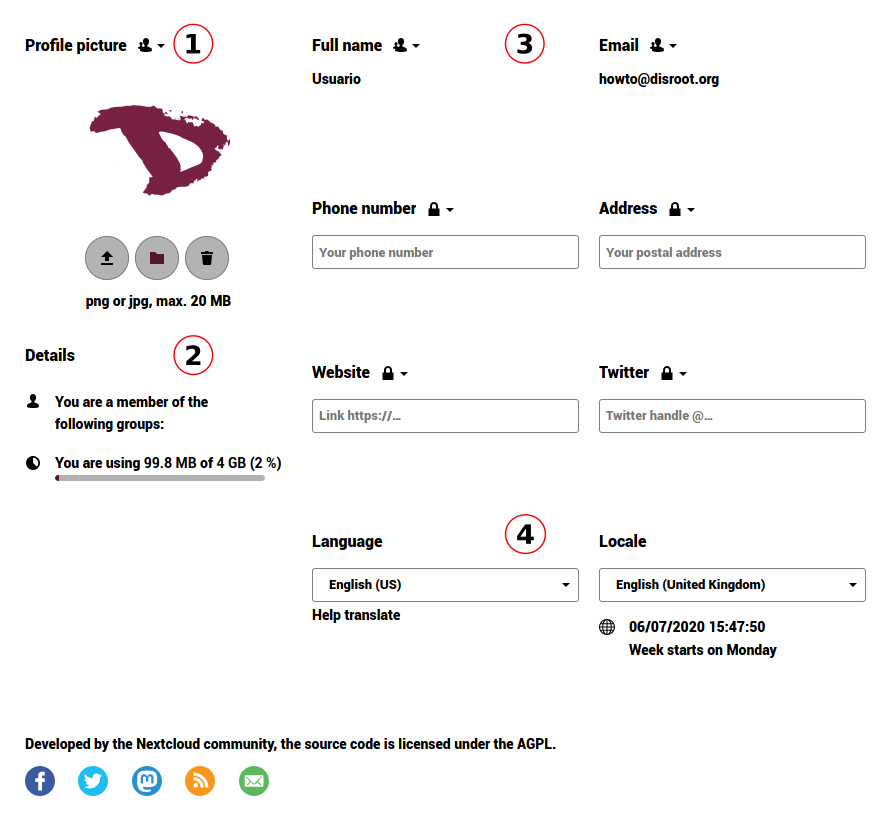

### 1. Profile picture
By clicking the "user" icon 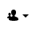 (right next to the information title) you can set the privacy level you want to assign to it. By default, your profile picture, full name and email are set to be visible only to the local users and the servers you trust.

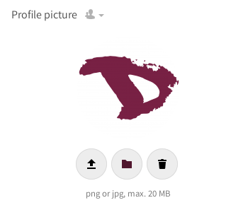

Depending on the information, the levels you can choose are:

  - **Private**: You are the only person that can see this information

  - **Local**: The information will be visible to other **Disroot Cloud** users (only if they know your username)

  - **Contacts**: Besides other **Disroot Cloud** users, the information will be shared with users on other **Nextcloud** instances when you share data or files with them.

  - **Public**: The information will be sent to a global address book (which means it can be viewed by anyone)

!!**NOTE:**
!! You should pay extra attention when filling up this information *(which is optional)* and decide how much information about yourself you want to share and reveal to others.

### 2. Details
Below the profile picture you can see:

  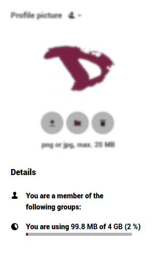

  - **the groups** you belong to (if any). By default, **Disroot** accounts are not associated with any group,
  - **the quota** of storage space you are using.

### 3. User and contact information
Your full name and email are taken from your **Disroot** account settings. To learn how to change this information, please check [this tutorial](/tutorials/user/account/administration/profile).

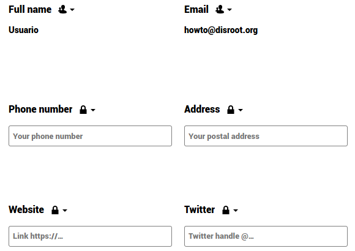

### 4. Language
Usually, the Cloud will automatically detect the **Language** and the **Locale** (which defines how dates and other formats are displayed) but if it does not, you can select the language of your choice from the dropdown menues.

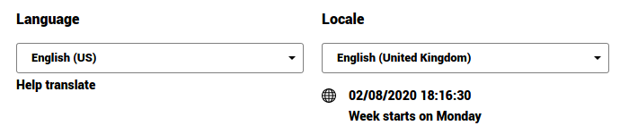

-----
# Security
Security is the place where you can review, set (additional) and revoke security settings.

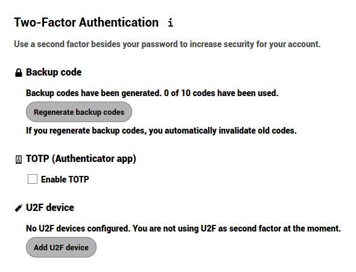

## Two-Factor Authentication

**Two-factor authentication (2FA)** is a security process that has a two steps verification, usually, the combination of two factors: 
  - 1: something you know (like a password), 
  - 2: something you have (could be a security token, a card, a QR code, etc.) or 
  - 3: something you are (like your fingerprint). 

**An example of how it works**: _when you go to an ATM to extract money you need to use your bank card (something you have) and a PIN (something you know). If the combination fails, you can't extract the money._

Two-factor authentication can be used if you want have a more secure login (you can read more about it [here](https://en.wikipedia.org/wiki/Multi-factor_authentication)). When enabled, you will be asked not only for your login name and password, but also for an extra authentication like a one-time-password (OTP) or verification via a hardware device. 

### Two-factor backup codes

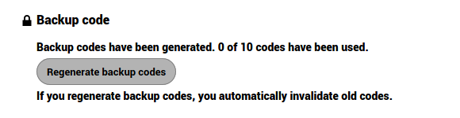

It's highly advisable to download backup codes when you have enabled two-factor. If, for some reason, your OTP app doesn't work (*you lost your phone!*), you still be able to login. You should keep these backup codes in a safe place (*not your phone!*). Each code allows you to login once. Then, when you are in, you can reconfigure you OTP or disable two-factor.

### TOTP and U2F

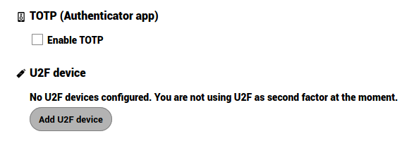

**Disroot** offers two types of two-factor authentication:

- **TOTP (Time-based One-Time-Password)**: You can install and run an app on your phone that generates a time based password. Some open source authenticators are [andOTP](https://f-droid.org/en/packages/org.shadowice.flocke.andotp/) and [FreeOTP](https://f-droid.org/en/packages/org.liberty.android.freeotpplus/).

  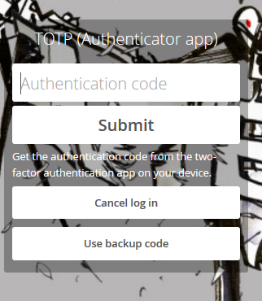

- **U2F (Universal 2nd Factor)**: U2F uses a hardware device like the [USB key by Yubico](https://en.wikipedia.org/wiki/YubiKey). You plug the device into your laptop and press the device button to authorize. After adding it, the browser will communicate with the U2F device to authorize you to log in.

  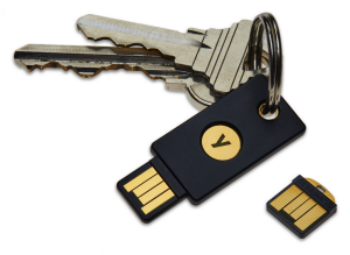

You can add as many devices as you like. It is recommended to give each device a distinct name. **Chrome** is the only browser that supports U2F devices by default. You need to install the "U2F Support Add-on" on **Firefox** to use U2F.

## Basic encryption module

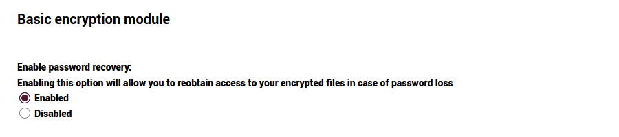

Here you can decide whether or not an administrator will be able to recover your files in case you lose your password. This option is disabled by default as it enables admins of **Disroot** to decrypt and view your files.

!!  
!! **Enabling this option after your password was lost will not recover your files!** You must make this decision beforehand. **We strongly encourage you keep your password stored in a safe place.** This is the best way to keep your files and your account safe. We really don't want to have access to it.

## Inavlid private key for encryption app

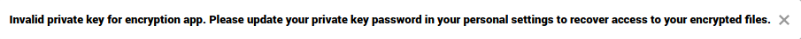

If you receive a message like this when you log in to the cloud, it is because you have probably changed your password recently. Since **Nextcloud** uses the user password to generate the encryption keys, it’s necessary to regenerate them from your new password. To do so, you must:

  - Go to the Settings menu and then to **Security**...

  

  - scroll down to the **Basic encryption module**...

  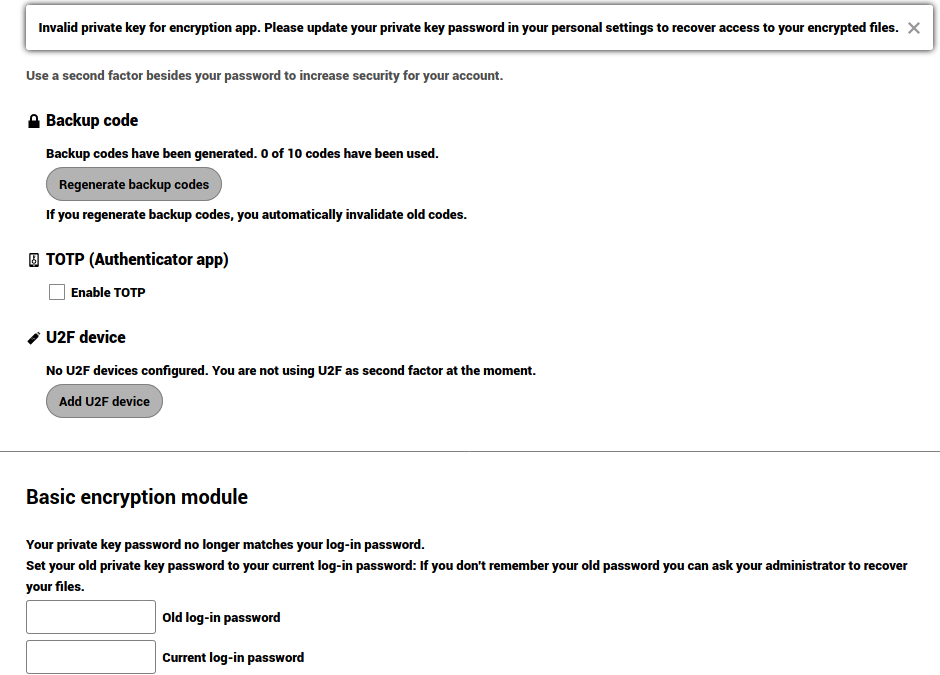

  - type in your old password, then the new one...

  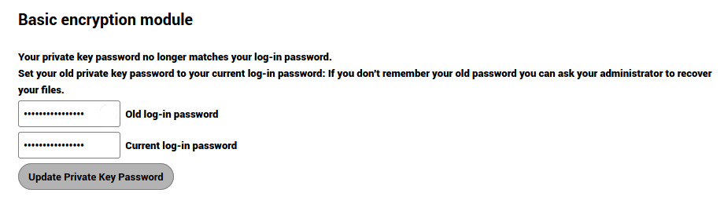

  - click **Update Private Key Password**

  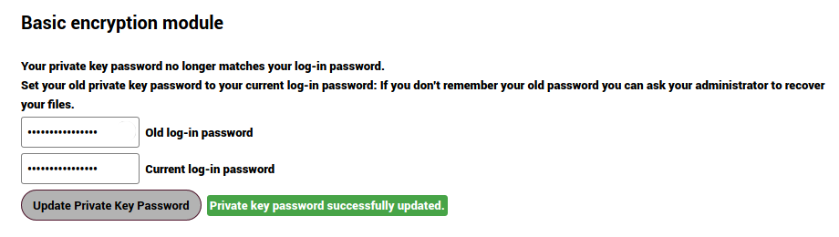

After login out and back into the Cloud again you should see your files and the message should have disappeared.

!!  
!! If you don't remember your old password, it's still possible to reset the account but **it won't be possible to recover any files on the cloud as they are encrypted with the old key**. What you have to do is to remove all files from the Cloud (this does not include calendars, contacts, etc., just files), and to contact us (support@disroot.org). We will then proceed wiping the key so the new key pair based on your current password can be re-generated automatically upon new login.

## Devices & sessions

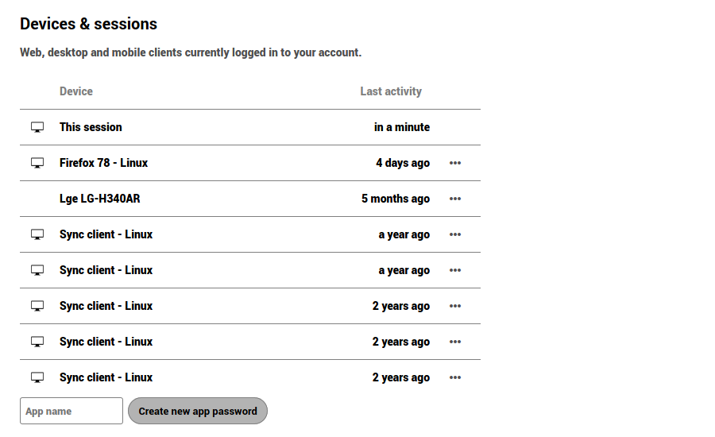

Here you can see how many devices are currently connected to your account. If you don't recognize one connected device, it might mean your account has been compromised and you should proceed to change your password.

!!  
!! Keep in mind that every browser, mobile, computer, etc., will be shown as separate devices each time you change your network, for example. So don't freak out at first. Just seriously double check everything, before you go full on paranoid mode.

### App password

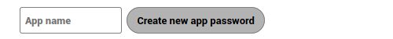

When Two-Factor Authentication is enabled, third party applications (like your email, notes or news clients) won't be able to login your account with your user credentials only. For those devices you can create a specific password for the app.

----

# Activity

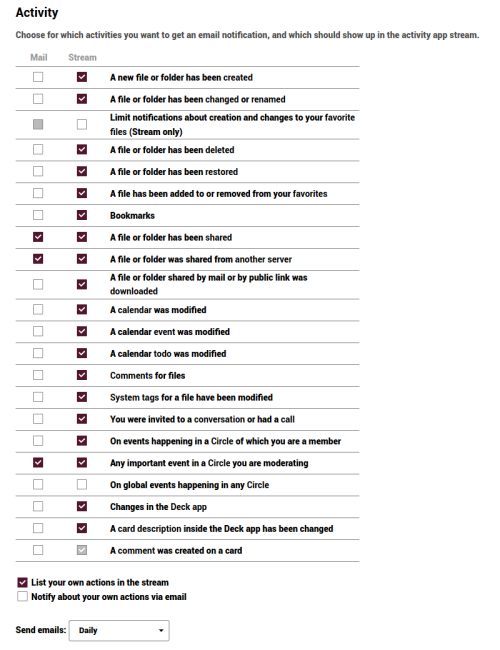

In the Activity section you can choose how do you want to be informed about what's happening on your cloud. You can get email notifications, being notified in the **Activity** stream or even not being notified at all. If you choose to get email notifications, you can set the frecuency from "**As soon as posible** to **Hourly**, **Daily** or **Weekly**.

----
# External storages

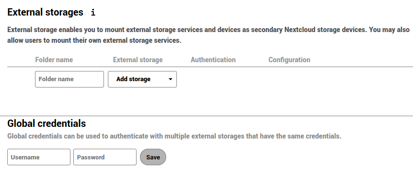

The external storage application allows you to mount external storage services and/or devices as secondary **Nextcloud** storage devices.

## Configuring an external storage

Select an available external storage option and then an authentication method.

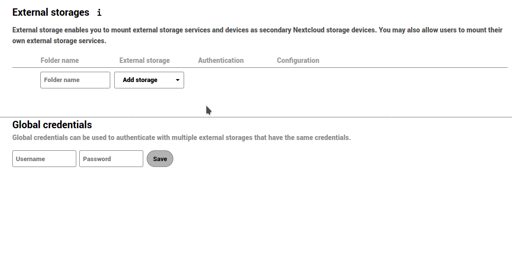

- **Username and password**: it requires a manually-defined username and password. These get passed directly to the backend and are specified during the setup of the mount point.

- **Log-in credentials, save in session**: it uses your **Cloud** login credentials to connect to the storage. These are not stored anywhere on the server, but rather in the user session, giving increased security. Although sharing is disabled when using this method, since **Nextcloud** has no access to the storage credentials.

- **Log-in credentials, save in database**: as the previous method, it uses your login credentials to connect to the storage, but these are stored in the database encrypted. This allows to share files from within this mount point.

- **Global credentials**: it uses the general input field for “Global credentials” in the external storage settings section as source for the credentials instead of individual credentials for a mount point.

----
# Mobile & desktop
Here you'll find shortcuts to the mobile and desktop **Nextcloud** applications...

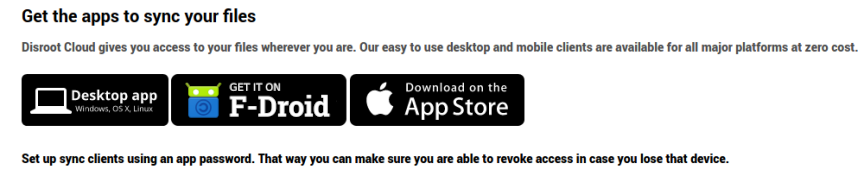

... as well as shortcuts to documentation about how to connect your calendar and contacts, access via WebDAV or download the configuration file for macOS/iOS...

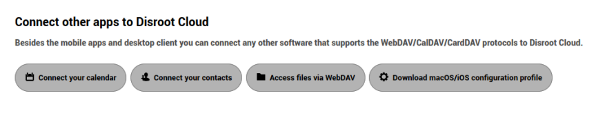

... the Disroot Cloud server address, in case you need it to setup a desktop or mobile client...

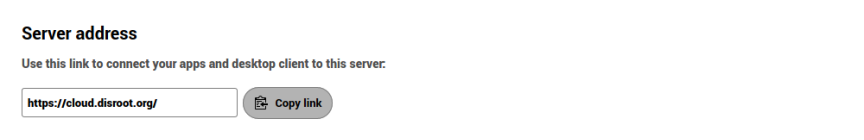

... and finally links to download the Nextcloud Talk app.

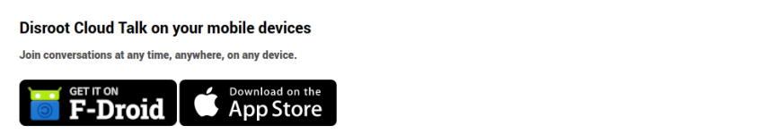

----
# Accesibility
In this section you can change the default high contrast theme to the dark theme and the default cloud font to the Dyslexia font.

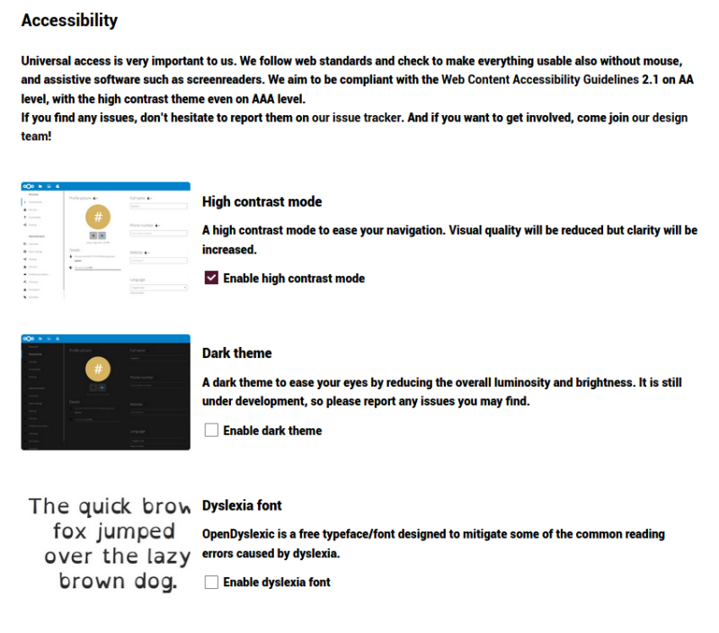

----
# Sharing

This is the very purpose of **Nextcloud**, to share. Here you can find your **Federated Cloud ID**, your identity in the ecosystem of platforms that use the same or similar software to store and share information.

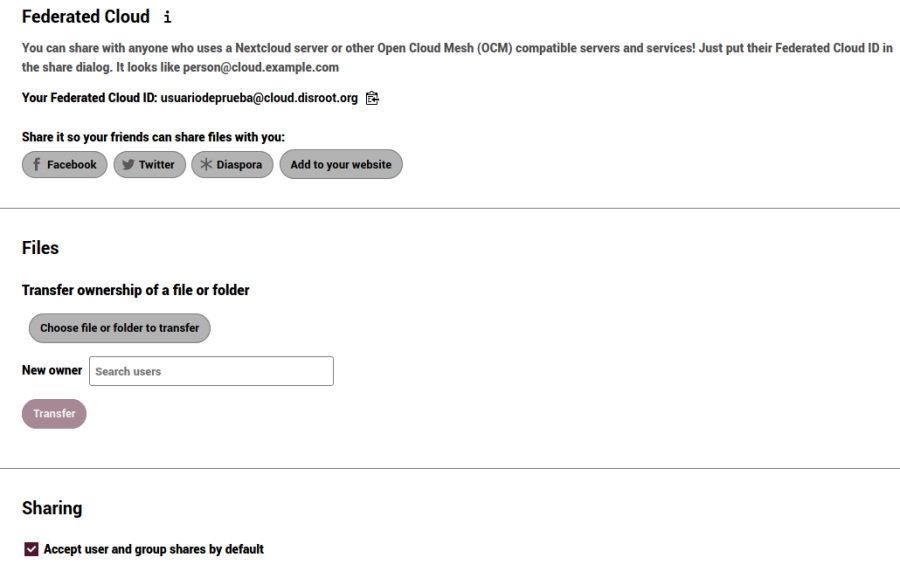

## Federated cloud
Just like when you send emails to other users who have accounts on other servers, **Nextcloud** makes it possible to share files, calendars, contacts, etc., between users of different platforms that use similar software, so they can collaborate with each other regardless of the service provider. You can share your **Federated Cloud ID** with others by just sending a link or via predefined platforms (you can add your preferred ones if they are not included).

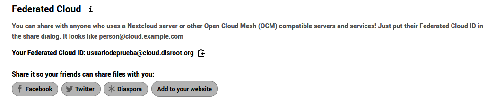

## Files

Here you can change the ownership of a file or folder by selecting it and entering the username of the person to whom you want to transfer ownership.

## Sharing

By default, you will automatically accept user and/or groups shares. You can disable that option here.

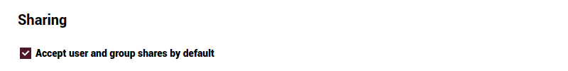

----
# Flow

Flow is an application that aims to help users automate tasks. For example, if you are working in a group on a document, you can set up a flow that sends a notification to your team's chat room when someone changes, creates or uploads files in a specific folder.

_**Write to conversation**_ is the only Flow available for the moment.

## How does it work?

Suppose you create a document that requires the participation of others and for that you create a conversation with your group via NC Talk. Through Flow, you can establish that every time the document is modified the group will be notified in the conversation. You can set a number of actions and tasks not only on a document, but also on a folder or other files.

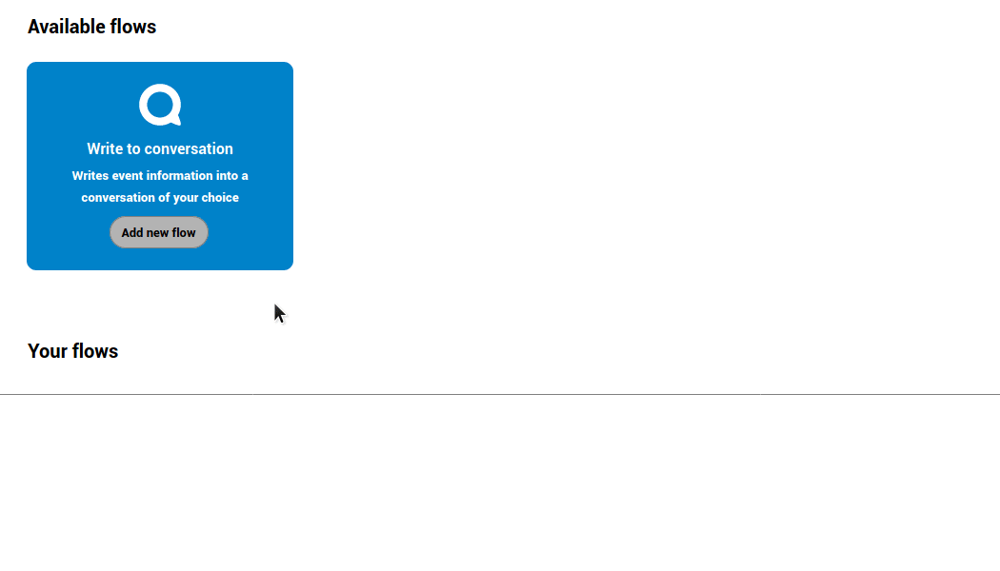

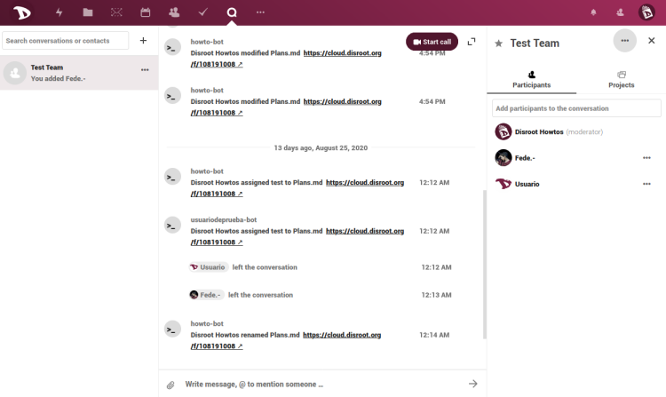

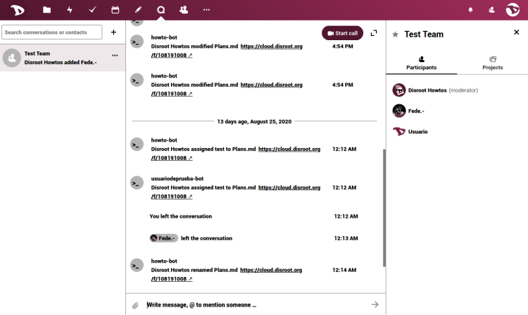

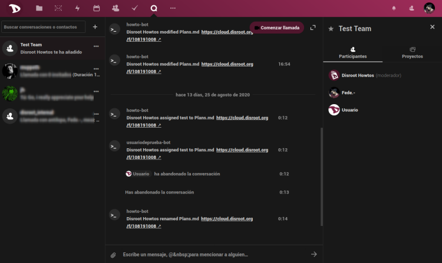

----
# Privacy

This section is merely informative. Here you can find the **Nextcloud** User Data Manifesto...

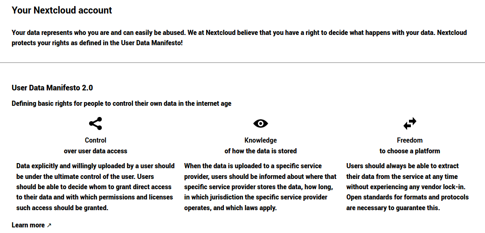

... who has access to your data (in our case, **Disroot** admins), with whom you have shared something, a shortcut to our **Privacy Statement**, how your data is encrypted...

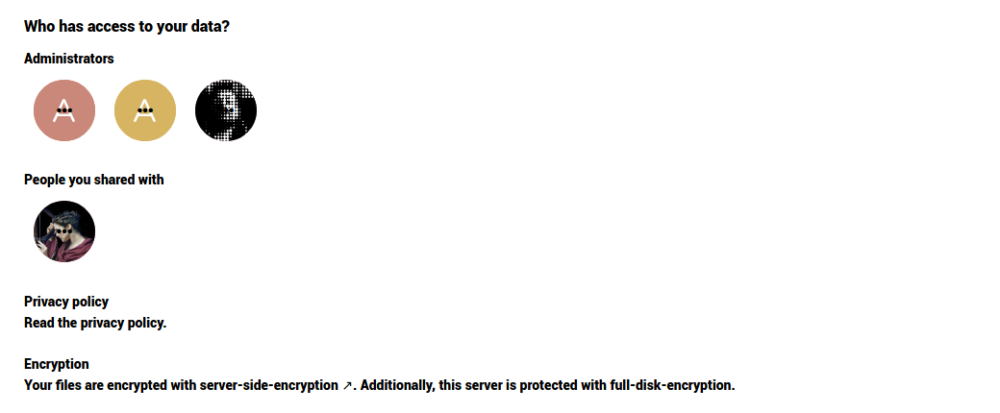

... and where the data is located.

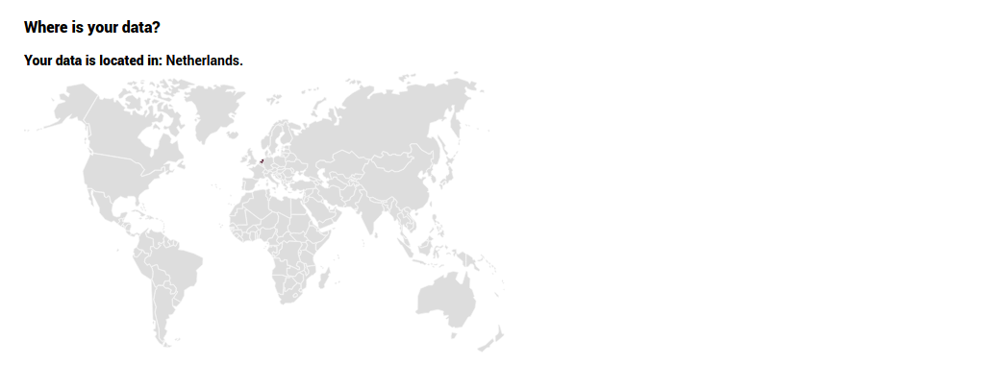

----
# App order

Here you can check/uncheck the applications you want to appear on the top bar and change the order by dragging them to the position you want.

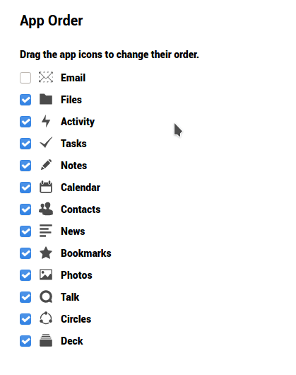
------
# Additional settings

This app prevents the **Nextcloud** sync clients from uploading files with known ransomware file endings, though it does not help in case the server is infected directly by a ransomware nor guarantee that your files can not be affected by another way.

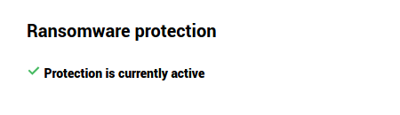
