# Paramètres
C'est ici que vous trouverez et gérerez vos paramètres personnels et ceux du cloud.

  

# Paramètres personnels

Cliquez sur votre photo de profil dans le coin supérieur droit et choisissez **"Paramètres "** *(si vous n'avez pas encore défini de photo, vous verrez un avatar rond avec la première lettre de votre nom d'utilisateur à l'intérieur)*.

  

## Informations personnelles
C'est l'endroit où vous pouvez ajouter des informations sur vous-même, que vous pouvez ensuite choisir de partager avec les autres.

  

### 1. Photo de profil
En cliquant sur l'icône "utilisateur"  (juste à côté du titre de l'information), vous pouvez définir le niveau de confidentialité que vous souhaitez lui attribuer. Par défaut, votre photo de profil, votre nom complet et votre adresse électronique sont configurés pour être visibles uniquement par les utilisateurs locaux et les serveurs auxquels vous faites confiance.

En fonction des informations, les niveaux que vous pouvez choisir sont les suivants :

  - **Privé** : Vous êtes la seule personne à pouvoir voir ces informations.

  - **Local** : Les informations seront visibles pour les autres utilisateurs de **Disroot Cloud** (uniquement s'ils connaissent votre nom d'utilisateur).

  - **Contacts** : Outre les autres utilisateurs de **Disroot Cloud**, les informations seront partagées avec les utilisateurs d'autres instances **Nextcloud** lorsque vous partagez des données ou des fichiers avec eux.

  - **Public** : Les informations seront envoyées à un carnet d'adresses global (ce qui signifie qu'elles peuvent être consultées par n'importe qui).

REMARQUE
! ! Vous devez faire très attention lorsque vous remplissez ces informations *(qui sont facultatives)* et décider de la quantité d'informations vous concernant que vous souhaitez partager et révéler aux autres.

### 2. Détails
Sous la photo de profil, vous pouvez voir :

  

  - **les groupes** auxquels vous appartenez (le cas échéant). Par défaut, les comptes **Disroot** ne sont associés à aucun groupe,
  - **le quota** d'espace de stockage que vous utilisez.

### 3. Informations sur l'utilisateur et les contacts
Votre nom complet et votre adresse électronique sont extraits des paramètres de votre compte **Disroot**. Pour savoir comment modifier ces informations, veuillez consulter [ce tutoriel](/tutorials/user/account/administration/profile).

### 4. Langue
En général, le Cloud détecte automatiquement la **Langue** et le **Locale** (qui définit la façon dont les dates et autres formats sont affichés) mais si ce n'est pas le cas, vous pouvez sélectionner la langue de votre choix dans les menus déroulants.

-----
# Security
Security is the place where you can review, set (additional) and revoke security settings.

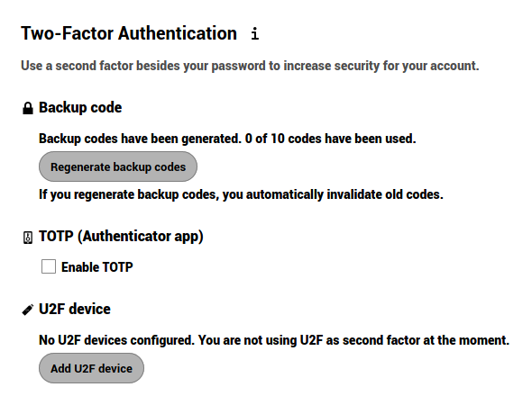

## Two-Factor Authentication

**Two-factor authentication (2FA)** is a security process that has a two steps verification, usually, the combination of two factors: 
  - 1: something you know (like a password), 
  - 2: something you have (could be a security token, a card, a QR code, etc.) or 
  - 3: something you are (like your fingerprint). 

**An example of how it works**: _when you go to an ATM to extract money you need to use your bank card (something you have) and a PIN (something you know). If the combination fails, you can't extract the money._

Two-factor authentication can be used if you want have a more secure login (you can read more about it [here](https://en.wikipedia.org/wiki/Multi-factor_authentication)). When enabled, you will be asked not only for your login name and password, but also for an extra authentication like a one-time-password (OTP) or verification via a hardware device. 

### Two-factor backup codes

It's highly advisable to download backup codes when you have enabled two-factor. Si, pour une raison quelconque, votre application OTP ne fonctionne pas (*vous avez perdu votre téléphone!*), vous pourrez toujours vous connecter. Vous devez conserver ces codes de sauvegarde dans un endroit sûr (*pas votre téléphone!*). Chaque code vous permet de vous connecter une fois. Ensuite, lorsque vous êtes connecté, vous pouvez reconfigurer votre OTP ou désactiver le système à deux facteurs.

### TOTP et U2F

(en/2fa.png)

**Disroot** propose deux types d'authentification à deux facteurs :

- **TOTP (Time-based One-Time-Password)** : Vous pouvez installer et exécuter une application sur votre téléphone qui génère un mot de passe basé sur le temps. Certains authentificateurs open source sont [andOTP](https://f-droid.org/en/packages/org.shadowice.flocke.andotp/) et [FreeOTP](https://f-droid.org/en/packages/org.liberty.android.freeotpplus/).

  

- **U2F (Universal 2nd Factor)** : U2F utilise un dispositif matériel comme la [clé USB de Yubico](https://en.wikipedia.org/wiki/YubiKey). Vous branchez le dispositif sur votre ordinateur portable et appuyez sur le bouton du dispositif pour l'autoriser ou vous tapez simplement sur le dispositif U2F (la fonction NFC est requise). Après l'avoir ajouté, le navigateur communiquera avec le dispositif U2F pour vous autoriser à vous connecter.

  

## Basic encryption module

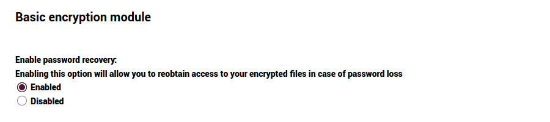

Here you can decide whether or not an administrator will be able to recover your files in case you lose your password. This option is disabled by default as it enables admins of **Disroot** to decrypt and view your files.

!!  
!! **Enabling this option after your password was lost will not recover your files!** You must make this decision beforehand. **We strongly encourage you keep your password stored in a safe place.** This is the best way to keep your files and your account safe. We really don't want to have access to it.

## Inavlid private key for encryption app

If you receive a message like this when you log in to the cloud, it is because you have probably changed your password recently. Since **Nextcloud** uses the user password to generate the encryption keys, it’s necessary to regenerate them from your new password. To do so, you must:

  - Go to the Settings menu and then to **Security**...

  

  - scroll down to the **Basic encryption module**...

  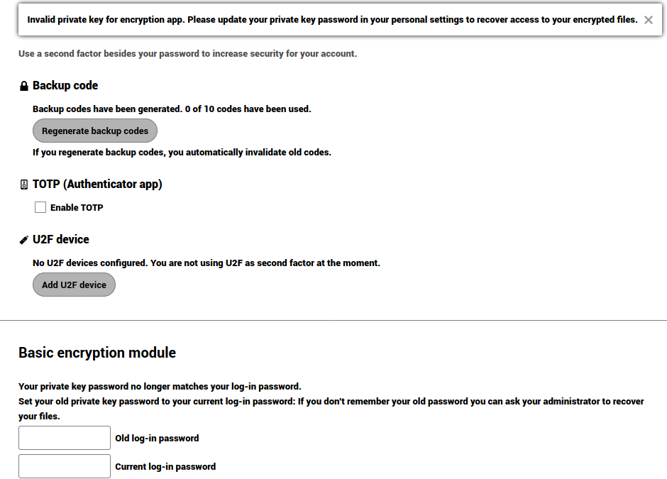

  - type in your old password, then the new one...

  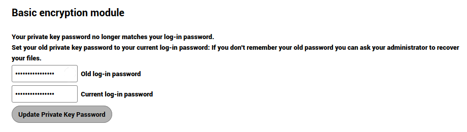

  - click **Update Private Key Password**

  

After login out and back into the Cloud again you should see your files and the message should have disappeared.

!!  
!! If you don't remember your old password, it's still possible to reset the account but **it won't be possible to recover any files on the cloud as they are encrypted with the old key**. What you have to do is to remove all files from the Cloud (this does not include calendars, contacts, etc., just files), and to contact us (support@disroot.org). We will then proceed wiping the key so the new key pair based on your current password can be re-generated automatically upon new login.

## Devices & sessions

Here you can see how many devices are currently connected to your account. If you don't recognize one connected device, it might mean your account has been compromised and you should proceed to change your password.

!!  
!! Keep in mind that every browser, mobile, computer, etc., will be shown as separate devices each time you change your network, for example. Ne paniquez donc pas au début. Vérifiez juste sérieusement tout, avant de passer en mode paranoïaque intégral.

### Mot de passe de l'application

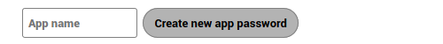

Lorsque l'authentification à deux facteurs est activée, les applications tierces (comme vos clients de messagerie, de notes ou d'actualités) ne pourront pas se connecter à votre compte avec vos seules informations d'identification. Pour ces appareils, vous pouvez créer un mot de passe spécifique pour l'application.

----

# Activité

Dans la section Activité, vous pouvez choisir comment vous souhaitez être informé de ce qui se passe dans votre cloud. Vous pouvez recevoir des notifications par e-mail, être notifié dans le flux **Activité** ou même ne pas être notifié du tout. Si vous choisissez de recevoir des notifications par e-mail, vous pouvez définir la fréquence de "**Dès que possible**" à **Horaire**, **Journalier** ou **Semaine**.

----
# Stockages externes

L'application de stockage externe vous permet de monter des services et/ou des périphériques de stockage externes comme périphériques de stockage secondaires **Nextcloud**.

## Configuration d'un stockage externe

Sélectionnez une option de stockage externe disponible, puis une méthode d'authentification.

- **Nom d'utilisateur et mot de passe** : il faut un nom d'utilisateur et un mot de passe définis manuellement. Ils sont transmis directement au backend et sont spécifiés lors de la configuration du point de montage.

- **Crédentiels de connexion, enregistrer dans la session** : il utilise vos crédentiels de connexion **Cloud** pour se connecter au stockage. Ces informations ne sont pas stockées sur le serveur, mais plutôt dans la session de l'utilisateur, ce qui offre une sécurité accrue. Bien que le partage soit désactivé lorsque vous utilisez cette méthode, puisque **Nextcloud** n'a pas accès aux informations d'identification du stockage.

- **Log-in credentials, save in database** : comme la méthode précédente, elle utilise vos identifiants de connexion pour se connecter au stockage, mais ceux-ci sont stockés dans la base de données de manière cryptée. Cela permet de partager des fichiers à partir de ce point de montage.

- Informations d'identification globales** : cette méthode utilise le champ de saisie général pour les "informations d'identification globales" dans la section des paramètres de stockage externe comme source pour les informations d'identification au lieu des informations d'identification individuelles pour un point de montage.

----
# Mobile et bureau
Vous trouverez ici des raccourcis vers les applications mobiles et de bureau **Nextcloud**...

... ainsi que des raccourcis vers la documentation sur la façon de connecter votre calendrier et vos contacts, d'accéder via WebDAV ou de télécharger le fichier de configuration pour macOS/iOS...

... l'adresse du serveur Disroot Cloud, au cas où vous en auriez besoin pour configurer un client de bureau ou mobile...

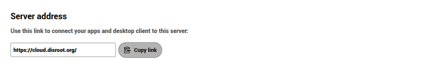

... et enfin les liens pour télécharger l'application Nextcloud Talk.

----
# Accessibilité
Dans cette section, vous pouvez changer le thème par défaut à fort contraste en thème sombre et la police par défaut du nuage en police Dyslexia.

----
# Partage

C'est le but même de **Nextcloud**, partager. Vous trouverez ici votre **Federated Cloud ID**, votre identité dans l'écosystème des plateformes qui utilisent un logiciel identique ou similaire pour stocker et partager des informations.

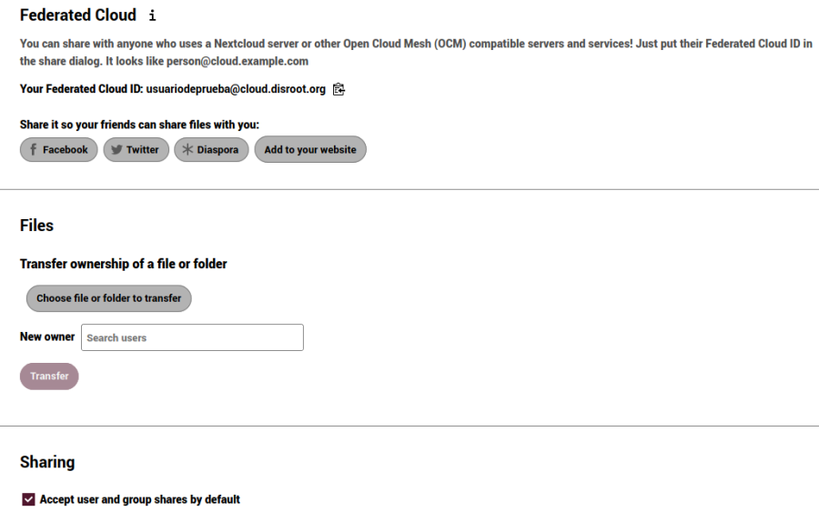

## Nuage fédéré
Tout comme lorsque vous envoyez des e-mails à d'autres utilisateurs qui ont des comptes sur d'autres serveurs, **Nextcloud** permet de partager des fichiers, des calendriers, des contacts, etc. entre les utilisateurs de différentes plateformes qui utilisent des logiciels similaires, afin qu'ils puissent collaborer les uns avec les autres, quel que soit le fournisseur de services. Vous pouvez partager votre **Identifiant Cloud fédéré** avec d'autres personnes en envoyant simplement un lien ou via des plateformes prédéfinies (vous pouvez ajouter vos plateformes préférées si elles ne sont pas incluses).

## Fichiers

Ici, vous pouvez changer la propriété d'un fichier ou d'un dossier en le sélectionnant et en entrant le nom d'utilisateur de la personne à qui vous voulez transférer la propriété.

## Partage

Par défaut, vous acceptez automatiquement les partages d'utilisateurs et/ou de groupes. Vous pouvez désactiver cette option ici.

----
## Flow

Flow est une application qui vise à aider les utilisateurs à automatiser des tâches. Par exemple, si vous travaillez en groupe sur un document, vous pouvez configurer un flux qui envoie une notification au salon de discussion de votre équipe lorsque quelqu'un modifie, crée ou télécharge des fichiers dans un dossier spécifique.

_**Écrire dans la conversation**_ est le seul flux disponible pour le moment.

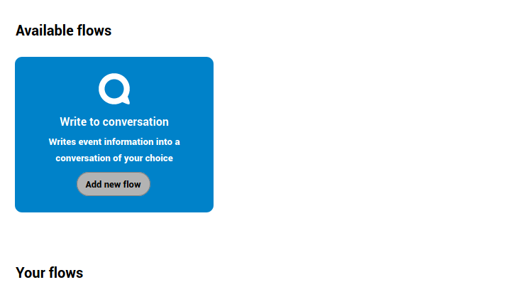

## Comment cela fonctionne-t-il ?

Supposons que vous créez un document qui nécessite la participation d'autres personnes et que pour cela vous créez une conversation avec votre groupe via NC Talk. Grâce à Flow, vous pouvez établir que chaque fois que le document est modifié, le groupe sera notifié dans la conversation. Vous pouvez définir un certain nombre d'actions et de tâches non seulement sur un document, mais aussi sur un dossier ou d'autres fichiers.

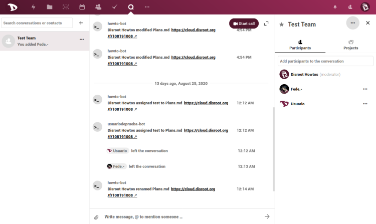

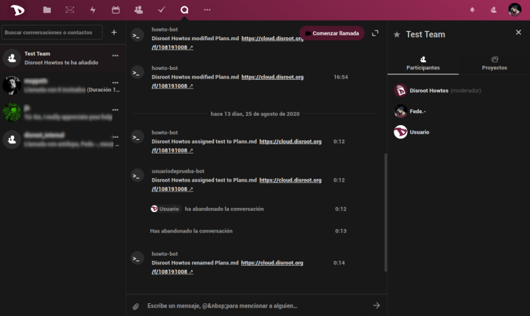

----
# Vie privée

Cette section est simplement informative. Vous trouverez ici le Manifeste sur les données des utilisateurs de **Nextcloud**...

... qui a accès à vos données (dans notre cas, les administrateurs de **Disroot**), avec qui vous avez partagé quelque chose, un raccourci vers notre **Déclaration de confidentialité**, comment vos données sont cryptées...

... et où se trouvent les données.

----
# Commande de l'application

Ici, vous pouvez cocher/décocher les applications que vous souhaitez voir apparaître sur la barre supérieure et changer l'ordre en les faisant glisser vers la position que vous souhaitez.

------
# Paramètres supplémentaires

Cette application empêche les clients de synchronisation **Nextcloud** de télécharger des fichiers avec des terminaisons de fichiers de ransomware connues, bien qu'elle n'aide pas dans le cas où le serveur est infecté directement par un ransomware ni ne garantit que vos fichiers ne peuvent pas être affectés d'une autre manière.

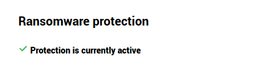
