# Impostazioni
Qui è dove troverai e gestirai le tue impostazioni personali e cloud. 

  

# Impostazioni personali

Fai clic sull'immagine del tuo profilo nell'angolo in alto a destra e scegli **"Impostazioni"** *(se non hai ancora impostato un'immagine, vedrai un avatar rotondo con all'interno la prima lettera del tuo nome utente)*. 

  

## Informazioni personali
Questo è il luogo in cui puoi aggiungere informazioni su di te, che poi puoi scegliere di condividere con gli altri. 

  

### 1. Foto di profilo
Cliccando sull'icona "utente"  (proprio accanto al titolo dell'informazione) puoi impostare il livello di privacy che vuoi assegnargli. Per impostazione predefinita, l'immagine del profilo, il nome completo e l'e-mail sono impostati per essere visibili solo agli utenti locali e ai server di cui ti fidi. 

A seconda delle informazioni, i livelli che puoi scegliere sono:

   - **Privato**: sei l'unica persona che può vedere queste informazioni

   - **Locale**: le informazioni saranno visibili agli altri utenti **Disroot Cloud** (solo se conoscono il tuo nome utente)

   - **Contatti**: oltre ad altri utenti **Disroot Cloud**, le informazioni verranno condivise con utenti su altre istanze **Nextcloud** quando condividi dati o file con loro

   - **Pubblico**: le informazioni verranno inviate a una rubrica globale (il che significa che possono essere visualizzate da chiunque) 

!!**ATTENZIONE:**
!! Dovresti prestare molta attenzione quando imposti queste informazioni *(che è facoltativo)* e decidi quante informazioni su di te vuoi condividere e rivelare agli altri. 

### 2. Dettagli
Sotto l'immagine del profilo puoi vedere: 

  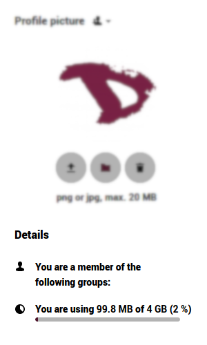

- **i gruppi** a cui appartieni (se presenti). Per impostazione predefinita, gli account **Disroot** non sono associati ad alcun gruppo,
- **la quota** di spazio di archiviazione che stai utilizzando. 

### 3. Informazioni e contatto utente
Il tuo nome completo e la tua email sono presi dalle impostazioni del tuo account **Disroot**. Per sapere come modificare queste informazioni, controlla [questo tutorial](/tutorials/user/account/administration/profile). 

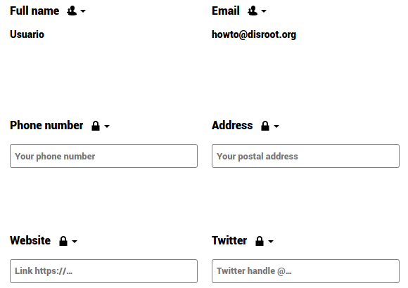

### 4. Lingua
Di solito, il Cloud rileverà automaticamente la **Lingua**, ma in caso contrario, puoi selezionare la lingua che preferisci dai menu a tendina. 

-----
# Sicurezza
La sicurezza è il luogo in cui è possibile rivedere, impostare e revocare le impostazioni di sicurezza. 

## Autenticazione a due fattori (2FA)

**L'autenticazione a due fattori (2FA)** è un processo di sicurezza che prevede una verifica in due passaggi, solitamente la combinazione di due fattori: 
   - 1: qualcosa che conosci (come una password), 
   - 2: qualcosa che hai (potrebbe essere un token di sicurezza, una carta, un codice QR, ecc.) o 
   - 3: qualcosa che sei (come la tua impronta digitale).  
**Un esempio di come funziona**: _quando vai a un bancomat per prelevare denaro devi usare la tua carta di credito (qualcosa che hai) e un PIN (qualcosa che conosci). Se la combinazione fallisce, non puoi estrarre il denaro._ 

L'autenticazione a due fattori può essere utilizzata se desideri avere un accesso più sicuro (puoi leggere di più a riguardo [qui](https://en.wikipedia.org/wiki/Multi-factor_authentication)). Una volta abilitato, ti verrà chiesto non solo il nome di accesso e la password, ma anche un'autenticazione aggiuntiva come una password monouso (OTP) o la verifica tramite un dispositivo hardware.  
### Two-factor backup codes

È altamente consigliabile scaricare i codici di backup dopo aver abilitato due fattori. Se, per qualche motivo, la tua app OTP non funziona (*hai perso il telefono!*), puoi comunque accedere. Dovresti conservare questi codici di backup in un luogo sicuro (*non nel tuo telefono!;)*). Ogni codice ti consente di accedere una volta. Quindi, quando ne hai bisogno, puoi riconfigurare la tua OTP o disabilitare due fattori. 

### TOTP e U2F

**Disroot** offre due tipi di autenticazione a due fattori:

- **TOTP (Password monouso basata sul tempo)**: puoi installare ed eseguire un'app sul telefono che genera una password basata sul tempo. Alcuni autenticatori open source sono [andOTP](https://f-droid.org/en/packages/org.shadowice.flocke.andotp/) e [FreeOTP](https://f-droid.org/en/packages /org.liberty.android.freeotpplus/). 
  

- **U2F (Universal 2nd Factor)**: U2F utilizza un dispositivo hardware come la [chiave USB di Yubico](https://en.wikipedia.org/wiki/YubiKey). Collega il dispositivo al laptop e premi il pulsante del dispositivo per autorizzare o tocca semplicemente il dispositivo U2F (è richiesto l'abilitazione NFC). Dopo averlo aggiunto, il browser comunicherà con il dispositivo U2F per autorizzarti ad accedere. 
  

## Modulo di crittografia di base

Qui puoi decidere se un amministratore sarà in grado o meno di recuperare i tuoi file in caso di smarrimento della password. Questa opzione è disabilitata per impostazione predefinita in quanto consente agli amministratori di **Disroot** di decrittografare e visualizzare i tuoi file. 

!!  
!! **Ti consigliamo vivamente di conservare la tua password in un luogo sicuro.** Questo è il modo migliore per proteggere i tuoi file e il tuo account. Non vogliamo davvero avervi accesso. 

## Chiave privata non valida per l'app di crittografia 

Se ricevi un messaggio come questo quando accedi al cloud, è perché probabilmente hai cambiato la tua password di recente. Poiché **Nextcloud** utilizza la password utente per generare le chiavi di crittografia, è necessario rigenerarle dalla nuova password. Per farlo, segui i seguenti passi:

   - Vai al menu Impostazioni e poi su **Sicurezza**... 
  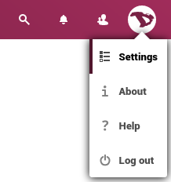

   - scorri verso il basso fino al **Modulo di crittografia di base**...

   

   - digita la tua vecchia password, poi quella nuova...

   

   - fai clic su **Aggiorna la password della chiave privata**

    
Dopo il logout e di nuovo nel Cloud dovresti vedere i tuoi file e il messaggio dovrebbe essere scomparso. 

!!  
!! Se non ricordi la tua vecchia password, è comunque possibile reimpostare l'account ma **non sarà possibile recuperare alcun file sul cloud in quanto crittografato con la vecchia chiave**. Quello che devi fare è rimuovere tutti i file dal Cloud (questo non include calendari, contatti, ecc., solo file) e contattarci (support@disroot.org). Procederemo quindi con la cancellazione della chiave in modo che la nuova coppia di chiavi basata sulla password corrente possa essere rigenerata automaticamente al nuovo accesso.

## Dispositivi e sessioni

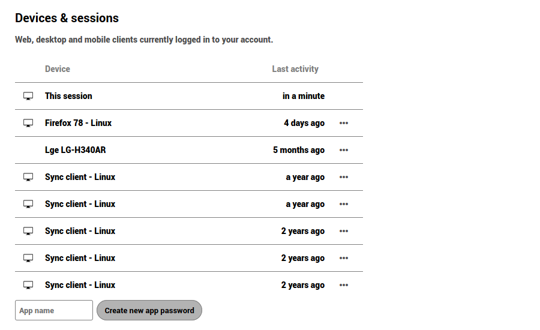

Qui puoi vedere quanti dispositivi sono attualmente collegati al tuo account. Se non riconosci un dispositivo connesso, potrebbe significare che il tuo account è stato compromesso e dovresti procedere con la modifica della password. 

!!  
!! Tieni presente che ogni browser, cellulare, computer, ecc., verrà mostrato come dispositivi separati ogni volta che cambi rete, ad esempio. Quindi non impazzire all'inizio. Basta ricontrollare seriamente tutto, prima di passare completamente alla modalità paranoica. 

### Password delle app

Quando l'autenticazione a due fattori è abilitata, le applicazioni di terze parti (come e-mail, note o client di notizie) non saranno in grado di accedere al tuo account solo con le tue credenziali utente. Per questi dispositivi puoi creare una password specifica per l'app. 

----

# Attività

Nella sezione Attività puoi scegliere come vuoi essere informato su ciò che sta accadendo sul tuo cloud. Puoi ricevere notifiche via e-mail, ricevere notifiche nello stream **Attività** o addirittura non ricevere alcuna notifica. Se scegli di ricevere le notifiche e-mail, puoi impostare la frequenza da "**Non appena possibile** a **Oraria**, **Giornaliera** o **Settimanale**. 

----
# Archiviazioni esterne

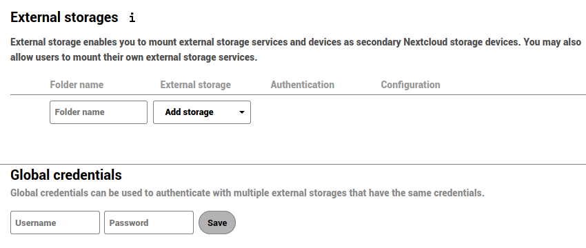

L'applicazione di archiviazione esterna consente di montare servizi di archiviazione esterni e/o dispositivi come dispositivi di archiviazione **Nextcloud** secondari. 

## Configurazione delle archiviazioni esterne

Selezionare un'opzione di archiviazione esterna disponibile e quindi un metodo di autenticazione. 

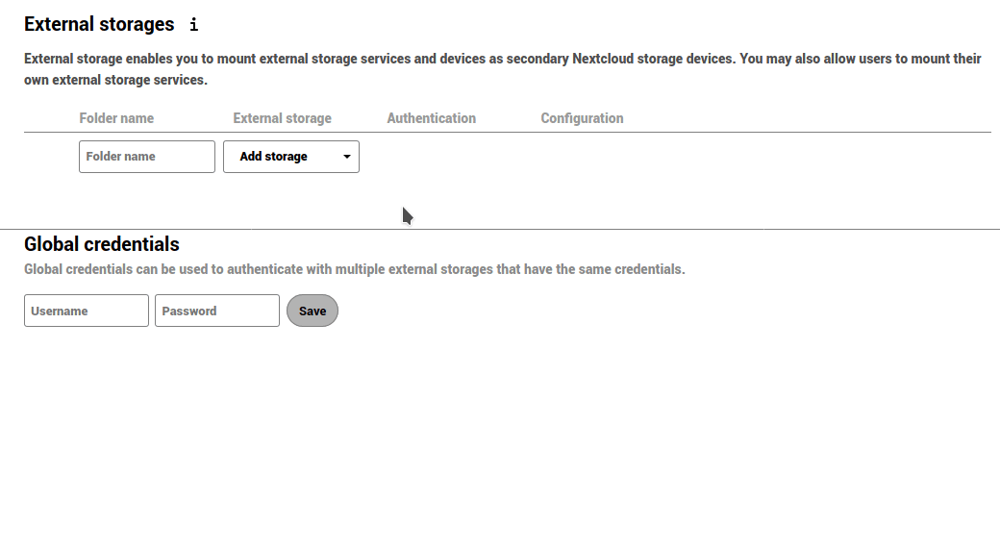

- **Nome utente e password**: richiede un nome utente e una password definiti manualmente. Questi vengono passati direttamente al back-end e vengono specificati durante l'installazione del punto di montaggio.

- **Credenziali di accesso - sessione**: utilizza le tue credenziali di accesso al **Cloud** per connetterti allo storage. Questi non vengono archiviati da nessuna parte sul server, ma piuttosto nella sessione dell'utente, offrendo una maggiore sicurezza. Sebbene la condivisione sia disabilitata quando si utilizza questo metodo, poiché **Nextcloud** non ha accesso alle credenziali di archiviazione.

- **Credenziali di accesso - database**: come il metodo precedente, utilizza le tue credenziali di accesso per connetterti allo storage, ma queste sono archiviate nel database crittografato. Ciò consente di condividere file da questo punto di montaggio.

- **Credenziali globali**: utilizza il campo di input generale per "Credenziali globali" nella sezione delle impostazioni di archiviazione esterna come origine per le credenziali anziché le singole credenziali per un punto di montaggio. 
----

# Mobile & desktop
Qui troverai i collegamenti alle applicazioni mobili e desktop **Nextcloud**... 

... oltre a collegamenti alla documentazione su come collegare il calendario e i contatti, accedere tramite WebDAV o scaricare il file di configurazione per macOS/iOS...

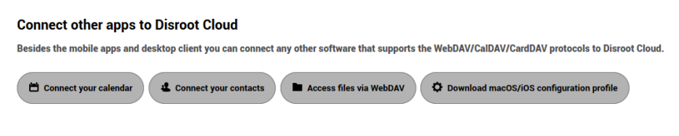

...l'indirizzo del server Disroot Cloud, nel caso sia necessario per configurare un client desktop o mobile... 

... e infine i link per scaricare l'app Nextcloud Talk. 

----
# Accessibilità
In questa sezione puoi cambiare il tema predefinito ad alto contrasto con il tema scuro e il carattere nuvola predefinito con il carattere Dyslexia. 

----
# Condivisione

Questo è lo scopo stesso di **Nextcloud**, condividere. Qui puoi trovare il tuo **Federated Cloud ID**, la tua identità nell'ecosistema di piattaforme che utilizzano software uguali o simili per archiviare e condividere informazioni. 

## Cloud federata
Proprio come quando invii e-mail ad altri utenti che hanno account su altri server, **Nextcloud** consente di condividere file, calendari, contatti, ecc., tra utenti di piattaforme diverse che utilizzano software simili, in modo che possano collaborare con reciprocamente indipendentemente dal fornitore di servizi. Puoi condividere il tuo **Federated Cloud ID** con altri semplicemente inviando un link o tramite piattaforme predefinite (puoi aggiungere le tue preferite se non sono incluse). 

## File

Qui puoi cambiare la proprietà di un file o di una cartella selezionandolo e inserendo il nome utente della persona a cui vuoi trasferire la proprietà. 

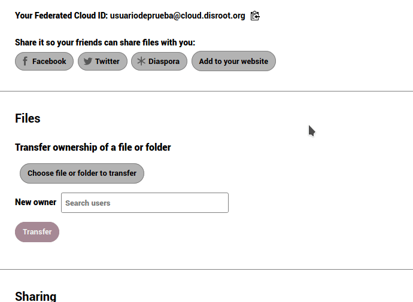

## Condisivione

Per impostazione predefinita, accetterai automaticamente le condivisioni di utenti e/o gruppi. Puoi disabilitare questa opzione qui. 

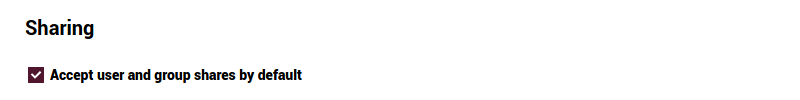

----
# Flow

Flow è un'applicazione che mira ad aiutare gli utenti ad automatizzare le attività. Ad esempio, se stai lavorando in un gruppo su un documento, puoi impostare un flusso che invii una notifica alla chat room del tuo team quando qualcuno modifica, crea o carica file in una cartella specifica.

_**Scrivi alla conversazione**_ è l'unico flusso disponibile per il momento. 

## Come funziona?

Supponiamo di creare un documento che richiede la partecipazione di altri e per questo crei una conversazione con il tuo gruppo tramite NC Talk. Attraverso Flow, puoi stabilire che ogni volta che il documento viene modificato il gruppo verrà avvisato nella conversazione. È possibile impostare una serie di azioni e attività non solo su un documento, ma anche su una cartella o altri file. 

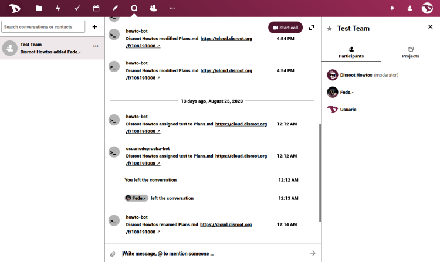

----
# Privacy

Questa sezione è puramente informativa. Qui puoi trovare il **Nextcloud** User Data Manifesto... 

... chi ha accesso ai tuoi dati (nel nostro caso, **Disroot** admins), con chi hai condiviso qualcosa, una scorciatoia alla nostra **Informativa sulla privacy**, come i tuoi dati vengono crittografati... 

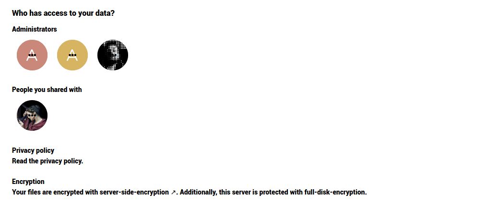

... e dove it uoi dati sono stoccati.

----
# Ordine delle app

Qui puoi selezionare/deselezionare le applicazioni che vuoi che appaiano sulla barra in alto e modificare l'ordine trascinandole nella posizione desiderata. 

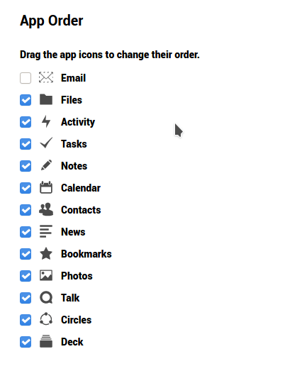
------
# Ulteriori impostazioni

Questa app impedisce ai client di sincronizzazione di **Nextcloud** di caricare file con ransomware noti, anche se non aiuta nel caso in cui il server sia infettato direttamente da un ransomware né garantisce che i tuoi file non possano essere interessati in altro modo. 

