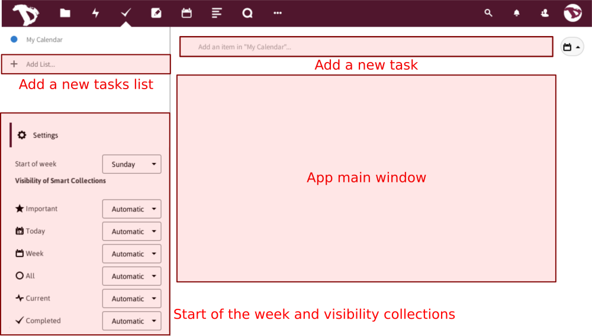
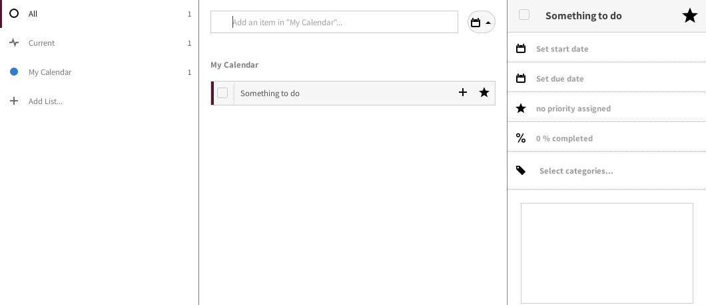

## Tasks

The Tasks app allows you to add and delete tasks. A task could be a meeting date reminder, a job that needs to be done, a personal or a group activity and a lot of other things.  In this howto we'll see how to create, edit and share tasks.

||
|:--:|
|Tasks app sections|

#### Adding a new task
Click in the item box and enter the name of the new task.

Once you did it, a new section will show at the right.

**Here you can set:**

- **The start date and due date**

||
|:--:|
| |
|By clicking on the Start/Due option you can set the day and the hour of it. You can also set the task as an all day activity|

- **The priority of the task**

||
|:--:|
|By moving the bar, you can set the priority level from 1 to 9.|

- **Set and edit the progress level of the task**

||
|:--:|
|By moving the bar, you can set the task progress from 0% to 100%.|

- **Tags**
