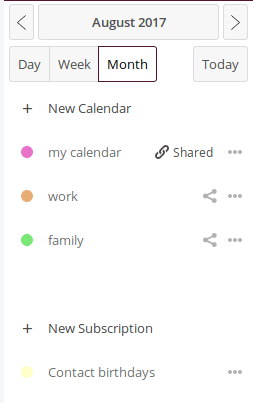
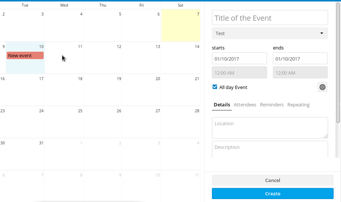

# Utilizzare l'applicazione calendario attraverso l'interfaccia web

Puoi accedere all'applicazione del tuo calendario premendo l'icona  {.inline} nella barra in alto.
*Barra sinistra*nella finestra del calendario offre una panoramica dei calendari, delle loro opzioni e impostazioni generali.. 

## Creare calendari
Per creare un nuovo calendario in questo pannello opzioni premere "*crea calendario*"
Verrà visualizzato un piccolo prompt in cui è possibile digitare il nome che si desidera assegnare a questo nuovo calendario e selezionare un colore per esso.
Quindi premere "*crea*".

Puoi creare più calendari per scopi diversi (lavoro, attivismo, ecc.) ripetendo questo processo. Se lo fai, puoi usare colori diversi per distinguerli (l'ultima icona è il selettore colori che ti consente di scegliere qualsiasi colore tu preferisca).

## Elimina, modifica e scarica il calendario.
Sul pannello di sinistra, vedrai i tuoi calendari elencati. A destra di ogni calendario troverai un pulsante "altro" dove puoi:
- rinominare il tuo calendario
- scaricarlo
- accedere all'indirizzo per la sincronizzazione con gli altri dispositivi
- eliminare il tuo calendario

## Creare un evento
Puoi creare un nuovo evento nel tuo calendario facendo clic, nella pagina principale del calendario, sul giorno dell'evento. Apparirà un pannello sul lato destro, dove puoi riempire con le informazioni dell'evento.

Nello specifico in questo pannelo vedrai:

  - titolo dell'evento
  - data di inizio e di fine
  - orario di inizio e di fine
  - se è un evento che dura tutta la giornata o meno
  - luogo dell'evento
  - descrizione dell'evento

Se hai più calendari, nell'app Disroot Calendar, devi selezionare su quale calendario dovrà andare l'evento. Puoi farlo sotto il campo del titolo dell'evento.

Puoi impostare un promemoria per l'evento premendo "Promemoria" e "Aggiungi".

Puoi decidre il tipo di promemoria desiderato:

* audio
* email
* pop up

E settarlo per l'evento desiderato.

Basta premere il promemoria che hai aggiunto e le opzioni verranno visualizzate.

Puoi anche impostare se si tratta di un evento ricorrente o meno. Controlla le opzioni * ripetute *.

## Invitare persone all'evento

Poi anche invitare persone all'evento via email:

* premi su "Partecipanti"
* compila il campo con il nome della persona o l'indirizzo di posta elettronica
* premi enter

Le persone che inviti riceveranno un'e-mail generata automaticamente con l'invito. Eventuali modifiche apportate all'evento verranno inviate automaticamente via e-mail alla persona che hai aggiunto.

Quando hai finito con le modifiche, basta premere crea alla fine del pannello e il tuo evento verrà visualizzato sullo schermo.

## Editare o eliminare eventi
Per modificare o eliminare un evento che hai creato, fai clic sull'evento sullo schermo, modificalo e quindi premi "aggiorna".
Per eliminarlo, troverai il grande pulsante rosso.

## Condividere calendari
Puoi condividere i tuoi calendari, con un altro utente, tramite e-mail o link pubblico.
Per condividere un calendario con un altro utente di Disroot:

* premi il pulsante di condivisione a destra del nome del tuo calendario
* digitare il nome utente dell'utente Disroot con cui si desidera condividere il calendario
* premere enter

Per condividere un calendario via email o link pubblico:

* premi il pulsante di condivisione a destra del nome del tuo calendario
* seleziona "Condividi link"
* riempire il campo dell'indirizzo e-mail con l'e-mail della persona con cui si desidera condividere il calendario
* premere enter
* per ottenere semplicemente il collegamento premere il simbolo della catena accanto al simbolo della busta della posta

## Importare calendari
Se ha un file .ics con i tuoi calendari da importare, vai nell'applicazione calendario di Disroot, accedi a "Impostazioni & importa" nella parte bassa a sinistra dello schermo.

E selezioni l'impostazione "Importa calendari".

