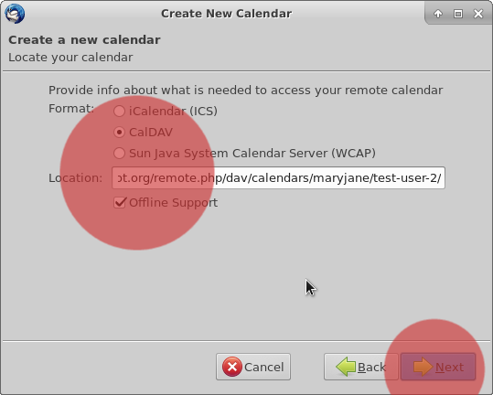
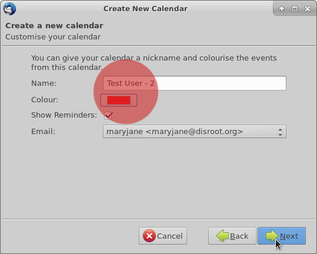

The main goal of having your contacts and calendars from **Disroot** integrated with **Thunderbird** through your email account is the chance to access them from one place on your desktop.

---------

# First step: Installing needed add-ons

In order to sync all your calendars and contacts on **Thunderbird**, you will need to install the following add-on:

* **Lightning:** a calendar for **Thunderbird**

## Installing Lightning

In **Thunderbird** go to > tools > Add-ons

In the Add-ons page on the upper right corner you will find a search bar. Just search for "Lightning". Once **Thunderbird** finds it for you, press install.

You will need to restart **Thunderbird** in order to finish the installation.

# Integrating calendar with Thunderbird

First login to your [Disroot cloud](https://cloud.disroot.org) and go to Calendar app. Select options of the calendar you want to sync to **Thunderbird**.
Now, copy the link URL of your calendar. You will need it to sync with **Thunderbird**.

 

In **Thunderbird** you can either go to: *File > New > Calendar* or go directly to Calendar window and select *"New calendar"* by right clicking on the calendar list.

Now configure your calendar to sync:
1. Select the option **CalDAV**
2. In the location field, paste the link of your **Disroot** Calendar that you copied earlier
3. Select *Offline support*, if you want to keep a local copy of you calendar, in case you need to work offline
4. Press *Next*

Give your calendar a name and assign it a color if you want. 
Then press *Next*.

And then, finlly press *Finish*.

Your calendar is now synced with **Thunderbird**. Any event created in **Thunderbird** will apear on **Disroot** cloud and vice versa.

| **Note**|
|:--:|
|If you have multiple calendars in your **Disroot** account, just repeat this process for each calendar.  You can use a different color to each calendar to set them apart. This method works for any **Nextcloud**/**ownCloud** provider out there. Additionally you can sync any calendars form any provider as long as they support caldav protocol (check with your provider for more details)|

## Adding events with multiple calendars
If you have multiple calendars in **Thunderbird**, when creating an event you need to select to which calendar it goes to, otherwise you maybe end up looking for it online in the wrong place.

If you right click the calendars in **Thunderbird** you will have a set of options, from:

* Show or hide a Calendar
* Export Calendar
* Unsubscribe Calendar (remove it from **Thunderbird**)
* Making it read only (in **Thunderbird**)
* Synchronize Calendar  

---
