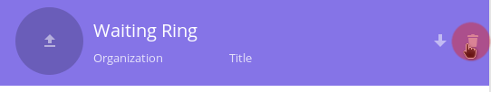
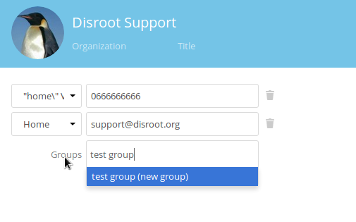
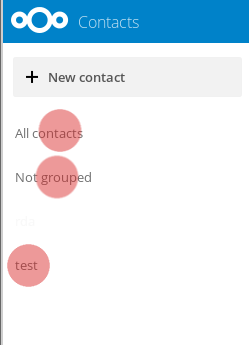
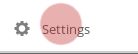
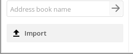

# Contactos
Puedes acceder a la aplicación presionando el ícono de contactos  {.inline}  en la barra superior en **Nextcloud**.

## Crear un contacto

En la aplicación contactos selecciona "*Nuevo contacto*".

Aparecerá un formulario en la "*barra derecha*" para crear el nuevo contacto.

Escribe la información que quieras/tengas en los campos correspondientes. Si lo necesitas, puedes agregar más campos al final del formulario.

## Borrar un contacto

* Selecciona el contacto.
* En el encabezado del formulario de contacto, selecciona el ícono de borrar.

## Crear grupos de contactos
Puedes crear grupos para organizar tus contactos, por ejemplo: facultad, trabajo, colectivo, etc.
En el campo grupo puedes asignar un nuevo contacto a un grupo existente o crear un grupo nuevo. O asignar un contacto a múltiples grupos tipeando los varios grupos.

A la izquierda de la pantalla en tu aplicación contactos, verás los grupos existentes. Al seleccionar uno presentará todos los contactos en ese grupo.

## Compartir la libreta de direcciones

Ve a "Configuraciones" en la esquina inferior izquierda de la pantalla en la aplicación de contactos.

En las configuraciones puedes compartir tu libreta de direcciones con otro usuario de **Disroot** seleccionando compartir libreta de direcciones y escribiendo el nombre de usuario de **Disroot** con el que deseas compartirla.

También puedes utilizar un link para compartir tu libreta de direcciones vía webDAV, a otras libretas (Thunderbird, móvil, etc,).

## Importar libreta de direcciones

Puedes importar libretas de direcciones o contactos individuales, si tienes un archivo vcf del contacto o la libreta.

* Selecciona "Importar".

Luego selecciona el archivo que quieres compartir, y presiona Ok.

## Crear una nueva libreta de direcciones

Dentro de configuraciones, en el campo “Nombre de la libreta de direcciones” escribe el nombre de la nueva libreta, luego presiona enter.

# Sincronizar contactos en la nube con el webmail
Hacerlo es muy sencillo. Permitirá que los contactos de tu webmail y la nube estén sincronizados.

Primero, ve a tu aplicación contactos de **Nexcloud**. Click en el ícono de configuraciones en la esquina inferior izquierda.
Selecciona la opción "Mostrar URL" de la libreta que te gustaría sincronizar con el webmail, y copia el link que aparece.

Ahora ve a la aplicación Webmail, y haz click en el ícono de configuraciones (arriba a la izquierda en la aplicación de webmail)

En tus configuraciones, en la barra lateral izquierda, selecciona **Contactos**.
En el menú de contactos:

1. Selecciona "Habilitar sincronización remota"
2. En URL de la Libreta de direcciones, introduce la URL de la libreta de contactos de **Nexcloud** que habías salvado antes.
3. Proporciona tu nombre de usuari@
4. Ingresa tu contraseña

Luego actualiza ambas páginas. Ahora, tus contactos estarán sincronizados.
