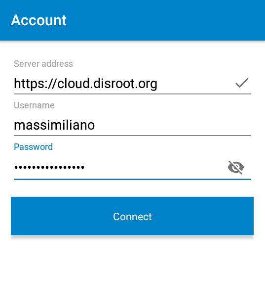
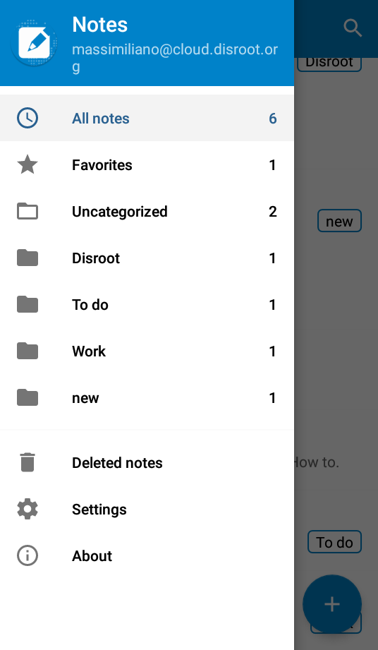

# Notes on Mobile

In this tutorial we'll show you how to setup and use your disroot notes in your Android device.

# Install notes app

First of grab **"Nextcloud Notes"** from [F-Droid](https://f-droid.org/packages/it.niedermann.owncloud.notes/) or other commercial app store.    

# Add your disroot account

Once you start the *"Notes"* app, for the first time you will need to add your credentials and URL of disroot cloud server.

- **Server address:** [https://cloud.disroot.org/](https://cloud.disroot.org/)
- **Username:** Your disroot username
- **Password:** Your disroot password

After that just press "*connect*".
Your existing notes from your disroot cloud account should be now synced to your phone.

# Create and delete notes

You can create a new note by pressing the *"plus"* (**+**) button on the lower right corner of the screen.

The editor is very simple:

* the first line of the note is automatically the title of the note.
* After you have written your note press the back arrow and the app will autosave the note.
* You will have some options when pressing the tree dots menu on the upper right:
  * **Favourite:** check it if you want to add the note to your favourites
  * **Category:** Option to categorize the note to an existent or new category
  * **Share:** To share your note
  * **Cancel:** To undo your last edit
  * **Delete:** To remove the note
* Any change to the notes will be automatically synced to and from disroot cloud.

Notes app uses Markdown formatting so if you are familiar with it you can make them look pretty. If you still dont know what Markdown is, you should definatelly check [this page](http://lifehacker.com/5943320/what-is-markdown-and-why-is-it-better-for-my-to-do-lists-and-notes) which will change your life forever :)

All the notes you create can be seen in the main menu of the Nextcloud Notes app.

* To edit a particular just press on it.
* To create new notes just press the plus symbol.

# Browse your notes categories

If you ordered your noter in categories, you can easily find your notes by browsing the categories.
To do so you need tap on the hamburger menu on the top left.

A sidebar with all your categories will pop up.
Select the category and all the notes of that category will be listed.

!! **Note!** Any changes you make to your notes in the Notes application, notes in the Notes web interface, notes in the desktop client or in the. txt file, will appear in all clients and web interface.
