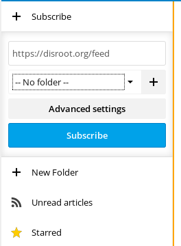
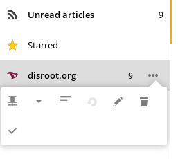

**News** app is a tool to keep track of the articles and posts of all the websites you like following in one place. **Disroot** cloud provides an app that does the job for you and syncs it to all your devices. In this tutorial we'll try to cover the basic usage.

----------
# News App on Disroot

To get into the app from web browser, just click news app icon  in the top bar. General idea behind the app is very simple: you add the RSS-feed of your favorite sites, get notifications on new articles and read them without the need to go to all those websites, by opening lots of tabs and get distracted half way.

## Add new feeds
Most of the websites provide [RSS](https://en.wikipedia.org/wiki/RSS) or Atom feeds. Once you have the RSS link ready, you can copy it and add it to your news app.
To add the feed simply click on the **"+ Subscribe"** button and fill in the URL of the feed you previously copied.

For better overview and sorting you can create folders and assign feeds to them. To create new folder hit **"+ New Folder"** button on the left-side bar. Now you can "drag and drop" feeds you wish to add to folders.

## Feed options
Every feed can be optimized to your needs. Clicking on **"Three dot"** icon:

