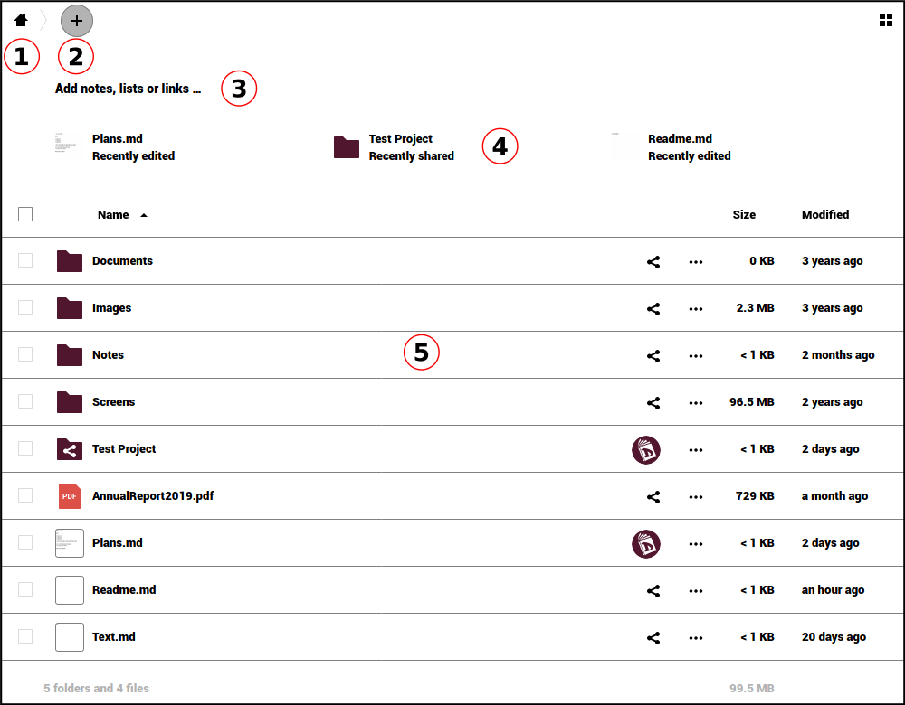
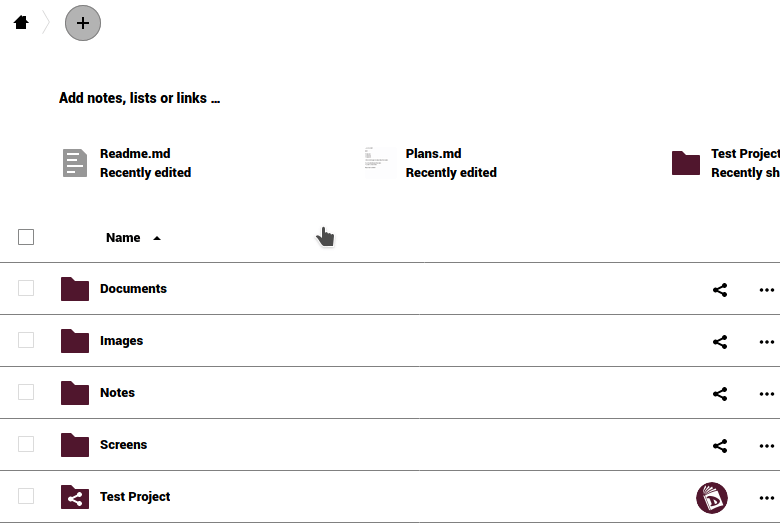
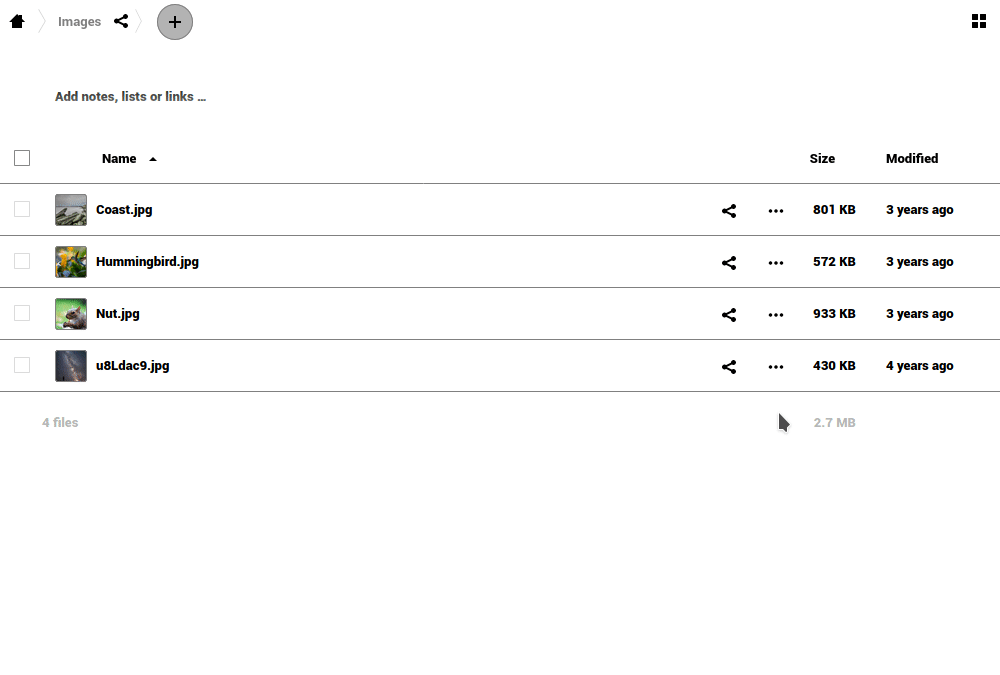
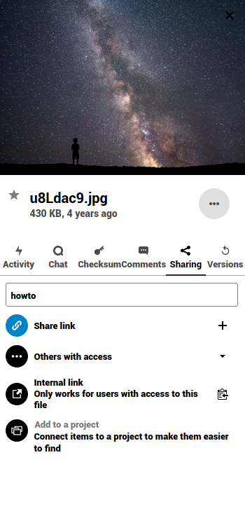
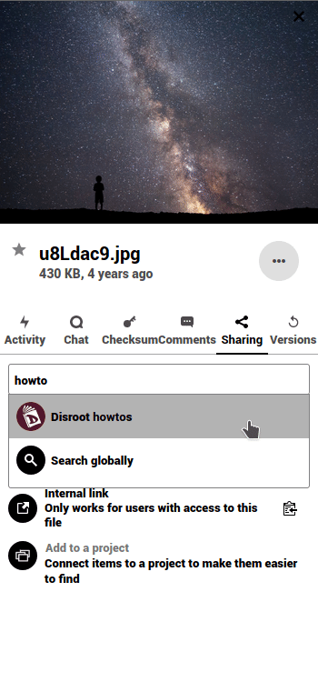
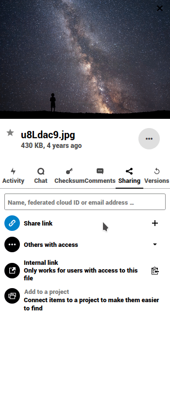
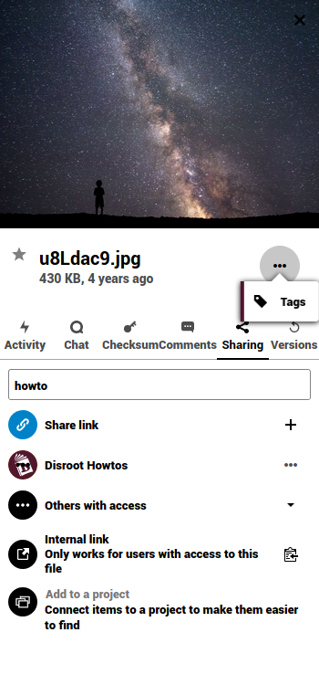
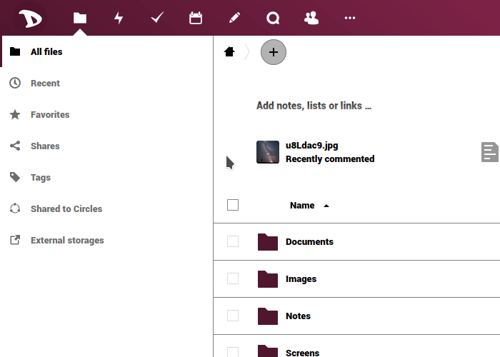
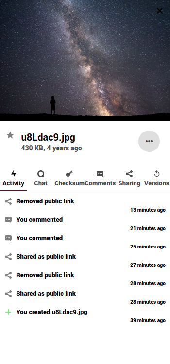
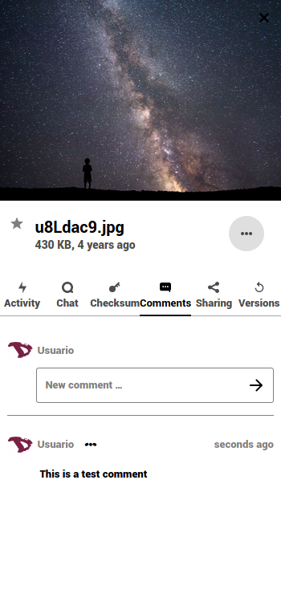

# Files

The main task of **Nextcloud** is file management. Below is an overview of the main window, which we will divide in two sections:

- The **left sidebar** let's you filter files based on certain criteria (recents, favorites, shared, by tags, shared with circles or from external storages).

- The **main window** is your file-browser and workspace. in addition to information about your files, from here you can perform a number of operations, such as commenting, tagging or sharing them.

# File management

We already mentioned the first three functions in the introduction, but it is worth reviewing them.

#### 1. Home button
It leads you back to the root folder (the home folder) when you navigate through your files or folders.

#### 2. New button
It enables you to upload a file and create new folders, text files or pads. Click on it and choose an action from the list.

#### 3. Workspace
It allows you to bring context to your folders by adding notes, todo lists and links to files on top.

Rich workspace can be enabled/disabled by clicking the settings icon at the bottom of the left sidebar.

#### 4. Recent files
Here you can see the last modified files or folders.

#### 5. File manager
From this section you can do a number of operations on files or folders.

##### 5.1 Upload files
In addition to the option in the **New** menu (+), you can upload your files directly by dragging them from your computer to here.

  

##### 5.2 Basic files and folders actions
By clicking on the **"three dots"** icon next to the filename or directory you can access to some extra options. Those options are self explanatory. You can "Add to favorites", see the "Details", "Rename", "Move or copy", "Download" or "Delete" the file or directory.

  

##### 5.3 Sharing files
Sharing files and directories is an essential part of any cloud storage service. You can choose to share files with other Disroot users, an entire group or even with other users using OwnCloud/Nextcloud on different platforms. You can also share with anyone out there through the public link option.

  

  To share a file or directory just click the *share icon*  right next to the name of the item you want to share. A right-bar popup will show up with all the sharing options for you to choose from.

  

You might share with other users, groups, or users on different cloud servers using the federation address. To do so, you will have to type their entire usernames because **we don't provide autocompletion for privacy reasons**.

When sharing with other users or groups, you can choose if they have rights to edit and/or re-share the shared file. You can also set an expiration date for it and send a note to the recipients.

You can also share a file or directory with anyone by using the **Share link** option. It allows you to copy/paste a link and share it. Any person who knows the address (url) will be able to access the file. They don't need to have an account. This option enables you to set editing permissions as well as hide the download, protect the link with a password, set an expiration date, send a note to the recipient, send the link via email, unshare the file and add another link to it.

##### 5.4 Additional file operations

As you may have noticed when setting up sharing, there are more options in the sidebar.

  - **Tags**

  

  Tagging files can be very useful to find them more easily. To assign a tag, go to the three-point menu to the left of the file name and select **Tags**. Type in a tag or browse through the ones already created and press Enter. You can assign as many tags as you like or need.

  

  Once you have assigned the tags, you can go to the **Tags** filter option and search for files by the tags associated with them.

  

  Keep in mind that they will all be system tags, so they will be shared with the rest of the users on the server.

- **Activity**

  

  It gives you an overview of all events with the file. The time it was created, when it was shared, removed, edited, commented on, etc.

- **Chat**

  

  You can start a call or chat with the users you've shared a file or directory.

- **Checksum**

  

  It allows you to create a hash checksum of a file. Select an algorithm and it will try to generate a hash.

- **Comments**

  

  This is a very useful feature when you're working on a file with other users. Everyone you've shared the file with can read and add comments. By clicking on the three dots icons right next to your username, you can edit your comment.

  

- **Versions**

  

  It lets you view all the changes done to a file. You can download previous revisions of a file as well as restore it to previous revision (deleting all changes done after).
