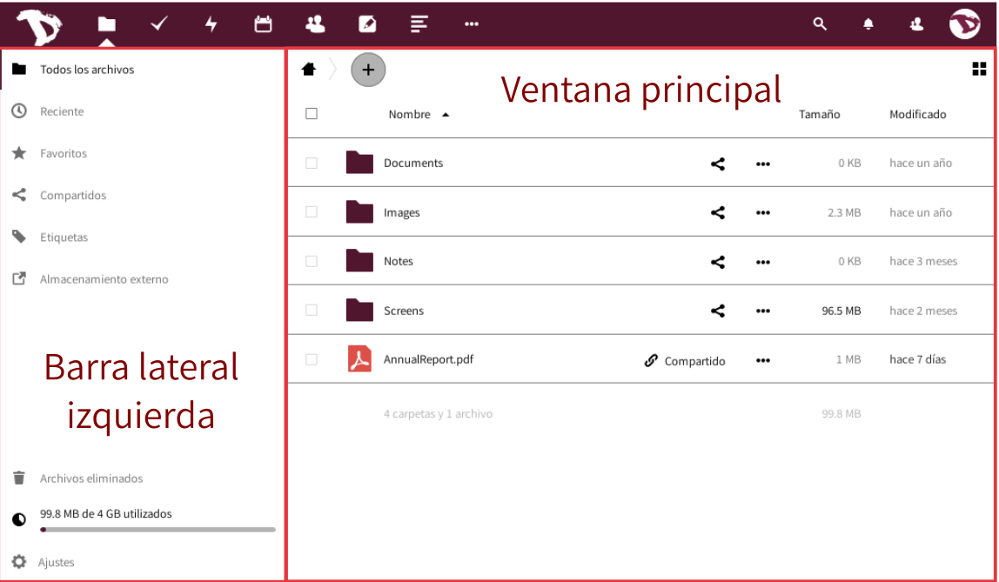
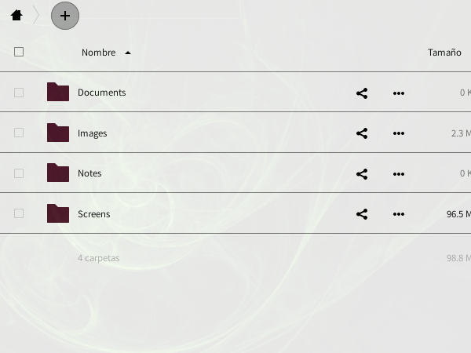
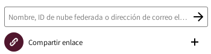
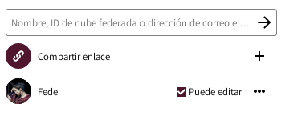
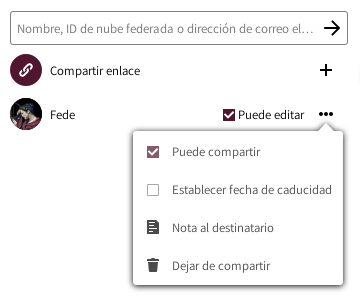

# Archivos

La principal tarea de la nube es administrar archivos. Puedes fácilmente subir, descargar, compartir y comentar.

La *barra lateral izquierda* te permite filtrar archivos basándose en ciertos criterios (recientes, favoritos, compartidos, por etiquetas). La *Ventana principal* es tu navegador de archivos (deberías estar familiarizadx con él si alguna vez has utilizado una computadora antes...)

## Crear nuevos archivos o directorios
Para crear un archivo nuevo, solo haz click sobre el botón **"+"** y elige el tipo de archivo de la lista. Puedes crear tanto directorios como archivos de textos y blocks de notas.

## Subir archivos
Hay dos maneras de subir archivos.
Puedes hacerlo arrastrando archivos desde tu equipo (navegador de archivos) hacia la ventana de navegación de la nube. La otra manera es utilizando el ícono **"+"** y seleccionar la opción **"Subir un archivo"**.

## Compartir archivos
Compartir archivos y directorios es una parte esencial de cualquier servicio de almacenamiento en la nube. Puedes elegir compartir archivos con otrxs usuarixs de **Disroot** o tu grupo entero, pero también con otrxs usuarixs que utilicen **Owncloud/Nextcloud** en diferentes plataformas. También puedes compartir con cualquiera a través de la opción Enlace público.

Para compartir un archivo o un directorio, simplemente haz click en el "*ícono compartir*" justo al lado del nombre del objeto que deseas compartir. Una barra derecha emergente aparecerá con todas las opciones para que elijas una manera de hacerlo.

Puedes decidir compartir con otrxs usuarixs, grupos o usuarixs en diferentes servidores de nube, utilizando la dirección federada o tipeando el nombre de usuarix completo (**no proveemos autocompletado por razones de seguridad**). Cuando compartes con otrxs usuarixs o grupos puedes decidir si lxs usuarixs tienen o no privilegios para editar/modificar el contenido de lo compartido (borrar archivos, subir, editar), y si pueden volver a compartirlo con respecto a otrxs usuarixs.

Además de compartir con otrxs usuarixs, puedes compartir tus datos con cualquiera utilizando "Compartir Enlace", que puedes copiar/pegar a quien quieras. Cualquiera que conozca la dirección (url) podrá acceder a los archivos. La persona no necesita tener una cuenta válida. Compartir un enlace te da la opción extra de proteger lo que compartes con contraseña y fecha de caducidad.

## Comentarios, Actividades, Versión
Como habrás notado cuando configurabas Compartir, hay más opciones en la barra derecha.

 - **Actividades:** te da un resumen de todas las actividades con el archivo. El momento en que fue creado, cuándo fue compartido, editado, comentado, etc.
 - **Comentarios:** son muy útiles cuando trabajas sobre el archivo con otrxs usuarixs. Todxs aquellxs con lxs que has compartido el archivo pueden leer y agregar comentarios.
 - **Versiones:** te permite ver todos cambios realizados al archivo. Puedes descargar revisiones previas del archivo, así como restaurar a una versión previa (borrando todos los cambios realizados posteriormente).

## Otras operaciones de archivo
Haciendo click en el ícono de **"tres puntos**" próximo al nombre del archivo o directorio, te da opciones extra. Esas opciones se explican solas. Puedes "Renombrar", "Mover", "Descargar" o borrar el archivo o directorio.

----------

#Actividades

Cuando tu cuenta comience a ponerse agitada, empieces a colaborar con muchxs otrxs usuarixs y grupos, podrías encontrar muy útil la aplicación **"Actividades"**. Aquí tienes un resumen general de todas las actividades sucediendo dentro de tu cuenta en la nube (cambios de archivos, comentarios, compartidos, contactos, pendientes, calendarios, etc).

La ventana principal te da una línea de tiempo con todas las actividades, y la barra lateral izquierda te permite filtrar la información según un criterio.

Adicionalmente puedes crear un aviso de actualizaciones RSS de tus actividades (Presiona el "botón configuraciones" al final de la barra lateral izquierda), que puedes seguir utilizando tu lector preferido de RSS, compartirlo con alguien o integrarlo en tu aplicación o sitio web (agregar el feed a tu sala matrix, por ejemplo).

----------
