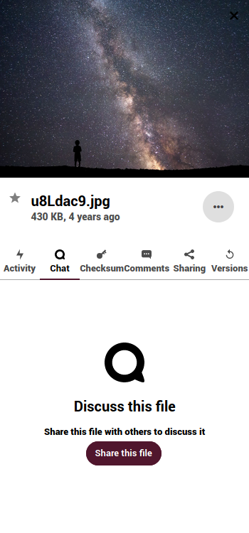
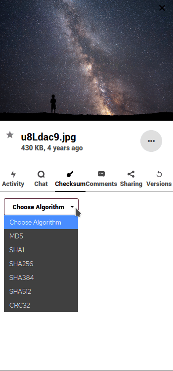

# Fichiers

La tâche principale de **Nextcloud** est la gestion des fichiers. Voici un aperçu de la fenêtre principale, que nous allons diviser en deux sections :

- La **barre latérale gauche** vous permet de filtrer les fichiers en fonction de certains critères (récents, favoris, partagés, par tags, partagés avec des cercles ou depuis des stockages externes).

- La **fenêtre principale** est votre navigateur de fichiers et votre espace de travail. En plus des informations sur vos fichiers, vous pouvez y effectuer un certain nombre d'opérations, comme les commenter, les étiqueter ou les partager.

# Gestion des fichiers

Nous avons déjà mentionné les trois premières fonctions dans l'introduction, mais il est utile de les revoir.

#### 1. Bouton d'accueil
Il vous ramène au dossier racine (le dossier d'accueil) lorsque vous naviguez dans vos fichiers ou dossiers.

#### 2. Bouton Nouveau
Il vous permet de télécharger un fichier et de créer de nouveaux dossiers, fichiers texte ou pads. Cliquez dessus et choisissez une action dans la liste.

#### 3. Espace de travail
Il vous permet d'apporter un contexte à vos dossiers en ajoutant des notes, des listes de tâches et des liens vers des fichiers en haut.

L'espace de travail riche peut être activé/désactivé en cliquant sur l'icône des paramètres en bas de la barre latérale gauche.

#### 4. Fichiers récents
Ici vous pouvez voir les derniers fichiers ou dossiers modifiés.

#### 5. Gestionnaire de fichiers
À partir de cette section, vous pouvez effectuer un certain nombre d'opérations sur les fichiers ou les dossiers.

##### 5.1 Télécharger des fichiers
En plus de l'option dans le menu **Nouveau** (+), vous pouvez télécharger vos fichiers directement en les faisant glisser de votre ordinateur vers ici.

  

##### 5.2 Actions de base sur les fichiers et les dossiers
En cliquant sur l'icône **"trois points "** à côté du nom du fichier ou du répertoire, vous pouvez accéder à des options supplémentaires. Ces options sont explicites. Vous pouvez "Ajouter aux favoris", voir les "Détails", "Renommer", "Déplacer ou copier", "Télécharger" ou "Supprimer" le fichier ou le répertoire.

  

##### 5.3 Partager des fichiers
Le partage de fichiers et de répertoires est un élément essentiel de tout service de stockage en nuage. Vous pouvez choisir de partager des fichiers avec d'autres utilisateurs de Disroot, un groupe entier ou même avec d'autres utilisateurs utilisant OwnCloud/Nextcloud sur différentes plateformes. Vous pouvez également partager avec n'importe qui grâce à l'option de lien public.

  

  Pour partager un fichier ou un répertoire, il suffit de cliquer sur l'icône *share*  juste à côté du nom de l'élément que vous voulez partager. Une fenêtre popup s'affichera dans la barre de droite avec toutes les options de partage parmi lesquelles vous pourrez choisir.

  

Vous pouvez partager avec d'autres utilisateurs, groupes ou utilisateurs sur différents serveurs cloud en utilisant l'adresse de fédération. Pour ce faire, vous devrez taper leurs noms d'utilisateur complets car **nous ne fournissons pas d'autocomplétion pour des raisons de confidentialité**.

Lorsque vous partagez avec d'autres utilisateurs ou groupes, vous pouvez choisir s'ils ont le droit de modifier et/ou de partager à nouveau le fichier partagé. Vous pouvez également fixer une date d'expiration pour celui-ci et envoyer une note aux destinataires.

Vous pouvez également partager un fichier ou un répertoire avec n'importe qui en utilisant l'option **Lien de partage**. Elle vous permet de copier/coller un lien et de le partager. Toute personne qui connaît l'adresse (url) pourra accéder au fichier. Elle n'a pas besoin d'avoir un compte. Cette option vous permet de définir des autorisations d'édition ainsi que de masquer le téléchargement, de protéger le lien par un mot de passe, de définir une date d'expiration, d'envoyer une note au destinataire, d'envoyer le lien par courrier électronique, de dé-partager le fichier et d'y ajouter un autre lien.

##### 5.4 Opérations supplémentaires sur les fichiers

Comme vous l'avez peut-être remarqué lors de la configuration du partage, il y a plus d'options dans la barre latérale.

  - **Balises**

  

  Le marquage des fichiers peut être très utile pour les retrouver plus facilement. Pour attribuer une balise, allez dans le menu à trois points à gauche du nom du fichier et sélectionnez **Balises**. Saisissez une balise ou parcourez les balises déjà créées et appuyez sur Entrée. Vous pouvez attribuer autant de balises que vous le souhaitez ou que vous en avez besoin.

  

  Une fois que vous avez attribué les balises, vous pouvez aller dans l'option de filtre **Balises** et rechercher des fichiers par les balises qui leur sont associées.

  

  Gardez à l'esprit qu'il s'agit de balises système, qui seront donc partagées avec le reste des utilisateurs du serveur.

- **Activité**

  

  Il vous donne un aperçu de tous les événements avec le fichier. L'heure à laquelle il a été créé, quand il a été partagé, supprimé, édité, commenté, etc.

- **Chat**

  

  Vous pouvez démarrer un appel ou un chat avec les utilisateurs qui ont partagé un fichier ou un répertoire.

- **Checksum**

  

  Il vous permet de créer une somme de contrôle de hachage d'un fichier. Sélectionnez un algorithme et il essaiera de générer un hachage.

- **Commentaires**

  

  Il s'agit d'une fonctionnalité très utile lorsque vous travaillez sur un fichier avec d'autres utilisateurs. Toutes les personnes avec qui vous avez partagé le fichier peuvent lire et ajouter des commentaires. En cliquant sur les trois icônes à côté de votre nom d'utilisateur, vous pouvez modifier vos commentaires.
