# File
L'attività principale di **Nextcloud** è la gestione dei file. Di seguito una panoramica della finestra principale, che divideremo in due sezioni: 

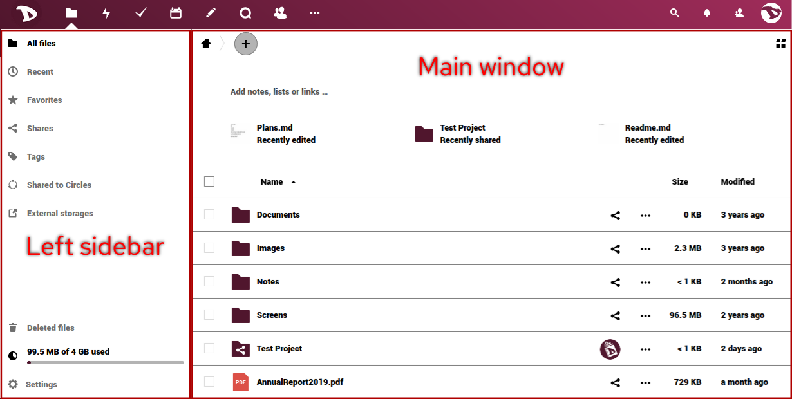

- La **barra laterale sinistra** ti consente di filtrare i file in base a determinati criteri (recenti, preferiti, condivisi, per tag, condivisi con cerchie o da archivi esterni).

- La **finestra principale** è il tuo browser di file e spazio di lavoro. oltre alle informazioni sui tuoi file, da qui puoi eseguire una serie di operazioni, come commentarli, taggarli o condividerli. 

# Gestione dei file

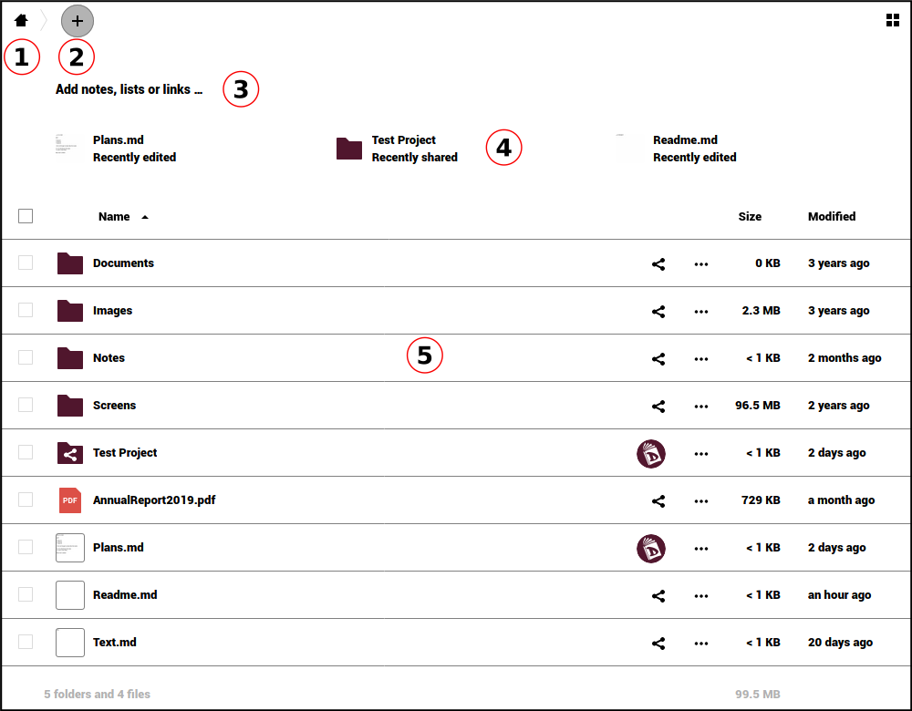

Abbiamo già menzionato le prime tre funzioni nell'introduzione, ma vale la pena rivederle.

#### 1. Pulsante Home
Ti riporta alla cartella principale (la cartella home) quando navighi tra i tuoi file o cartelle.

#### 2. Nuovo pulsante
Ti consente di caricare un file e creare nuove cartelle, file di testo o pad. Fare clic su di esso e scegliere un'azione dall'elenco.

#### 3. Area di lavoro
Ti consente di dare un contesto alle tue cartelle aggiungendo note, elenchi di cose da fare e collegamenti a file in cima.

 

Rich workspace può essere abilitato/disabilitato facendo clic sull'icona delle impostazioni nella parte inferiore della barra laterale sinistra.

#### 4. File recenti
Qui puoi vedere gli ultimi file o cartelle modificati.

#### 5. File manager
Da questa sezione è possibile eseguire una serie di operazioni su file o cartelle.

##### 5.1 Caricare i file
Oltre all'opzione nel menu **Nuovo** (+), puoi caricare i tuoi file direttamente trascinandoli dal tuo computer qui. 

  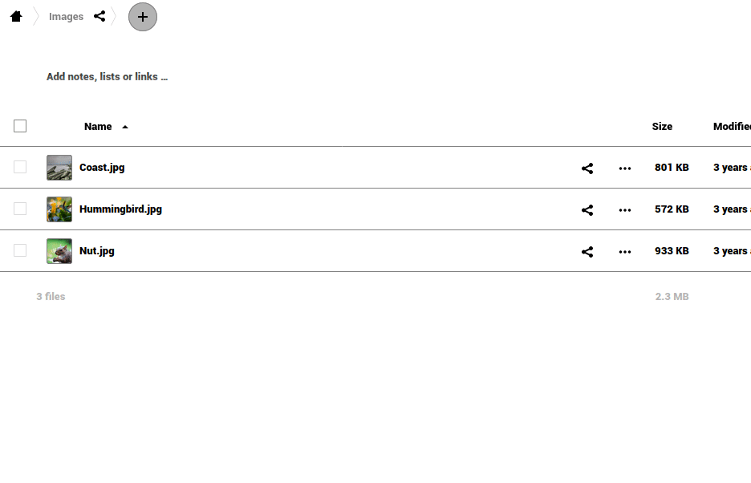

##### 5.2 Azioni di base su file e cartelle
Cliccando sull'icona **"tre punti"** accanto al nome del file o alla directory puoi accedere ad alcune opzioni extra. Queste opzioni sono autoesplicative. Puoi "Aggiungi ai preferiti", vedere "Dettagli", "Rinomina", "Sposta o copia", "Scarica" o "Elimina" il file o la directory. 

  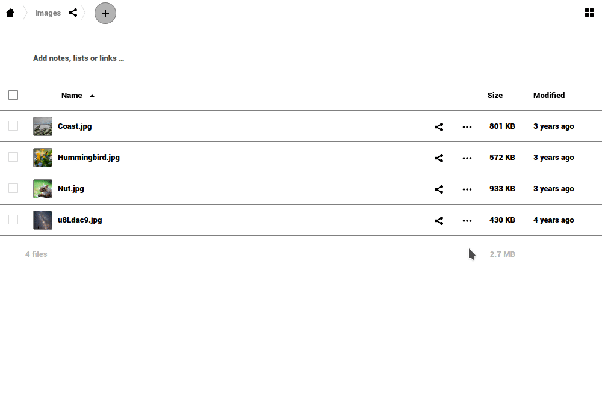

##### 5.3 Condivisione di file
La condivisione di file e directory è una parte essenziale di qualsiasi servizio di archiviazione cloud. Puoi scegliere di condividere file con altri utenti Disroot, un intero gruppo o anche con altri utenti utilizzando OwnCloud/Nextcloud su piattaforme diverse. Puoi anche condividere con chiunque là fuori tramite l'opzione di collegamento pubblico.

   

   Per condividere un file o una directory, fai clic sull'icona *share*  accanto al nome dell'elemento che desideri condividere. Verrà visualizzato un popup della barra di destra con tutte le opzioni di condivisione tra cui scegliere.

   

È possibile condividere con altri utenti, gruppi o utenti su server cloud diversi utilizzando l'indirizzo della federazione. Per farlo, dovrai digitare tutti i loro nomi utente perché **non forniamo il completamento automatico per motivi di privacy**. 

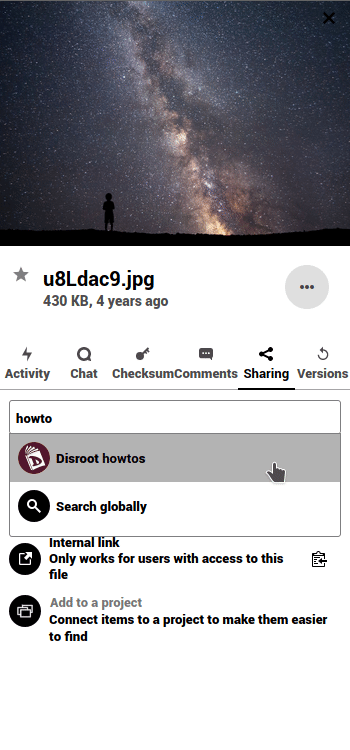

Durante la condivisione con altri utenti o gruppi, puoi scegliere se hanno i diritti per modificare e/o ricondividere il file condiviso. Puoi anche impostare una data di scadenza e inviare una nota ai destinatari.

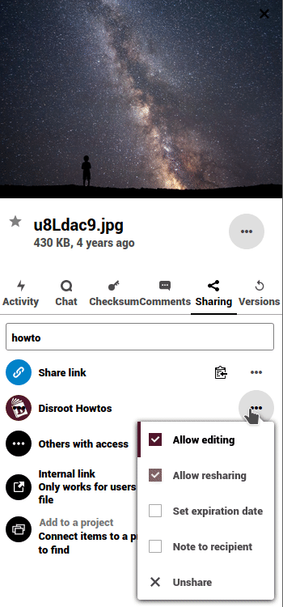

Puoi anche condividere un file o una directory con chiunque utilizzando l'opzione **Condividi collegamento**. Ti permette di copiare/incollare un link e condividerlo. Qualsiasi persona che conosce l'indirizzo (url) potrà accedere al file. Non hanno bisogno di avere un account. Questa opzione ti consente di impostare le autorizzazioni di modifica e nascondere il download, proteggere il collegamento con una password, impostare una data di scadenza, inviare una nota al destinatario, inviare il collegamento via e-mail, annullare la condivisione del file e aggiungere un altro collegamento ad esso. 

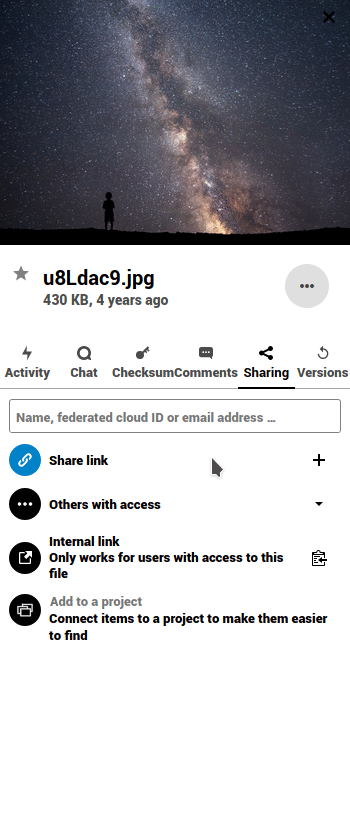

##### 5.4 Operazioni aggiuntive sui file

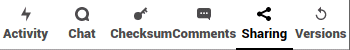

Come avrai notato durante la configurazione della condivisione, ci sono più opzioni nella barra laterale.

- **Tag**

   

   La codifica dei file può essere molto utile per trovarli più facilmente. Per assegnare un tag, vai al menu a tre punti a sinistra del nome del file e seleziona **Tag**. Digita un tag o sfoglia quelli già creati e premi Invio. Puoi assegnare tutti i tag che desideri o di cui hai bisogno.

   

   Dopo aver assegnato i tag, puoi andare all'opzione di filtro **Tag** e cercare i file in base ai tag ad essi associati.

   

   Tieni presente che saranno tutti tag di sistema, quindi saranno condivisi con il resto degli utenti sul server.

- **Attività**

   

   Ti offre una panoramica di tutti gli eventi con il file. Il momento in cui è stato creato, quando è stato condiviso, rimosso, modificato, commentato, ecc. 

- **Chat**

  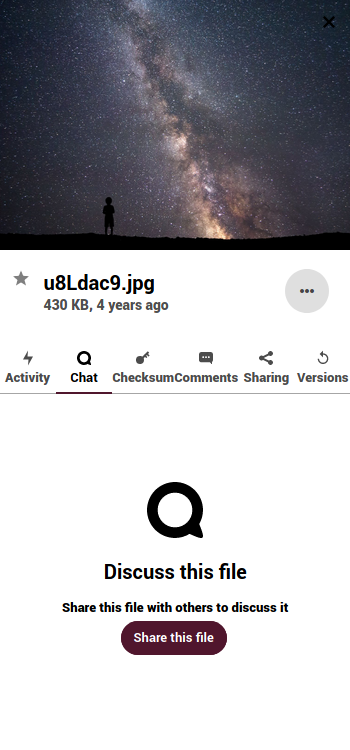

Puoi avviare una chiamata o chattare con gli utenti con cui hai condiviso un file o una directory. 

- **Checksum**

  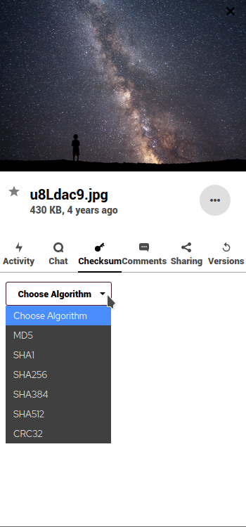

Ti permette di creare un checksum hash di un file. Seleziona un algoritmo e proverà a generare un hash.

- **Commenti**

   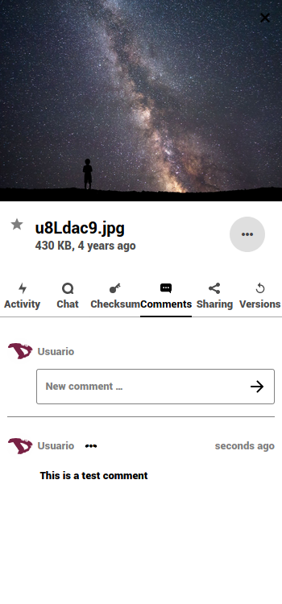

   Questa è una funzione molto utile quando lavori su un file con altri utenti. Tutte le persone con cui hai condiviso il file possono leggere e aggiungere commenti. Facendo clic sulle icone dei tre punti accanto al tuo nome utente, puoi modificare il tuo commento. 
   
  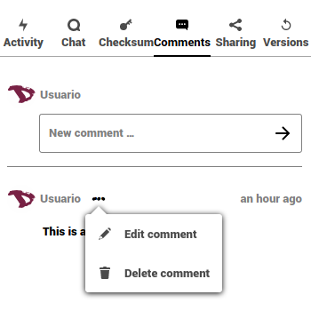

- **Versioni**

  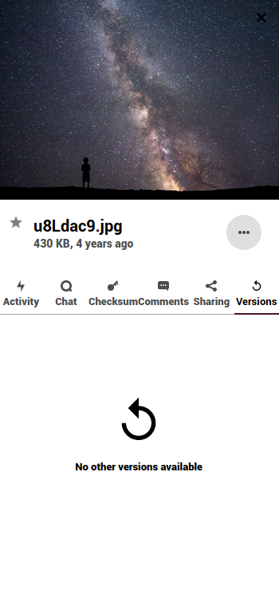

Ti consente di visualizzare tutte le modifiche apportate a un file. È possibile scaricare le revisioni precedenti di un file e ripristinarlo alla revisione precedente (eliminando tutte le modifiche apportate successivamente). 
