# Tasks

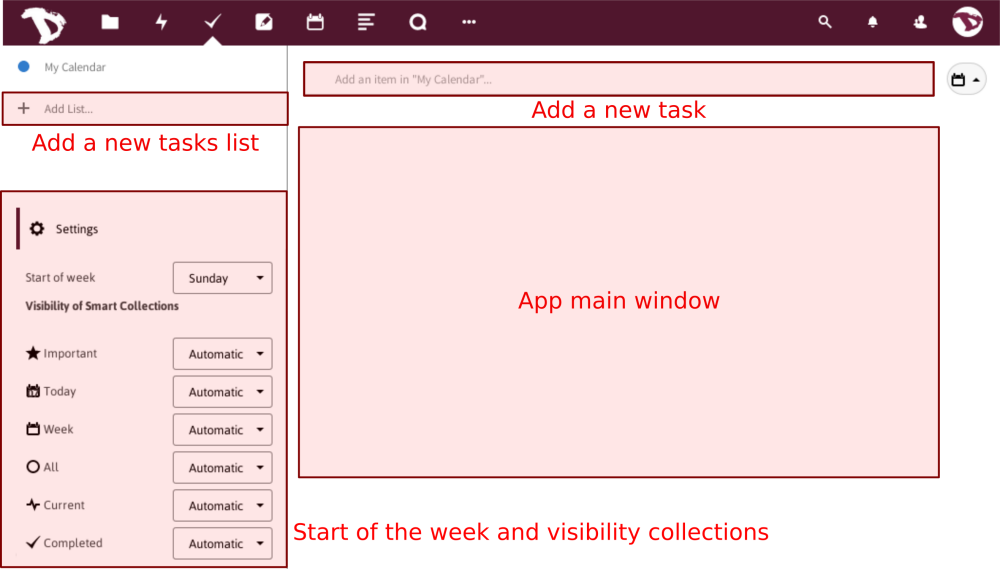

The **Tasks** app allows you to add and delete tasks, edit their title, description, start and due dates and mark them as important. A task could be a meeting date reminder, a job that needs to be done, a personal or a group activity and a lot of other things.

In this short howto we'll see how it works.

# Adding a new task
To start, click on **+ Add list...**, write the name of your new list of tasks and press enter.

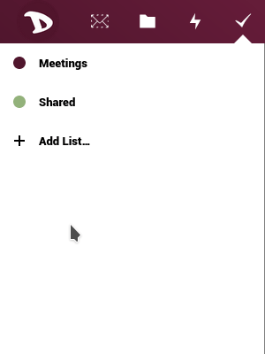

Once you did it, a new section will show at the right.

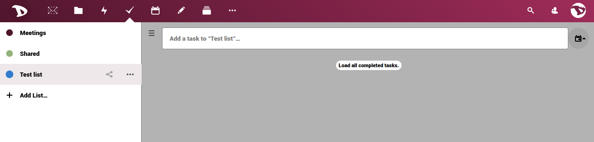

Type in the name of the new task you want to add and then press enter. Click on the three-dots icon at the right if you want to add subtasks.

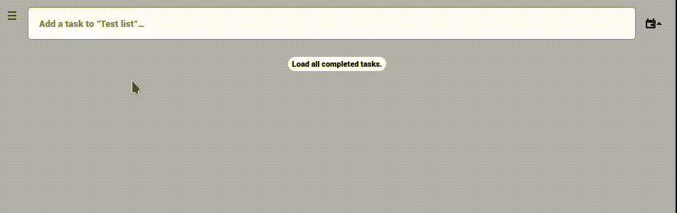

## Tasks options
Click on the task or subtask title to access the options.

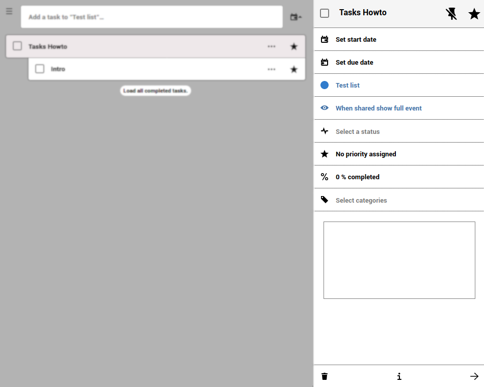

Here you can:

- **Set the start date and due date** 
By clicking on the Start/Due option you can set the day and the hour of it.

  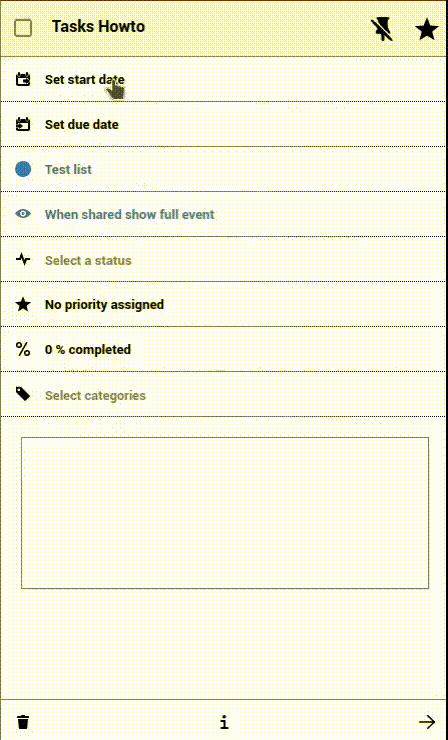

  You can also set the task as an all day activity.

  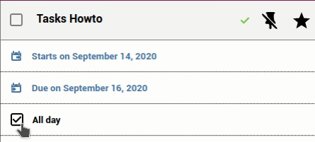

- **Assign / change the tasks list** 
  You can change / assign a task or sub-task to different lists or calendar. Just select one from the drop-down menu and the tasks will change to the new one.

  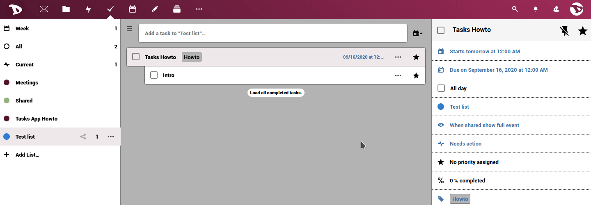

- **Select a classification** 
  You can assign the task list to a previously created calendar and choose how it should be shown.

  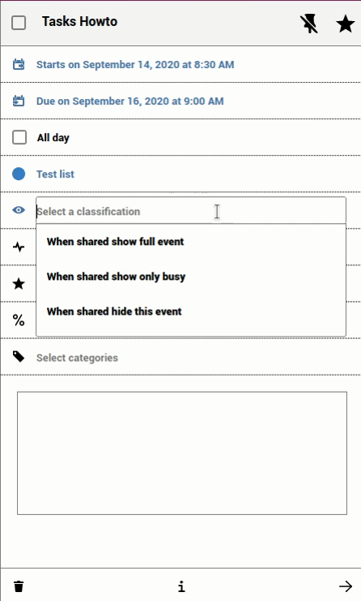

- **Select a status** 
  Select if the task **needs an action**, if it is **in process**, **completed** or **cancelled**.

  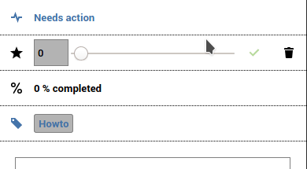

- **Assign a priority level to the task**
  By moving the bar, you can set the priority level where 1 to 4 is **High**, 5 is **Medium** and 6 to 9 is **Low**.

  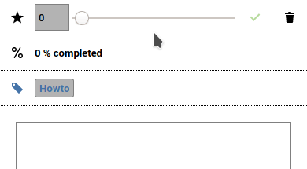

- **Set and edit the progress level of the task** 
  By moving the bar, you can set the task progress from 0% to 100%.

  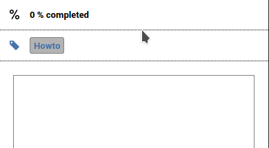

- **Categories and Comments** 
  Assigning categories and adding comments can be very useful when working in a group. Click on **Select categories**, select or create one and press Enter. To write a comment, simply type it in the box.

  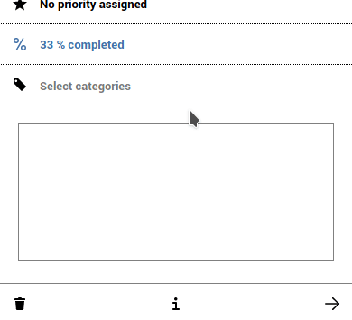

  When the task has a category assigned or a comment added, you can see it in the description, next to the title.

  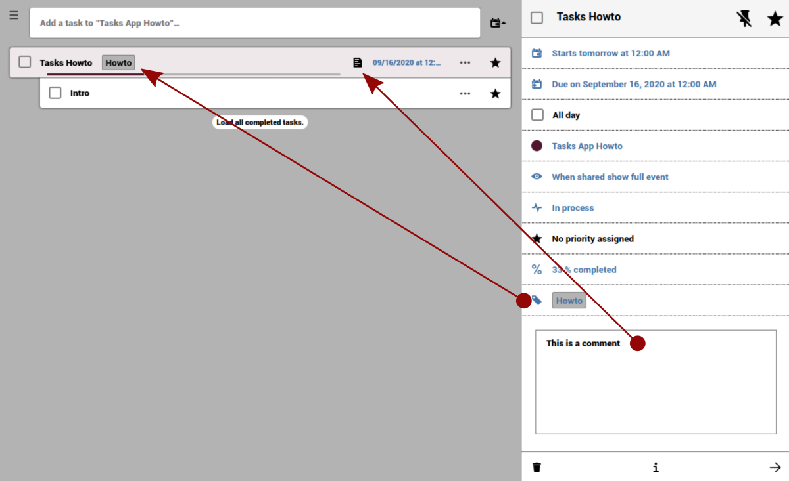

- Finally, at the bottom of the tasks details you will see a bar with the delete and info options.

  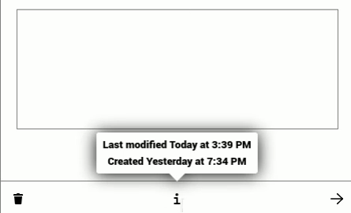
