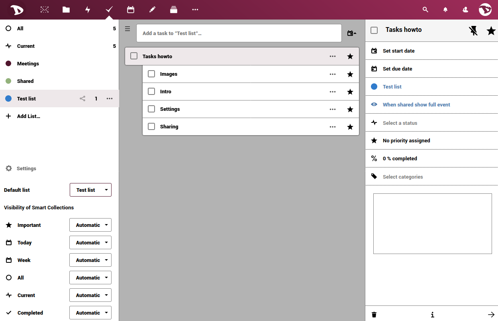

## Attività nell'interfaccia web

L'app Attività ti consente di aggiungere ed eliminare attività. Un'attività potrebbe essere un promemoria per la data di una riunione, un lavoro che deve essere svolto, un'attività personale o di gruppo e molte altre cose. 
  In questa guida vedremo come creare, modificare e condividere attività.

#### Aggiungere una nuova attività
Fare clic nella casella dell'elemento e inserire il nome della nuova attività.

Una volta fatto, una nuova sezione sarà mostrata sulla destra.

Qui puoi definire:

- **La data di inizio e la data di fine**

 
Facendo clic sull'opzione Start è possibile impostare il giorno e l'ora. È inoltre possibile impostare l'attività come attività per tutto il giorno

- **Le priorità delle attività**

Spostando la barra, è possibile impostare il livello di priorità da 1 a 9.

- **Imposta e modifica il livello di avanzamento dell'attività**

Spostando la barra, è possibile impostare l'avanzamento dell'attività dallo 0% al 100%.

- **Tag**
