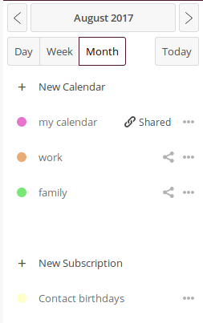
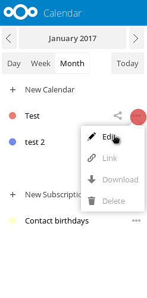
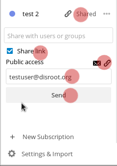

# Usando la aplicación Calendario

Puedes acceder a tu aplicación calendario presionando el ícono  en la barra superior.
*La barra lateral izquierda* en la ventana del calendario te da una vista general de tus calendarios, sus opciones y configuraciones.

## Crear un Calendario
Para crear un nuevo calendario en este panel de opciones presiona "*crear calendario*".
Aparecerá una pequeña entrada donde puedes tipear el nombre que quieras darle a este nuevo calendario y seleccionar su color. Luego presiona "*crear*".

Puedes crear múltiples calendarios para diferentes propósitos (trabajo, activismo, etc.) repitiendo este proceso. Si haces eso, puedes usar diferentes colores para distinguirlos (el último ícono es el selector de color, que te permite elegir el color que quieras).

## Borrar, editar, descargar el calendario.
En el panel izquierdo, verás tus calendarios listados. A la derecha de cada calendario encontrarás un botón "más" donde puedes:

- renombrar tu calendario,
- descargarlo,
- obtener un link URL para sicronizarlo con otros dispositivos,
- borrar tu calendario.

## Crear un evento
Puedes crear un nuevo evento en tu calendario simplemente haciendo click en el día del evento, en la *ventana principal* del calendario. Un panel aparecerá en el lateral derecho, donde puedes completar con información del evento.

En este panel puedes especificar:

  - Título del evento
  - Día de inicio, día de finalización
  - Hora de inicio y finalización
  - Si es un evento de todo el día o no
  - Lugar del evento
  - Descripción del evento

Si tienes múltiples calendarios en tu aplicación calendario de Disroot, necesitas seleccionar en qué calendario va el evento. Puedes hacerlo debajo del campo "título" del evento.

Puedes establecer un recordatorio para cada evento presionando "Recordatorios" y "Agregar".

Puedes seleccionar qué tipo de recordatorio deseas:

* audio
* correo
* ventana emergente

Y establecer el tiempo para ello.

Sólo presiona el recordatorio que agregaste y se mostrarán las opciones.

También puedes establecer si es un evento que se repite o no. Sólo verifica las opciones *repetir*.

## Invita gente a los eventos

También puedes invitar gente a tu evento vía correo electrónico de la siguiente manera:

* presionando "Asistentes",
* completando el campo con las direcciones de correo de las personas,
* presionando enter. 

La gente que invitas recibirá un correo electrónico generado automáticamente con la invitación. Cualquier cambio que realices al evento será enviado automáticamente a la persona que hayas agregado.

Cuando hayas terminado con todo, sólo presiona crear al final del panel, y tu evento aparecerá en la pantalla.

## Editar o borrar eventos
Para editar o borrar cualquier evento que hayas creado, sólo haz click en el evento en tu pantalla, edítalo y luego presiona “actualizar”. Para borrarlo, encontrarás el gran botón rojo.

## Compartir calendarios
Puedes compartir también tus calendarios con otro usuario de Disroot, a través de un correo electrónico o un link público.

Para compartir con otro usuario de Disroot:

* presiona el botón de compartir a la derecha del nombre de tu calendario,
* escribe el nombre del usuario de Disroot con el que quieres compartir tu calendario,
* presiona enter.

Para compartir calendarios vía correo electrónico o un link público:

* ve a la misma opción "Compartido",
* selecciona "Compartir link",
* completa el campo de dirección de correo con el de persona con la que deseas compartir tu calendario.
* presiona enter.
* Para obtener solamente el link, presiona el símbolo de la cadena próximo al símbolo del sobre de correo.

## Importar calendarios
Si tienes un archivo ICS con un calendario para importar, ve a la aplicación calendario de Disroot, luego a “Configuraciones e Importar" en la esquina inferior izquierda de la pantalla. 

Y selecciona la opción Importar calendario.

----------------------------------------
