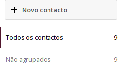
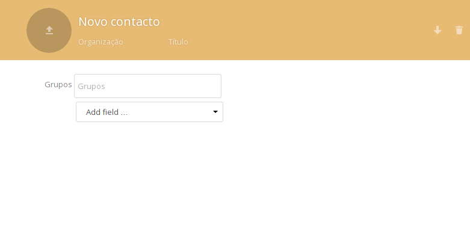
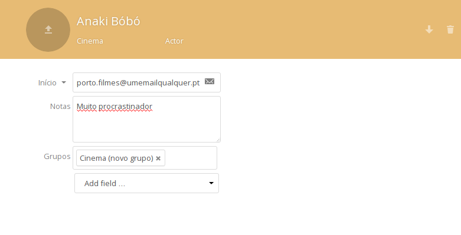
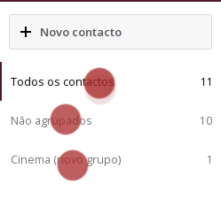
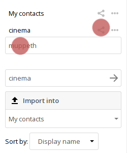
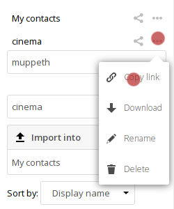
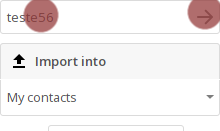

# Contactos
Você pode aceder à aplicação de contactos carregando no ícone de contactos  na barra de topo no nextcloud.

----------------------
## Criar um contacto

Na aplicacação de contactos carregue em "**+ Novo contacto**"

Irá aparecer um formulário no lado **direito do ecrã** para preencher as informações do novo contacto.

Escreva a informação que quiser ter, nos diferentes campos. Se precisar de mais campos pode adicioná-los carregando em **Add fields** no fundo do formulário.

-----------------------
## Apagar um contacto

* selecionar o contacto
* No cabeçalho do contacto carregue no ícone do caixote de lixo

-----------------------
## Criar grupos de contacto
Você pode criar grupos para organizar os seus contactos, ex: faculdade, trabalho, colectivos, etc.
No campo **Grupo** pode adicionar um contacto a um determinado grupo, ou criar um novo grupo ao qual adicionar esse contacto. Ou adicionar um contacto a vários grupos, selecionando os grupos que quer.

No lado esquerdo da aplicação de contactos pode ver os grupos existentes.
Se selecionar um grupo irá ver todos os contactos que pertencem a esse grupo.

------------------------
## Partilhar o livro de endereços

Vá a "**Definições**" no canto inferior esquerdo da aplicação de contactos.

Nas definições pode partilhar contactos com outros utilizadores do Disroot do seguinte modo:
- Carregue no botão de partilhar o livro de endereços
- Escrever o username do(s) outro(s) utilizador(es) do Disroot com quer partilhar o livro de endereços

Também pode usar um link URL para partilhar os seus contactos via wevDAV, com livros de endereços de outras aplicações (Thunderbird, smartphone, etc.).

-------------------------
## Importar livros de endereços

Você pode importar livros de endereços ou contactos individuais se tiver um ficheiro .vcf do contacto ou livro de endereços.

* Carregue em  "**Import into**".

Escolha para qual grupo quer que o contacto seja importado e depois escolha o ficheiro que quer importar e carregue em ok.
-----------------------------
## Criar um novo livro de endereços

Ainda em "**Definições**" no campo "nome do livro de endereços" escreva o nome do novo livro de endereços que quer criar e carregue na seta à sua esquerda.

-----------------------------
